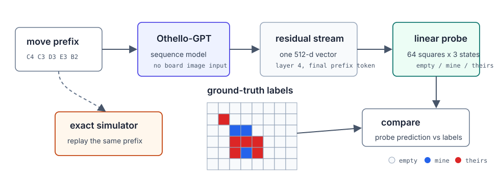

# Learning to See the Invisible Board

In Chapter 1 we framed the central mystery:

```text
moves so far
    -> hidden computation
    -> next-move prediction
```

The model sees the moves. We, as researchers, can replay those moves and recover the board. The question now is whether the model's internal vectors contain something recognizably board-shaped.

This is the first empirical step in the journey. Before asking whether the model uses a board representation, we should ask whether such a representation is available at all.

## The First Question

Suppose we pause Othello-GPT after a prefix such as:

```text
C4 C3 D3 E3 B2
```

Inside the model, the prefix has become a collection of activation vectors. In the TransformerLens notebook, the vector we use is read from:

```text
blocks.4.hook_resid_post
```

This is the residual stream after Transformer block 4. It does not come labeled with useful names. It is just a point in the model's 512-dimensional internal space.

Outside the model, the same prefix has a precise board state. We can run an Othello simulator, apply the moves one by one, and label every square as empty, belonging to the next player to move, or belonging to the opponent.

So the experiment asks:

Can a simple readout recover those 64 square labels from the model's activation?

This is not yet a causal question. We are not changing the model. We are not proving that later layers consult the recovered board. We are asking whether the information is linearly decodable from a chosen internal state.

!!! question "Pause and think"
    If a linear probe can recover the board from the residual stream, what does that show? What would it still fail to show?

## Why a Probe Is the Right First Tool

A probe is an observer trained after the model has already learned. It receives activations as input and predicts some external label. In this chapter, the labels are board states computed by the simulator.

That makes probing an unusually direct test in Othello. In language, a probe for "the topic of the sentence" or "the speaker's intention" depends on a human annotation scheme. In Othello, the board after a move prefix is not a matter of interpretation. It is fixed by the rules.

This does not make probes magical. A probe can reveal information that is present without showing how the model uses that information. But as a first test, it is powerful. If even a simple linear probe could not recover the board, then a straightforward board-representation story would be much less plausible.

<figure markdown>

<figcaption>
A conceptual view of the board-probe experiment. The model receives only a move prefix. The simulator produces board labels from the same prefix. A linear probe tries to read those labels from an internal residual-stream activation.
</figcaption>
</figure>

## The Intuition

Imagine each activation vector as a complicated running summary of the game so far. The word "residual" is not meant to be mysterious. In a decoder-only Transformer, each token position carries a vector forward through the stack. Attention and MLP blocks add updates into that running vector. TransformerLens calls this running vector the residual stream, and exposes it with hook names such as `hook_resid_pre` and `hook_resid_post`.

For this experiment, we take the residual stream after layer 4 at the final prefix token. In code, the notebook caches:

```text
blocks.4.hook_resid_post[:, -1, :]
```

That slice has one 512-dimensional vector per position in the probe dataset. It is not the model's final answer. It is an intermediate internal state that the later layers still have to process.

This is different from a move logit. A model logit is an output score over the 61 Othello move tokens after the model has run to the end. In the notebook, those appear when the model is called with:

```text
return_type="logits"
```

So the distinction is:

```text
residual stream
    internal 512-dimensional vector at a layer and token position

model move logits
    final output scores over the 61 move tokens
```

The Chapter 2 probe does not start from the final move logits. It starts from the layer-4 residual vector and asks whether board labels are readable there.

For example, perhaps moving in one direction makes the probe more likely to say "C4 is mine" rather than "C4 is theirs." Another direction might separate occupied squares from empty squares. These directions are not guaranteed to be the model's own variables. They are directions discovered by an external readout.

Still, linearity is important. A linear probe is deliberately limited. It cannot run a fresh Othello simulator internally. It cannot apply a deep nonlinear computation to reconstruct the board from scratch. For each square and class, it can only take a weighted sum of the activation coordinates.

Those weighted sums are what "weights" means here. The weights are not hidden symbolic rules. They are the learned coefficients of a separate linear layer trained after Othello-GPT was already trained. So high linear-probe accuracy is evidence that the board information is arranged in a relatively accessible way. It does not mean the representation is human-like. It does not mean each square has a single neuron. It means a simple affine readout can recover the square states.

Concretely, one training example looks like this:

```text
input to probe:
    one cached residual vector h_t
    shape: [512]

target for probe:
    simulator-computed board labels
    shape: [64]
    each entry is 0, 1, or 2
```

The probe turns the single 512-dimensional vector into 192 scores:

```text
64 squares x 3 possible labels = 192 scores
```

Then those 192 scores are reshaped into a table:

```text
shape: [64, 3]

row 0: scores for A1 being empty / mine / theirs
row 1: scores for B1 being empty / mine / theirs
...
row 63: scores for H8 being empty / mine / theirs
```

For each square, the probe predicts the label with the largest score. Training adjusts the linear layer so the correct simulator label gets the largest score as often as possible.

## The Mathematics

Let the move prefix be:

$$
m_{\le t} = m_1, m_2, \ldots, m_t.
$$

Let:

$$
B_t(q)
$$

be the true state of square \(q\) after the prefix, labeled relative to the next player to move. In the executed notebook, each square has one of three labels:

```text
0 = empty
1 = mine
2 = theirs
```

Here "mine" means the square belongs to the player whose turn it is after the prefix, not necessarily to black or white in absolute terms. This relative labeling matters because the model's next-move problem is also relative to the player about to move.

Now choose an activation:

$$
h_t \in \mathbb{R}^{512}.
$$

In the executed experiment, \(h_t\) is the layer-4 residual-stream activation at the final token of the prefix. In TransformerLens terms, it comes from `blocks.4.hook_resid_post[:, -1, :]`. The model configuration printed by the notebook has `d_model: 512`, which is why \(h_t\) has 512 coordinates.

The probe is a linear map from that vector to scores for all square-state labels:

$$
\text{probe}(h_t) \in \mathbb{R}^{64 \times 3}.
$$

For each square \(q\), the probe produces three scores:

$$
s(q,\text{empty}), \quad s(q,\text{mine}), \quad s(q,\text{theirs}).
$$

The notebook code calls these values `logits_batch` because they are pre-softmax classifier scores. To avoid confusion, call them probe logits: they are the external probe's scores over board labels, not Othello-GPT's move logits over the 61 move tokens. The predicted label is the largest of the three probe logits for that square. The probe is trained with ordinary cross-entropy over all 64 squares.

The linear map has the form:

$$
s(q,c) = W_{q,c} \cdot h_t + b_{q,c}.
$$

Here \(W_{q,c}\) is a 512-dimensional vector of learned probe weights for square \(q\) and class \(c\). The dot product says: multiply each coordinate of the residual vector by the corresponding learned coefficient, add the results, then add a bias. That is the whole probe computation.

The notebook implementation is exactly this:

```python
board_probe = nn.Linear(D_MODEL, 64 * 3)
logits_batch = board_probe(x_batch).view(-1, 64, 3)
loss = F.cross_entropy(logits_batch.reshape(-1, 3), y_batch.reshape(-1))
```

Here `x_batch` is a batch of cached residual vectors with shape `[batch, 512]`. The linear layer produces `[batch, 192]`, and `.view(-1, 64, 3)` reshapes that into `[batch, square, class]`. The loss then flattens the first two axes, so training treats the batch as many square-label classification problems:

```text
batch positions x 64 squares
```

At validation time, prediction is just:

```python
probe_val_logits = board_probe(X_val).view(-1, 64, 3)
probe_val_pred = probe_val_logits.argmax(dim=-1)
```

The `argmax` chooses one of the three labels for each square. Accuracy is the fraction of all square labels where `probe_val_pred` matches the simulator target `Y_val`.

In code terms, the probe's weight tensor is reshaped as:

```text
[64, 3, 512]
```

The axes mean:

```text
board square
    x board-state class
    x residual-stream coordinate
```

This shape is useful because it gives us more than a classifier. It also gives us candidate semantic directions. For square \(q\), the difference between the "mine" and "theirs" weights is an operational mine-vs-theirs direction:

$$
v_{q,\text{mine-vs-theirs}}
=
W_{q,\text{mine}} - W_{q,\text{theirs}}.
$$

Likewise, comparing the average occupied weight against the empty weight gives an occupied-vs-empty direction:

$$
v_{q,\text{occupied-vs-empty}}
=
\frac{1}{2}(W_{q,\text{mine}} + W_{q,\text{theirs}})
- W_{q,\text{empty}}.
$$

<figure markdown>

<figcaption>
A conceptual 2D cartoon of the true 512-dimensional residual space. The probe's weight difference \(W_{q,\text{mine}} - W_{q,\text{theirs}}\) defines an operational direction that separates "mine-like" from "theirs-like" activations for a square.
</figcaption>
</figure>

These directions will matter later. For now, they should be read cautiously: they are directions defined by a trained probe, not proof that the model itself stores a named variable for each square.

## The Experiment

The executed notebook section is `7. Train a linear mine / theirs / empty board probe` in:

```text
demos/Othello_GPT_Jacobian_Lens.ipynb
```

on the `othello-jspace-analysis` branch of `diegovalverde/TransformerLens`.

The notebook rebuilds a small explicit Othello simulator and regenerates synthetic random-play games using the same move-token convention used by Othello-GPT. The token convention is:

- `0 = pass`
- `1..60 =` row-major board squares, excluding the four starting center squares `D4`, `E4`, `D5`, and `E5`
- square indices for probe labels still run over all 64 board squares, with `0=A1`, `1=B1`, ..., `63=H8`

The notebook validates this mapping by checking that Neel Nanda's canonical `sample_input` is legal under the inferred token mapping. The executed output reports:

```text
Validated: sample_input is legal under the inferred token mapping.
Example move names from the sample sequence: ['D3', 'C3', 'B3', 'B2', 'B1', 'A1', 'C4', 'C1']
```

The split is important. An earlier style of probe experiment could split individual prefixes after pooling them across games. That is too permissive: nearby prefixes from the same game can land in both train and validation, making the validation set easier than it should be.

The executed notebook instead splits whole games first. It generates 150 unique random-play games, assigns 120 games to training and 30 games to validation, and only then extracts prefixes. It also removes train prefixes that overlap with validation prefixes. The executed output reports:

<figure markdown>

<figcaption>
A position-level split can place adjacent states from the same game on opposite sides of the train/validation boundary. The executed probe experiment uses a stricter game-level split, so validation positions come from games unseen during probe training.
</figcaption>
</figure>

```text
train games: 120
validation games: 30
train positions: 1318
validation positions: 330
removed overlapping train prefixes: 2
games disjoint: True
prefixes disjoint: True
```

Prefixes were taken at lengths:

```text
5, 10, 15, 20, 25, 30, 35, 40, 45, 50, 55
```

For each prefix, the notebook runs Othello-GPT, caches the layer-4 residual stream at the final prefix token, and pairs that activation with the simulator-computed board labels after the prefix.

The collected activation tensors had shapes:

```text
train activations: (1318, 512)
validation activations: (330, 512)
```

The probe is a single linear layer trained for 20 epochs with AdamW. It is intentionally simple: all the Othello-specific work is in the labels, not in the probe architecture.

!!! example "Experiment - Can we decode the board?"

    Input:
    Layer-4 residual activation, dimension 512

    Target:
    64 board squares x {empty, mine, theirs}

    Probe:
    Linear

    Split:
    Held-out games

    Validation positions:
    330

    Overall accuracy:
    97.96%

    Conclusion:
    Board state is highly linearly decodable.

    Limitation:
    This does not establish causal use.

## The Result

The held-out result is strong:

```text
Overall validation accuracy: 0.9796
 empty accuracy: 0.9976 (count=9900)
  mine accuracy: 0.9561 (count=5101)
theirs accuracy: 0.9703 (count=6119)
Per-square validation accuracy (min / mean / max): 0.9364 / 0.9796 / 0.9970
```

This means the probe correctly predicts about 98% of square labels over 330 validation positions, where each position contributes 64 square labels.

The class counts also tell us something useful. Empty squares are easiest, with 0.9976 accuracy. Current-player and opponent squares are harder, with 0.9561 and 0.9703 accuracy. That pattern is not surprising. Most squares in an Othello position are often empty, especially in earlier prefixes, while distinguishing ownership requires more detailed state tracking.

<figure markdown>

<figcaption>
Strict game-level held-out validation. Source: Othello_GPT_Jacobian_Lens.ipynb, section 7.
</figcaption>
</figure>

But the ownership accuracies are still high. The probe is not merely learning that many squares are empty. It is recovering a large amount of player-relative occupancy information from the residual stream.

The notebook then reshapes the learned parameters into:

```text
board_probe_weight shape: (64, 3, 512)
board_probe_bias shape: (64, 3)
mine_vs_theirs_dirs shape: (64, 512)
occupied_vs_empty_dirs shape: (64, 512)
```

These derived directions are the bridge to later chapters. They let us ask how changing a square's semantic direction would affect a move logit, and whether a local Jacobian predicts that effect. Those are causal questions. This chapter only establishes the readout.

## What the Result Establishes

The conservative claim is:

Othello board state is linearly decodable from the layer-4 residual stream under a strict game-level split.

That is already an important result. The model was trained on move sequences, not board images. Yet after a prefix, a simple linear readout can recover the hidden board with high held-out accuracy.

This supports the representation part of the world-model story. The board is not merely a story that we impose from outside. Information corresponding to the simulator's board state is available in the model's internal activations.

But we should not overstate it.

The result does not prove that Othello-GPT uses this representation when choosing moves. It does not identify which components write or read the representation. It does not show that the representation has the same structure as a symbolic Othello engine. It does not establish a complete legality circuit.

The probe is an external reader. A good external reader can discover information that later parts of the model ignore, or information that is correlated with the variables actually used downstream.

This is why the book keeps three claims separate:

```text
The model predicts legal-looking moves.
The board is decodable from its activations.
The model causally uses board information to choose moves.
```

Chapter 2 supports the second claim. Later chapters will test versions of the third.

## What It Means to "See" the Board

The chapter title says the model is learning to see the invisible board. That is a metaphor, and we should keep it under control.

The model is not seeing a board in the human sense. It is not given a diagram. It is not moving pieces in an explicit array named `board`. What the experiment shows is narrower and more precise: the residual stream contains enough information for a linear readout to reconstruct the board state.

That narrower claim is actually more useful. It gives us a handle. Once a probe has found mine-vs-theirs and occupied-vs-empty directions, we can ask follow-up questions:

- Do those directions have predictable effects on model move logits?
- Are the effects local to particular positions and moves?
- Which layers transform those directions?
- Which components are most responsible for legality-relevant changes?
- Where does square-level state become capture-line structure?

This is how a probe result becomes the beginning of a mechanistic investigation rather than the end of one.

!!! question "Pause and think"
    Suppose the probe reads square `D3` as "mine" with high confidence. What additional experiment would convince you that this information affects the model's next-move prediction?

## What We Learned

The main lesson is that representation can be tested without solving the entire mechanism.

We began with a hidden state \(B_t\), the true board after a prefix. We chose an internal activation \(h_t\), the layer-4 residual stream at the final token. We trained a simple linear map from \(h_t\) to the 64 square labels of \(B_t\). On held-out games, that map reached 0.9796 overall accuracy.

That gives us a concrete, reproducible foothold:

```text
move prefix
    -> residual-stream activation
    -> linearly decoded board
```

It also gives us a discipline. We should say "decodable" when we mean decodable. We should reserve "used" for causal evidence. We should reserve "mechanism" for an account that says how information is transformed by model components into outputs.

## The Next Mystery

The next question is almost forced.

If the board is decodable, does that mean the model uses it?

Not automatically. A probe is like a scientist looking at the activation through a trained instrument. The model itself is not the probe. Later layers might use the same information, a transformed version of it, a correlated shortcut, or something else entirely.

Chapter 3 is about that gap. It asks why probing is not enough, and what kinds of interventions can begin to turn a representation claim into a causal claim.

## Try It Yourself

1. Reproduce the legality check for a short prefix such as `C4 C3 D3 E3 B2` using the notebook's simulator convention. After each move, list the legal next moves.
2. Modify the probe experiment to train on only early prefixes, such as lengths 5 through 25, and validate on later prefixes. Does accuracy fall more for mine/theirs than for empty?
3. Train separate probes for absolute black/white ownership and for relative mine/theirs ownership. Which target seems more natural for next-move prediction, and why?
4. Pick one square and inspect the probe's three label scores across a few validation prefixes. When does it confuse mine and theirs? Are the mistakes concentrated in particular game phases?

## References

- Executed notebook: `demos/Othello_GPT_Jacobian_Lens.ipynb`, section `7. Train a linear mine / theirs / empty board probe`, on `diegovalverde/TransformerLens`, branch `othello-jspace-analysis`.
- Project research memory: [provenance](../research/provenance.md), [findings snapshot](../research/findings_snapshot.md), [research log](../research/research_log.md), and [experiment index](../research/experiment_index.md).
- Li et al., [*Emergent World Representations: Exploring a Sequence Model Trained on a Synthetic Task*](https://openreview.net/forum?id=DeG07_TcZvT), ICLR 2023.
- Neel Nanda, [*Actually, Othello-GPT Has A Linear Emergent World Representation*](https://www.neelnanda.io/mechanistic-interpretability/othello), 2023.
