# J-Space

Imagine two Othello positions.

In the first, G6 sits inside a dense patch of discs. Nearby squares are occupied. Several directions from G6 run quickly into other pieces. Changing what the model internally believes about G6 might matter for a move that depends on that local geometry.

In the second, G6 appears in a very different strategic neighborhood. Perhaps nearby rows and diagonals are mostly empty, or perhaps the same square belongs to a quiet part of the board while the next legal moves are being decided elsewhere.

In both positions we can point to the same kind of layer-4 semantic direction:

$$
v_{\mathrm{G6},\mathrm{mine-vs-theirs}}.
$$

This is the direction from the board probe that operationally separates "G6 is mine" from "G6 is theirs." It lives in the layer-4 residual-stream space. It is a 512-dimensional vector. It is the same kind of object we used in Chapter 4 when we asked whether a small semantic residual edit changed the E3 logit as the local Jacobian predicted.

But now the question changes.

On board A, the downstream Transformer sees one context. On board B, it sees another. The same source-space nudge is being inserted into different internal states. Should the later computation transform that nudge in the same way?

Chapter 4 gave us a local object:

$$
J_x v.
$$

Here \(x\) is not decoration. It names the current context: the activation produced by a particular move prefix, at a particular layer and token position. If we choose another board position, we get another activation \(y\), and therefore another local Jacobian:

$$
J_y v.
$$

There is no mathematical reason these two vectors must be equal. A Transformer is nonlinear. Its attention patterns, layer normalizations, MLP activations, and residual interactions can all depend on the current activation. So the same semantic direction can have different downstream images in different positions.

That is the mystery of this chapter:

```text
same semantic question
different Othello context
different local transformation?
```

J-space is the name we will use for reasoning about this transformed geometry.

## The Point Matters

It is tempting to write \(J\) as if the Jacobian were a property of the model in general. That shorthand is sometimes convenient, but it hides the most important fact.

A Jacobian is attached to a point.

For a scalar function, the derivative is the slope at one input value. If the curve bends, the slope changes as we move along the curve. The same idea holds in high dimensions. For a nonlinear model, the local linear map at one activation does not have to match the local linear map at another activation:

$$
J(x_1) \ne J(x_2)
$$

in general.

<figure markdown>

<figcaption>
A conceptual cartoon of context dependence. The same semantic arrow \(v\) is placed at two different points on a nonlinear field. The local Jacobian can transform it into different downstream arrows.
</figcaption>
</figure>

The figure is deliberately simple. It is not an Othello board, and it is not a literal picture of the Transformer's activation manifold. Its job is to make one fact hard to forget: a local Jacobian answers a local question.

For a fixed context \(x\), \(J_x v\) means:

```text
near this activation,
what first-order downstream displacement is caused by moving along v?
```

For another context \(y\), \(J_y v\) asks the same question somewhere else. The source direction \(v\) can be the same operational board direction, but the local answer can change.

This is not a technical nuisance. It is the phenomenon we want to study. If G6 is part of a capture-relevant pattern in one board and irrelevant in another, a useful Othello model should not necessarily treat the corresponding semantic direction identically. Context dependence may be a sign that the model is doing computation rather than merely carrying a static board label.

!!! question "Pause and think"
    Why can the same layer-4 semantic direction \(v\) have different downstream images \(J_x v\) on two different boards?

## What Is Being Transported?

Before defining J-space, we need to be precise about what the experiment actually differentiates.

Chapter 4 mostly discussed Jacobians from an internal residual-stream state to output logits. In that setting, the function looked like:

```text
layer-4 residual edit
    -> rest of model
    -> output move logits
```

For Othello-GPT, the relevant shapes were:

```text
source residual direction: [512]
output logits:             [61]
logit-space Jv:            [61]
```

That was the right object for asking:

```text
How does this semantic residual edit affect move logits?
```

Chapter 5's J-space experiment is different. In the executed notebook section `10. Local J-space vs averaged J-space`, the main JVP maps a layer-4 residual edit to a later hidden representation, not directly to the logit vector.

The source is:

```text
blocks.4.hook_resid_post
```

at the final token of the 28-move analysis prefix, position `27`.

The target is:

```text
final residual stream at the same token position
```

immediately before final layer normalization and unembedding. This target vector also has dimension 512.

Operationally, the notebook defines a function like this:

```text
take cached layer-4 residual stream
add delta at source position 27
continue the model from layer 5 through the end of the transformer stack
return the final residual vector at target position 27
```

Call this context-dependent downstream function \(F_x\). Then the local Jacobian is:

$$
J_x = \frac{\partial F_x}{\partial h_4}.
$$

Here \(h_4\) is the layer-4 residual activation at `blocks.4.hook_resid_post`, and \(F_x(h_4)\) is the final residual representation produced after the remaining Transformer layers run.

So in this chapter:

$$
v \in \mathbb{R}^{512}
$$

is a semantic source direction, and:

$$
J_x v \in \mathbb{R}^{512}
$$

is its first-order image in the final residual stream.

That distinction is fundamental.

Chapter 4 asked:

```text
How does an edit affect an output?
```

Chapter 5 asks:

```text
How is a semantic direction itself transformed by the network?
```

The notebook still checks how the transformed final-residual direction affects the E3 logit under the final readout. That is useful. But the main J-space comparison is hidden-state transport: layer-4 residual space to final residual space.

## Direction Transport

The geometric intuition is a small arrow on a rubber sheet.

Draw the arrow at one point. Then deform the sheet. The point moves, but the arrow changes too. It might rotate. It might stretch. It might shrink. It might shear relative to nearby arrows.

A Jacobian describes that local transformation of small displacements.

In our setting, the source arrow is not an arbitrary vector. It is a semantic probe direction: G6 mine-vs-theirs. The downstream network takes the activation at layer 4 and continues through later layers. The local Jacobian tells us what an infinitesimal movement along the G6 direction becomes in the final residual representation.

<figure markdown>

<figcaption>
The first-order transport picture. A source-space semantic direction \(v\) is transformed by the local Jacobian of the downstream computation into a target-space direction \(J_x v\). This is a derivative, not a literal object moving through the network.
</figcaption>
</figure>

The warning in the caption matters. We are not saying a little labeled object named "G6 mine-vs-theirs" travels through the layers. We are saying that if we make a tiny residual edit in that source direction, the downstream function changes in a particular first-order direction at the target representation.

That is enough to ask new questions.

At layer 4, the probe tells us that a direction is semantically interpretable. After transport, \(J_x v\) tells us how the rest of the model locally transforms that direction. If we compare \(J_x v\) across contexts, we are no longer only asking whether the board fact is decodable. We are asking how the model's downstream computation treats the board fact.

## An Operational Definition

The term "J-space" comes from the Jacobian Lens line of work. In the broader Jacobian Lens setting, an averaged Jacobian maps activations from an earlier residual-stream basis into a later or final representational basis before applying a readout. The Transformer Circuits article by Gurnee et al., *Verbalizable Representations Form a Global Workspace in Language Models*, defines J-lens vectors and then discusses a J-space built from sparse nonnegative combinations of those vectors. That is a richer construction than what we need here.

Our Othello chapter uses a narrower operational adaptation:

!!! info "Operational definition"
    For a fixed input context \(x\), we use J-space to refer to the geometry of interpretable source directions after they have been transformed by the relevant local Jacobian.

For one semantic direction \(v\), the local J-space direction is:

$$
v'_x = J_x v.
$$

This lets us compare concepts not only where they are decoded, but by how the network locally transforms them.

The phrase "relevant local Jacobian" is doing important work. In this chapter, it means the Jacobian from the layer-4 residual stream at `blocks.4.hook_resid_post`, final prefix position `27`, to the final residual stream at the same position. In another analysis, J-space might refer to a Jacobian from an earlier layer to logits, from one residual layer to another residual layer, or to an averaged Jacobian of the sort used by the Jacobian Lens. The notation must follow the experiment.

For this experiment:

```text
source direction v:
    normalized G6 mine-vs-theirs probe direction
    shape [512]

local transformed direction J_x v:
    final residual-stream displacement
    shape [512]
```

The chapter's central comparison is between one local transformed direction and an average of transformed directions from other contexts.

## Why This Is Not Just a Probe

A probe asks what information is readable from an activation.

J-space asks what the downstream computation locally does to an interpretable direction.

Those are different questions.

<figure markdown>

<figcaption>
Probe geometry asks what can be decoded from the source representation. J-space geometry asks how an interpretable source direction is transformed by the downstream model.
</figcaption>
</figure>

The left side is Chapter 2. We train a linear readout and discover that the board is highly decodable from the layer-4 residual stream. The probe weight difference:

$$
W_{q,\mathrm{mine}} - W_{q,\mathrm{theirs}}
$$

gives us an operational semantic direction for square \(q\).

The right side is Chapter 5. We take one of those directions and pass it through the local Jacobian of the downstream computation:

$$
v \mapsto J_x v.
$$

This is not a new probe. It is a first-order causal object. It says how a tiny perturbation in the semantic direction would alter a later representation, according to the model's own local computation.

This difference is why J-space is useful. Probe directions give us handles. Jacobians tell us how those handles affect later computation. J-space puts the two together.

## First Validate the JVP

Before comparing contexts, we should verify that the JVP itself is the correct local displacement.

The notebook computes:

$$
J_x v
$$

with `torch.autograd.functional.jvp`. The function being differentiated takes a 512-dimensional residual delta at the layer-4 source position and returns a 512-dimensional final residual vector at the target position.

Autodiff gives a vector. But we still need to check that it agrees with the finite behavior of the model near the same point. The notebook does this with a central finite difference:

$$
\frac{F_x(h + \epsilon v) - F_x(h - \epsilon v)}{2\epsilon}.
$$

The finite-difference epsilon was:

```text
epsilon = 0.001
```

Both the analytic JVP and the finite-difference estimate are 512-dimensional target-space vectors. The notebook compares them with cosine similarity:

$$
\cos(a,b)
=
\frac{a \cdot b}{\|a\|\|b\|}.
$$

A cosine of \(+1\) means the vectors point in the same direction. A cosine of \(0\) means they are orthogonal. A cosine of \(-1\) means they point in opposite directions.

The executed output reports:

```text
Selected semantic direction: G6 mine-vs-theirs
Local JVP finite-difference cosine: 0.999944
Local JVP finite-difference relative error: 0.010651
```

<figure markdown>

<figcaption>
Measured JVP validation from the executed notebook, section 10. The cosine compares the autodiff JVP with a central finite-difference estimate. The relative error compares vector magnitudes as well as direction.
</figcaption>
</figure>

The cosine is extremely close to one. Directionally, the autodiff JVP and finite-difference vector agree almost perfectly.

The relative error is a different measurement. It asks how large the vector difference is relative to the JVP norm. Direction can be nearly perfect while magnitude differs slightly. Here the reported relative error is about `0.010651`, roughly a one-percent scale discrepancy in this local finite-difference check.

This validation does not prove every later JVP comparison is automatically meaningful. It does verify that, for the source hook, target representation, token position, semantic direction, and epsilon used here, the JVP is describing the same local downstream function as the finite intervention.

## Many Contexts

Now we can ask the context question.

Take the same semantic source direction:

$$
v = v_{\mathrm{G6},\mathrm{mine-vs-theirs}}.
$$

Sample many Othello positions:

$$
x_1, x_2, \ldots, x_N.
$$

For each one, compute:

$$
J_{x_i}v.
$$

There are now many target-space versions of the same source-space board direction.

<figure markdown>

<figcaption>
Conceptual context cloud. One source semantic direction can have many local transformed images \(J_{x_i}v\) across sampled Othello positions. The arrows may share a common tendency while still varying substantially by context.
</figcaption>
</figure>

If the network applied one nearly global linear transformation to this semantic feature, all of these arrows might point in almost the same direction. If the downstream meaning of the feature were entirely context-specific, the arrows might scatter broadly and average toward something weak or uninformative.

Neither extreme is guaranteed. Othello gives us reasons to expect both stability and variation.

Stability would make sense because the model reuses weights across all positions. The later layers are the same functions. The residual width is the same. The model has presumably learned some reusable structure for turning board information into move predictions.

Variation would also make sense because a square's relevance depends on the board. G6 being mine rather than theirs has different consequences depending on whose turn it is, whether nearby squares are occupied, whether G6 lies on a capture ray, which target moves are under consideration, and what phase of the game we are in.

So the empirical question is not:

```text
Is the transformation exactly the same everywhere?
```

It is:

```text
How much does one local transformed direction resemble the average transformed direction?
```

!!! question "Pause and think"
    If \(\cos(J_x v, \mathbb{E}[J_i v])\) were 0.99, what would that suggest? What would it still not prove?

## Averaging Without the Whole Matrix

The averaged transformed direction is:

$$
\bar{v}_J
=
\frac{1}{N}\sum_{i=1}^{N} J_{x_i}v.
$$

Equivalently, if all source and target spaces are aligned, we can write:

$$
\bar{J}v
=
\left(\frac{1}{N}\sum_{i=1}^{N} J_{x_i}\right)v.
$$

But the notebook does not need to materialize a full \(512 \times 512\) Jacobian for every position. It only cares about one semantic direction \(v\). So it computes the JVP for that direction at each sampled context and averages those output vectors.

That is much cheaper and more direct:

```text
for each sampled context x_i:
    compute J_i v

average the resulting 512-dimensional vectors
```

The executed notebook used:

```text
JSPACE_AVG_NUM_POSITIONS = 100
JSPACE_AVG_PREFIX_MIN_LEN = 12
JSPACE_AVG_PREFIX_MAX_LEN = 45
JSPACE_AVG_RANDOM_SEED = PROBE_RANDOM_SEED + 1
```

The sampling procedure generated random legal Othello games, chose one unique prefix per sampled position with a prefix length in the valid range, skipped duplicates and positions with no legal moves, and recorded a chosen legal move by maximizing flipped pieces, then number of capture lines, then lower token id. The chosen move metadata ensured the sampled positions were meaningful legal Othello contexts. The averaged J-space direction itself still used the same fixed G6 mine-vs-theirs source direction.

The executed output reported:

```text
Sampled J-space positions (independent games, one prefix each): 100
Sampled prefix lengths (min / mean / max): 12 / 29.14 / 45
First five sampled moves: [(30, 'F3', 5), (29, 'A3', 3), (28, 'G4', 5), (16, 'B4', 4), (16, 'D1', 5)]
```

The important point is that the experiment averages transformed directions, not probe scores and not full Jacobian matrices.

## What Different Answers Would Mean

Before looking at the result, it helps to calibrate the cosine.

If:

$$
\cos(J_x v, \bar{v}_J) \approx 1,
$$

then the local transformed direction is nearly aligned with the average. That would suggest a strong shared transformation for this semantic direction across contexts. It would not prove a complete algorithm. It would not tell us which components produce the transformation. But it would make a simple stable-routing story more plausible.

If:

$$
\cos(J_x v, \bar{v}_J) \approx 0,
$$

then the local transformed direction is roughly orthogonal to the average. That could suggest strong context dependence, cancellation across contexts, or a poor choice of averaging distribution. It would not prove the source direction is unused. The direction might matter in many contexts but matter differently in each one.

If the cosine were negative, the local direction would point partly against the average. That would be especially interesting, but still not self-interpreting. A negative cosine could reflect opposing roles in different board states, or it could reflect a mismatch between the sampled average and the local example.

Cosine is a geometric summary. It is not a mechanism.

!!! question "Pause and think"
    Is a cosine of 0.62 the same as saying two transformations are "62% the same"? Why not?

## The Observed Result

The executed notebook compares the local transformed G6 mine-vs-theirs direction from the analysis example to the average transformed direction over the 100 sampled positions.

The local transformed direction had norm:

```text
||J_local_v|| = 1.496970
```

The averaged transformed direction had norm:

```text
||J_avg_v|| = 0.819020
```

Their cosine was:

```text
cos(J_local_v, J_avg_v) = 0.617840
```

The notebook also checked the final readout against the E3 logit gradient. The source-space derivative for the G6 direction was:

```text
v^T grad z_E3 = 0.030897
```

The final-readout effect of the local transported vector was the same:

```text
final-readout effect of local J_local_v = 0.030897
```

The final-readout effect of the averaged transported vector was smaller:

```text
final-readout effect of averaged J_avg_v = 0.018023
```

<figure markdown>

<figcaption>
Local versus averaged transformed direction for the G6 mine-vs-theirs source direction. Arrow lengths and layout are schematic; the cosine annotation is measured from the executed notebook.
</figcaption>
</figure>

A cosine of `0.617840` is neither "almost identical" nor "unrelated." As geometric intuition, it corresponds to an angle of about 52 degrees. That angle is useful only as a way to picture the cosine. It should not be overinterpreted as an Othello-specific quantity.

The restrained interpretation is:

```text
substantial shared transformed geometry
plus substantial context-dependent variation
```

This is exactly the kind of middle result that makes J-space useful. If the cosine had been nearly one, we might be tempted to treat the direction's downstream meaning as almost context-independent. If it had been near zero, we might suspect that the average is not capturing much about the local example. Around 0.62, the evidence points to neither extreme.

The local transformation shares something with the average, but the local board still matters.

!!! example "Experiment - Is semantic transport context-independent?"

    Source direction:
    G6 mine-vs-theirs

    Source layer:
    Layer 4

    Source hook:
    `blocks.4.hook_resid_post`

    Source position:
    Final prefix token, index 27

    Target:
    Final residual stream before final layer normalization and unembedding

    Target position:
    Final prefix token, index 27

    Vector dimension:
    512 in source space and 512 in target space

    Averaging set:
    100 sampled Othello positions

    Local JVP validation:
    cosine = 0.999944; relative error = 0.010651

    Local vs averaged transformed direction:
    cosine = 0.617840

    Interpretation:
    substantial shared geometry with substantial context dependence

    Limitation:
    one semantic direction and one analysis setup do not establish a model-wide property.

## Why 0.62 Is Interesting

A naive hope would be:

```text
The model learns one global linear transformation for this semantic feature.
```

The result does not support that simple story. The local transformed direction is not almost parallel to the average. The final-readout effect of the averaged direction is also smaller than the final-readout effect of the local direction in the analysis example.

But the result also does not support the opposite simple story:

```text
Every context transforms the direction in an unrelated way.
```

The cosine is substantially positive. The local transformed direction is meaningfully aligned with the average transformed direction.

A useful mental model is:

$$
J_x v
=
\mathrm{shared}(v)
+
\mathrm{context}_x(v).
$$

This is not a measured decomposition. The notebook did not separately estimate a shared component and a context-specific component. The equation is a way of thinking, not a result.

The measured result is only the cosine comparison. The mental model says why that comparison matters. A reusable Transformer computation may give the same semantic direction a common downstream tendency, while local Othello structure modulates that tendency in each position.

This is exactly what we might expect from a model that has to use board facts rather than merely store them. A square feature does not have one universal consequence. Its consequence depends on relationships to other squares and to candidate moves.

## Why Context Dependence Makes Sense in Othello

Consider the statement:

```text
G6 is mine rather than theirs.
```

That is a board fact. It is not yet a move prediction.

Whether it matters depends on the rest of the board. G6 might be a friendly terminator for a capture ray. It might be an opponent piece adjacent to a candidate target. It might sit behind an empty square that breaks a line. It might be far away from every legal move the model is considering. It might matter in the early game differently from the late game.

The same square fact can participate in different local computations:

- it can support a legal move by terminating an opponent line
- it can block a legal move by being the wrong color
- it can be irrelevant to the next move
- it can matter only in combination with nearby occupancy
- it can matter differently depending on the current player

So context dependence is not a defect by itself. If the model transformed every square's mine-vs-theirs feature identically across all boards, we would still have to explain how legal-move computation becomes sensitive to the actual board geometry. Othello legality is relational. Static square labels must eventually become relation-sensitive evidence.

This is the conceptual shift:

```text
context dependence can be computation,
not merely noise in a representation.
```

We should still be cautious. The current experiment does not tell us which contextual variables cause the difference. It does not prove that the variation is specifically due to capture rays, legal targets, game phase, or attention patterns. It only shows that, for this tested direction, the local transformed vector is moderately aligned with the sampled average rather than identical to it.

That is enough to motivate the next stage of the investigation.

## Local, Average, and Probe Directions

We now have three related objects.

| Object | Depends on context? | Question it answers |
| --- | --- | --- |
| Probe direction \(v\) | No, once the probe is trained | What semantic distinction is linearly decodable in the source residual space? |
| Local J-space direction \(J_x v\) | Yes | How does the downstream computation locally transform this direction in context \(x\)? |
| Average direction \(\mathbb{E}_x[J_x v]\) | Depends on the sampling distribution, not one context | What transformed component tends to survive averaging across sampled contexts? |

These should not be collapsed into one idea.

The probe direction is a source-space readout object. It comes from the linear board probe. It tells us how to move in a direction operationally associated with a board-state contrast.

The local J-space direction is a target-space causal object. It depends on the local Jacobian of the downstream model at one activation. It tells us what that source movement becomes, to first order, later in the computation.

The average direction is a population object. It depends on which contexts we sample and how we average them. It tells us what part of the transported direction is stable enough to survive across the sampled distribution.

Each object is useful. Each answers a different question.

## Cosine Is Not Everything

Cosine similarity is a good first comparison because it isolates direction. But direction is not the whole story.

Two vectors can have cosine one and very different magnitudes. If:

$$
a = [1,0]
$$

and:

$$
b = [100,0],
$$

then they point in exactly the same direction, but one is much larger. In a causal setting, magnitude can matter. A transported direction with the same angle but much smaller norm may have a weaker downstream effect.

Two vectors can also have a moderate cosine but similar effects on one downstream scalar. If the part of the vector that matters for a particular logit gradient is aligned, the scalar effect can be similar even when the full 512-dimensional vectors differ.

So there are several possible comparisons:

- cosine direction
- vector norm
- projection onto a selected output gradient
- effect on a legality contrast
- pairwise similarity distribution across many contexts
- layer-by-layer changes in transformed geometry

The `0.617840` result is one geometric comparison. It does not summarize every aspect of the local computation.

This is why the chapter does not say:

```text
J-space tells us what the model is thinking.
```

That would be too strong and too vague. The disciplined statement is:

```text
J-space describes how selected perturbation directions are locally transformed
by the downstream network.
```

And the measured statement is:

```text
For the normalized layer-4 G6 mine-vs-theirs direction, transported to the
final residual stream, one local transformed direction had cosine 0.617840
with the average transformed direction over 100 sampled positions.
```

That sentence is less dramatic. It is also more useful.

!!! question "Pause and think"
    Could two transformed vectors have cosine 1 but different causal strengths? What extra measurement would reveal the difference?

## J-Space as a Bridge

The investigation now has three kinds of evidence.

Probe analysis asks:

```text
What semantic structure exists in the activation?
```

Jacobian analysis asks:

```text
What are the model's local causal sensitivities?
```

J-space combines them:

```text
How are interpretable semantic directions transformed by the model's local computation?
```

<figure markdown>

<figcaption>
J-space bridges representation and computation. Probe directions provide semantic handles; Jacobians show how the downstream model locally transforms those handles.
</figcaption>
</figure>

This is the broader payoff of the chapter. We are no longer limited to saying that a board fact is decodable at layer 4. We can ask how a board direction changes as later layers process it. We can ask whether that transformation is stable across positions. We can ask whether the transformed direction aligns with later gradients, components, or candidate neuron directions.

That does not give us a complete rule circuit. It gives us a sharper bridge toward one.

Later chapters will care about layer 7 and MLP7 because the notebook finds stronger legality-related evidence there. J-space helps explain why that question is natural. A semantic board direction at layer 4 may be transformed into a later representation where rule-relevant computation is easier to localize.

The path looks like this:

```text
semantic direction
    -> local Jacobian
    -> transformed semantic direction
    -> compare across contexts and layers
    -> candidate computation
```

This is not yet an algorithm. It is a way to turn representation into a tractable causal question.

## Connection to the Jacobian Lens

The broader Jacobian Lens methodology inspired this chapter, but our Othello experiment is not the same as the full Jacobian Lens setup.

Gurnee et al.'s Transformer Circuits article, *Verbalizable Representations Form a Global Workspace in Language Models*, describes the Jacobian Lens as a method that computes averaged Jacobian maps from earlier residual streams into a later representational basis, then applies a model readout to make earlier activations interpretable. In that work, the J-space is formalized using J-lens vectors associated with vocabulary tokens and sparse nonnegative decompositions over those vectors.

Our experiment is narrower:

```text
one Othello-GPT model
one layer-4 board-probe direction
one final-residual target representation
one local-vs-average cosine comparison
```

We are borrowing the central insight that averaged Jacobian transformations can correct for representational changes across layers. We are not claiming to reproduce the full global-workspace analysis, the sparse J-space decomposition, or the verbalizability claims from that paper.

This distinction matters because Othello-GPT is not a language model producing natural-language reports. Its outputs are move tokens. Our semantic directions come from a board-state probe, not from vocabulary-token J-lens vectors. The common idea is the use of Jacobians to understand how internal directions are transformed by downstream computation.

## What We Have Not Done

This chapter has not localized the transformation to attention heads, MLPs, or neurons.

It has not shown that G6 mine-vs-theirs is the only relevant direction for the E3 example. It has not shown that every square direction behaves like G6. It has not shown that the averaged direction is the right object for every downstream question. It has not decomposed the context dependence into Othello variables such as capture-line membership, target emptiness, game phase, or number of legal moves.

Most importantly, it has not opened the black box between source and target:

```text
layer-4 residual stream
    -> later attention and MLP blocks
    -> final residual stream
```

We know the source direction. We can compute its local downstream image. We can compare that image to an average over contexts. But the model still contains several layers of computation between those endpoints.

That is the next problem.

If the Jacobian tells us what transformation occurs locally, which parts of the Transformer are responsible for producing it?

To answer that, we need to look inside the block:

```text
residual stream
    + attention
    + MLP
    + residual connections
```

Chapter 6 is about that information flow. It prepares us to decompose the later legality computation rather than treating the downstream network as one opaque function.

## What We Learned

The main lesson is that semantic directions do not have to keep the same downstream meaning in every context.

A probe direction \(v\) lives in a source residual space. A local Jacobian \(J_x\) transforms that direction according to the downstream model near one activation. The image \(J_x v\) is a target-space direction that depends on the current board context.

In the executed Othello-GPT notebook, the tested source direction was the normalized G6 mine-vs-theirs direction from the layer-4 board probe. The source hook was `blocks.4.hook_resid_post`, at final prefix position `27`. The target was the final residual stream at the same token position, immediately before final layer normalization and unembedding. Both source and target vectors had dimension 512.

The JVP implementation was validated by central finite difference at `epsilon = 0.001`, giving cosine `0.999944` and relative error `0.010651`. Then the local transformed direction was compared to the average transformed direction over 100 sampled Othello positions. The local-vs-average cosine was `0.617840`.

The cautious interpretation is a shared transformed component plus substantial context-dependent variation. It is not "62% shared computation." It is not a complete mechanism. It is a measured bridge from decodable board directions to downstream transformations.

## Try It Yourself

1. Suppose \(J_1v = [1,0]\) and \(J_2v = [0,1]\). Compute their average. What is the cosine between \(J_1v\) and the average?
2. Compute the cosine similarity between \([1,1]\) and \([1,0]\). What angle does it correspond to?
3. Give an example of two vectors with cosine 1 but different magnitudes. Why could that matter for causal effects?
4. Suppose every context gives \(J_i v = c_i u\), where all \(c_i\) are positive scalars and \(u\) is fixed. What would the local-vs-average cosine be?
5. Give an Othello reason why "G6 is mine rather than theirs" might matter in one board position but not another.
6. Design an experiment that repeats the local-vs-average comparison for several square directions rather than only G6 mine-vs-theirs.
7. Advanced: compute JVPs for the same probe direction over many prefixes and inspect the distribution of pairwise cosine similarities. How different is this from comparing one local direction to the mean?

## References

- Executed notebook: `demos/Othello_GPT_Jacobian_Lens.ipynb`, section `10. Local J-space vs averaged J-space`, on `diegovalverde/TransformerLens`, branch `othello-jspace-analysis`.
- Project research memory: [research log](../research/research_log.md), [experiment index](../research/experiment_index.md), [findings snapshot](../research/findings_snapshot.md), and [provenance](../research/provenance.md).
- Chapter 5 measured figure data: [jspace_jvp_validation.json](../figures/jspace_jvp_validation.json), generated by `scripts/generate_jspace_validation_figure.py`.
- Gurnee et al., [*Verbalizable Representations Form a Global Workspace in Language Models*](https://transformer-circuits.pub/2026/workspace/index.html), Transformer Circuits Thread, 2026.
- Anthropic, [Jacobian Lens implementation](https://github.com/anthropics/jacobian-lens), 2026.
