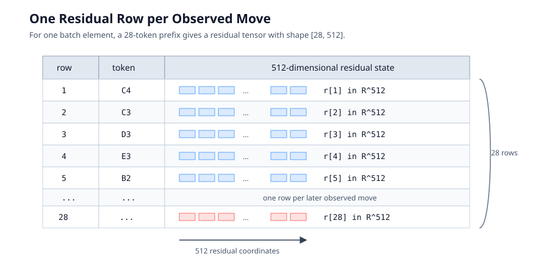

# Information Flow Through a Transformer

Chapter 5 left us with an endpoint map.

We started from a semantic direction in the layer-4 residual stream. We asked how the later model transformed that direction into the final residual stream. In notation, the downstream computation looked like one function:

```text
layer-4 residual
    -> later attention and MLP blocks
    -> final residual
```

For a local context \(x\), the Jacobian \(J_x\) told us how a tiny source-space direction \(v\) would appear after this downstream transformation. That was useful. It gave us a way to talk about semantic directions after the model had processed them.

But it also hid the machinery.

The phrase "later attention and MLP blocks" contains almost everything we eventually care about. It contains residual connections, attention heads, normalization, nonlinear MLPs, and many possible paths by which board-state information might become move-relevant evidence. The Jacobian told us how an arrow deforms after passing through this machine. It did not tell us which internal operations produced the deformation.

This chapter opens that box.

The question is:

```text
Which operations in the Transformer can retrieve information,
combine information, transform information, and write new information
back into the shared state?
```

This is not yet a chapter about a discovered Othello legality circuit. We will not identify the winning layer. We will not rank heads or neurons. We will not say which component turns board state into capture-line evidence. The purpose here is more basic and more durable: understand the architecture well enough that later experiments have places to attach.

## The Residual Stream First

It is tempting to begin a Transformer explanation with queries, keys, and values. That is where many tutorials start, because attention is the famous part.

For mechanistic work, the residual stream is the better starting point.

At one token position in Othello-GPT, the model carries a vector:

$$
r \in \mathbb{R}^{512}.
$$

Across a sequence of \(T\) move tokens, the residual stream is conceptually:

$$
R \in \mathbb{R}^{T \times 512}.
$$

Each row corresponds to one token position. Each row contains a 512-dimensional residual state. If the prefix has 28 moves, the main residual tensor for one batch element has 28 rows, one for each observed move token.

<figure markdown>

<figcaption>
A table-style view of the residual stream for one batch element. The prefix contributes one row per observed move token, and each row is a 512-dimensional residual vector.
</figcaption>
</figure>

A useful analogy is a shared working surface. Components read from it, compute updates, and write those updates back to the same surface. But the analogy needs restraint. There is no literal memory table with human-readable variables such as `D3_is_mine` or `E3_is_legal`. The residual stream is a learned vector space. Information can be distributed across directions, subspaces, and interactions among components.

The operational definition is:

```text
The residual stream is the common vector space through which successive
Transformer components communicate.
```

Each component reads from the current residual state and writes an update back into the same 512-dimensional space. That shared space is why a component output can be compared with a downstream gradient, why residual edits are possible, and why semantic directions from a probe can become handles for causal experiments.

<figure markdown>

<figcaption>
One verified Othello-GPT block in TransformerLens form. The block uses pre-normalization before attention and before the MLP. The attention and MLP outputs are 512-dimensional updates added into the residual stream.
</figcaption>
</figure>

The figure is the reference object for this chapter. It shows one block, indexed by \(l\). The residual state enters as \(r_\text{pre}\), attention writes an update, the MLP writes another update, and the result exits as \(r_\text{post}\). For consecutive blocks:

$$
r_\text{post}^{(l)} = r_\text{pre}^{(l+1)}.
$$

Layer numbers in this project are zero-based. Othello-GPT has eight transformer blocks:

```text
0, 1, 2, 3, 4, 5, 6, 7
```

So "layer 7" means the eighth and final transformer block. Likewise, the Chapter 2 probe at layer 4 uses zero-based block index 4, not the fourth block in ordinary one-based prose.

!!! info "Othello-GPT architecture"

    Transformer blocks: 8 (layers 0-7)  
    Residual width: 512  
    Attention heads per block: 8  
    Head width: 64  
    MLP hidden width: 2048  
    Activation: GELU  
    Output vocabulary: 61  
    Context length: 59  
    Normalization: TransformerLens `LNPre`

These are model configuration facts from the original `Othello_GPT.ipynb`, not experimental findings. The same source constructs the model with `HookedTransformerConfig` using `n_layers=8`, `d_model=512`, `d_head=64`, `n_heads=8`, `d_mlp=2048`, `d_vocab=61`, `n_ctx=59`, `act_fn="gelu"`, and `normalization_type="LNPre"`.

In this TransformerLens implementation, `LNPre` means the normalization modules perform the centering and scaling parts of LayerNorm without learned LayerNorm weights or biases. The relevant checkpoint has been converted into this representation. For our purposes, the important fact is simply that attention and the MLP read normalized versions of the residual stream before writing additive updates back into it.

The final readout follows the same source-level convention. After block 7 has produced the final residual stream, the model applies final `LNPre` normalization and then the unembedding matrix to produce move-token logits. So when a Chapter 4 experiment differentiates a layer-4 residual edit all the way to logits, the downstream function includes:

```text
blocks 5, 6, 7
    -> final LNPre normalization
    -> unembedding
    -> 61 move logits
```

When Chapter 5 instead asks for the final residual representation, the target is deliberately earlier: the final residual stream immediately before that final normalization and unembedding path. These two targets answer different questions. One asks how an internal direction affects output scores. The other asks what downstream residual-space direction the model locally produces before the final readout.

## The Block Equations

Now that the picture exists, the equations can be small.

Let \(r_l\) be the residual state entering block \(l\) at a fixed token position, while remembering that attention also sees all positions allowed by the causal mask. A simplified block computation is:

$$
a_l = \mathrm{Attention}_l(\mathrm{Norm}_1(r_l)),
$$

$$
r_l^\text{mid} = r_l + a_l,
$$

$$
m_l = \mathrm{MLP}_l(\mathrm{Norm}_2(r_l^\text{mid})),
$$

$$
r_{l+1} = r_l^\text{mid} + m_l.
$$

The names are:

```text
r_l
    residual state entering block l

a_l
    attention update

r_l^mid
    residual state after attention has been added

m_l
    MLP update

r_{l+1}
    residual state leaving the block
```

Neither attention nor the MLP replaces the residual state. They add to it.

That additive structure is one reason mechanistic decomposition is possible. A component output lives in the same 512-dimensional space as the residual stream it updates. We can cache it. We can compare it to a direction. We can ask what happens if we remove it or replace it.

But the additivity should not be mistaken for independence. The attention update \(a_l\) depends on the residual state \(r_l\). The MLP update \(m_l\) depends on \(r_l^\text{mid}\), which already includes the attention update. Later blocks depend on everything written before them. The outputs add; the computation that produced them is sequential and nonlinear.

<figure markdown>

<figcaption>
The residual stream can be viewed schematically as a running sum of component outputs in a common 512-dimensional space. This does not mean the outputs were computed independently.
</figcaption>
</figure>

If we ignore normalization and indexing details, the final residual state has the schematic form:

$$
r_\text{final}
=
r_\text{initial}
+
\sum_l a_l
+
\sum_l m_l.
$$

This identity is useful because it explains why component outputs are analyzable as residual-stream writes. It is also dangerous if read too literally. The term \(m_7\), for example, is not computed in isolation and then tossed into a bag. It is a context-dependent result of all previous residual updates flowing through attention, normalization, and the MLP.

!!! question "Pause and think"
    Why is the residual stream useful for component decomposition?

    Because many components write updates into the same dimensional space. That lets us compare their current outputs to the same downstream sensitivity directions. The comparison is useful, but it does not make the components independent.

## Token Positions Matter

The residual stream is not one vector for the whole game.

For a move prefix:

```text
D3 C3 B3 B2 B1 ...
```

there is a residual vector at each token position:

```text
move 1      move 2      move 3      ...      current move
  |           |           |                      |
512-D       512-D       512-D                  512-D
```

The model's next-token prediction is made from the current final token position. That is the row whose final residual state is normalized and passed through the unembedding to produce logits over the 61 move tokens.

Earlier positions still matter because attention can read them. A move played 20 turns ago can influence the current prediction if some attention operation, in this block or an earlier one, transfers useful information from that earlier position into the current residual row.

This is the bridge from residual streams to attention.

It also prevents a common interpretability mistake. When we say "the layer-4 residual stream contains board information," we must still specify which token position we mean. In the Chapter 2 probe, the activation is taken from the final token of each prefix:

```text
blocks.4.hook_resid_post[:, -1, :]
```

That slice produces one 512-dimensional vector per prefix. It is not an average over all moves. It is not the whole sequence representation. It is the residual state at the current position after block 4.

Other positions have their own residual vectors. A previous move position might contain information useful for later attention. A current position might contain an accumulated summary after several layers of attention have routed information into it. A mechanistic claim should keep those roles separate.

This matters especially in Othello. The token `C3` at position 2 is an observed move. The current final token position after a much longer prefix is where the model predicts what comes next. A later component can use information related to `C3` at the current position only if that information has been moved, copied, or reconstructed there through earlier computation. The architecture gives possible routes. It does not make position-specific information automatically global.

## Attention Mixes Information Across Positions

At the current move position, the model may need information that originated earlier in the transcript. Othello makes this especially concrete. A current legal move can depend on a piece placed many turns earlier, or on a piece that later flipped because of another move. The current token position does not receive a board image. Any useful board state must be constructed from the move history.

Attention is the part of a standard decoder-only Transformer block that can directly mix information across token positions.

MLPs do not directly look at other token positions. They act separately on each row of the residual stream. Attention can look across previous rows, subject to the causal mask.

Architecturally, the current position can do something like:

```text
earlier move positions
    -> attention
    -> 512-D update written into current residual position
```

The phrase "can do" matters. We are describing what the architecture permits, not what a specific head has been proven to do.

<figure markdown>

<figcaption>
Attention can route information from earlier move positions into the current position. The arrows show an architectural possibility, not a discovered Othello circuit.
</figcaption>
</figure>

For one attention head \(h\), using \(x_t\) for the normalized residual input at token position \(t\), the head forms:

$$
q_t = W_Q x_t,
$$

$$
k_s = W_K x_s,
$$

$$
v_s = W_V x_s.
$$

For Othello-GPT, each head has:

$$
q_t, k_s, v_s \in \mathbb{R}^{64},
$$

because `d_head = 64`.

The score from current position \(t\) to earlier position \(s\) is proportional to:

$$
\frac{q_t \cdot k_s}{\sqrt{64}}.
$$

After causal masking and softmax, the head takes a weighted sum of the value vectors from allowed positions. That result is then projected back into the model's 512-dimensional residual space through the output projection.

The useful decomposition is:

```text
Q/K
    help determine which positions receive attention weight

V/O
    help determine what vector is written when those positions are attended to
```

This language is helpful, but it is not a semantic guarantee. A query/key pattern is not automatically a human-readable search. A value vector is not automatically a clean fact. An output projection does not necessarily write one interpretable message.

Othello-GPT has 8 attention heads in each block. Each head uses 64-dimensional query, key, and value spaces. The head outputs are combined into the block's 512-dimensional attention update. Multiple heads can support different communication patterns, but we should not expect them to correspond to eight clean tasks.

!!! warning "Attention is evidence, not a circuit"
    A visually suggestive attention pattern is a hypothesis generator. Causal tests are still required.

This warning will matter later. If a head attends strongly to a capture-relevant token, that can be interesting. It does not establish that the attended information is the feature we think it is. It does not show that the head's output is important. It does not show that removing the head changes behavior. It does not show that the head implements an Othello rule.

Attention weights are routing weights. Mechanistic claims need more evidence.

There is another subtle point. Attention patterns are usually shown as probabilities over source positions. But the residual update from a head depends not only on those probabilities, but also on the value vectors at the attended positions and the output projection that maps the weighted value sum back into residual space. A head can put large weight on a position whose value vector contributes little to the downstream score we care about. Conversely, a moderate attention weight can matter if the value and output directions are strongly aligned with an important downstream sensitivity.

So a complete head-level story needs at least three ingredients:

```text
where the head attends
what vector it writes
what downstream computation does with that write
```

The attention map shows only the first ingredient directly.

!!! question "Pause and think"
    If a head attends strongly to `D3`, does that prove the head uses `D3`'s board state?

    No. The pattern tells us where attention weight went. It does not tell us what information was present in the value vector, what the output projection wrote, or whether that write mattered causally.

## The MLP Transforms One Position at a Time

After attention has written into the residual stream, the MLP reads the updated residual state at each token position independently.

For Othello-GPT, the MLP width is:

```text
512 -> 2048 -> 512
```

The input is a 512-dimensional normalized residual vector. The hidden layer has 2048 scalar activations. The output is a 512-dimensional vector that is added back into the residual stream.

Using TransformerLens's tensor orientation, the ordinary MLP has:

```text
W_in:  [512, 2048]
b_in:  [2048]
W_out: [2048, 512]
b_out: [512]
```

For one token position:

$$
p = x W_\text{in} + b_\text{in},
$$

$$
g = \mathrm{GELU}(p),
$$

$$
m = g W_\text{out} + b_\text{out}.
$$

The vector \(p\) contains 2048 preactivations. The vector \(g\) contains 2048 post-GELU activations. The vector \(m\) is the 512-dimensional residual update.

This architecture is interesting for rule-like computation because the MLP receives the current position's state after attention has had a chance to gather information. A useful architectural hypothesis is:

```text
attention:
    collect or route relevant information across positions

MLP:
    nonlinearly transform the collected information at the current position
```

That is only a hypothesis. It is not a claim that Othello-GPT's legality computation actually has this clean division of labor. Later experiments have to decide which components matter.

The nonlinearity is the main reason the MLP is more than a linear change of basis. If the MLP were only:

$$
m = x W_\text{in} W_\text{out},
$$

then it would apply one linear map to each token position. GELU changes the story. Different hidden units can turn on by different amounts depending on the input vector. That lets the MLP's effective transformation vary from context to context.

This is one way a position-wise module can participate in conditional computation. The MLP still does not inspect other positions directly. But once attention and earlier blocks have placed relevant information into the current residual row, the MLP can respond differently to different combinations of features already present in that row.

For an Othello legality computation, the relevant combination might involve several board facts: target emptiness, nearby opponent occupancy, and a friendly terminator somewhere along a ray. We are not claiming here that a particular MLP implements exactly that conjunction. The architectural point is narrower: a nonlinear position-wise MLP is a plausible place for relation-sensitive transformations after cross-position information has been routed into the current state.

!!! question "Pause and think"
    If the MLP is position-wise, how can its current-token computation depend on a move played 20 turns earlier?

    The needed information can already be present in the current residual row. Attention in the same block or earlier blocks can move information from earlier positions into that row before the MLP reads it.

## One MLP Neuron

The MLP can be decomposed into neuron-level contributions.

For hidden neuron \(j\):

$$
p_j = x W_{\text{in}[:,j]} + b_{\text{in},j},
$$

$$
g_j = \mathrm{GELU}(p_j),
$$

$$
\text{contribution}_j = g_j W_{\text{out}[j,:]}.
$$

Then the MLP output is:

$$
\mathrm{MLP}(x)
=
\sum_j g_j W_{\text{out}[j,:]}
+
b_\text{out}.
$$

This gives a useful read-gate-write intuition:

```text
input direction W_in[:, j]
    what direction tends to activate this neuron?

GELU nonlinearity
    how strongly is the neuron gated on?

output direction W_out[j, :]
    what direction does the active neuron write?
```

<figure markdown>

<figcaption>
One hidden MLP unit can be viewed as reading an input direction, passing through a nonlinear gate, and writing an output direction. This is an analysis frame, not a promise of one-neuron-one-concept semantics.
</figcaption>
</figure>

The qualification is essential. The fact that the MLP has 2048 hidden units does not mean there are 2048 symbols:

```text
neuron 1 = D3
neuron 2 = legal move
neuron 3 = capture line
...
```

Representations can be distributed. Several neurons can jointly implement one computation. One neuron can participate in several contexts. A neuron can have a strong output direction without being a clean detector for the feature we would like it to detect. A neuron can matter causally while still not corresponding to a neat symbolic variable.

This caution is not pessimism. It is the difference between a candidate mechanism and a finished explanation.

## One Block as Information Flow

We can now combine the pieces.

At the current token position, one Othello-GPT block can be read as:

1. The residual stream carries accumulated state.
2. Attention reads normalized residual states across allowed positions.
3. Attention writes a 512-dimensional update to the current position.
4. The residual stream now contains old state plus the attention update.
5. The MLP reads this updated current-position state after normalization.
6. The MLP performs a 512-to-2048-to-512 nonlinear transformation.
7. The MLP writes another 512-dimensional update.
8. The next block receives the result.

<figure markdown>

<figcaption>
Within one block, attention can route information across positions, while the MLP transforms the resulting current-position residual state. The semantic labels are illustrative.
</figcaption>
</figure>

For Othello, this gives a plausible architectural pathway:

```text
move history
    -> attention can gather position-dependent information
    -> current residual state
    -> MLP can transform combinations already present there
    -> updated residual state
```

Again, this is not an established circuit. It is a map of where a circuit might live.

## Paths Through Multiple Blocks

Chapter 5's downstream map began at `blocks.4.hook_resid_post` and continued through the remaining transformer blocks. Since there are eight blocks total, that means later computation can involve:

```text
attention 5
MLP 5
attention 6
MLP 6
attention 7
MLP 7
```

with residual connections between all stages.

An effect introduced at layer 4 can therefore travel in at least two broad ways.

First, it can persist directly through residual connections. If a direction is present in the residual stream after layer 4, later residual additions do not automatically erase it. Some component outputs may rotate, amplify, or cancel parts of it, but the identity path is always part of the block-level story.

Second, it can have indirect effects because later components respond differently to the changed state. If we add a tiny semantic direction at layer 4, attention in layer 5 may compute different scores or values. The MLP in layer 5 may receive a different normalized input. That changed MLP output then changes what layer 6 sees, and so on.

This is why J-space had both shared and context-dependent geometry. A semantic direction does not need to be explicitly rewritten at every layer to survive. The residual path can preserve part of it while components modify other parts. At the same time, because components read the current residual stream, the effect can branch into context-dependent downstream updates.

The chain rule gives the formal version.

If the downstream function is roughly the composition of blocks 5, 6, and 7:

$$
F = F_7 \circ F_6 \circ F_5,
$$

then its local Jacobian is a product of local Jacobians:

$$
J_F = J_7 J_6 J_5,
$$

where each factor is evaluated at the intermediate activation produced in this specific context.

The meaning is simpler than the notation. A small direction leaving layer 4 is transformed by layer 5. That transformed direction becomes the input perturbation to layer 6. Layer 6 transforms it again. Layer 7 transforms it again. Chapter 5 collapsed this sequence into one endpoint map. Chapter 6 shows the intermediate places where we can inspect the path.

Residual connections also appear inside local Jacobians. If a simple block were:

$$
r_\text{out} = r_\text{in} + f(r_\text{in}),
$$

then:

$$
J_\text{block} = I + J_f.
$$

The identity term \(I\) corresponds to the residual skip. It says that part of a small perturbation can pass through unchanged, while another part is transformed by the component \(f\). The actual transformer block is more involved because attention and MLP sublayers are composed and the MLP reads the attention-updated residual state. So we should not write the full block derivative as a simple independent sum of attention and MLP Jacobians. The reliable intuition is: residual connections add identity paths to the local transformation.

!!! question "Pause and think"
    If \(r_\text{out}=r_\text{in}+f(r_\text{in})\), what role does the identity term play in the Jacobian?

    It represents the direct residual path. A small perturbation can partly persist even before considering how the component \(f\) responds to that perturbation.

## TransformerLens Hooks as Instruments

Architecture becomes experimental only when we can measure and intervene at specific points.

TransformerLens gives us named hook points inside each block:

<figure markdown>

<figcaption>
Core hook points used in this project. Each records a tensor with shape `[batch, pos, 512]` for this Othello-GPT model.
</figcaption>
</figure>

The most important hooks for this chapter are:

| Hook | What it records |
| --- | --- |
| `hook_resid_pre` | residual stream before the block's attention sublayer |
| `hook_attn_out` | attention output that will be added to the residual stream |
| `hook_resid_mid` | residual stream after the attention update has been added |
| `hook_mlp_out` | MLP output that will be added to the residual stream |
| `hook_resid_post` | residual stream after the full block |

These hooks let us ask practical questions:

```text
What does the residual contain before this block?
What did attention write?
What does the residual contain after attention?
What did the MLP write?
What survives after the full block?
```

They also let us define the functions used by Jacobian and intervention experiments. A hook is a research instrument. It is not an extra component the trained model uses during ordinary inference.

## Component Decomposition

Suppose we care about a scalar score \(S\) downstream. Later chapters will define scores related to move legality, but for now \(S\) can be any differentiable scalar quantity computed after a component writes to the residual stream.

At some residual site, compute:

$$
g = \nabla_r S.
$$

This gradient is a local sensitivity direction. It tells us how a tiny residual edit would change the score \(S\), to first order.

Now take a component output \(c\), such as one attention head's residual write or an MLP output. Because \(c\) lives in the residual stream's 512-dimensional space, we can compute:

$$
g^\top c.
$$

This is an attribution-style quantity. It asks whether the component's current output points along a direction that locally increases or decreases the score.

Large magnitude can be useful. It can rank candidate components. It can suggest where to look next. It can connect a component's output to a downstream sensitivity direction.

But it is not the same as removing the component and watching the full model respond.

<figure markdown>

<figcaption>
Attribution and ablation answer different questions. Attribution uses the current component output and a local gradient. Ablation changes the computation and reruns the model under a chosen replacement baseline.
</figcaption>
</figure>

Attribution asks:

```text
Given the current activation and local downstream gradient,
how aligned is this component's output with the score?
```

Its advantages are that it is cheap, directional, and useful for ranking candidates. Its limitations are that it is local and first-order. It does not fully account for nonlinear downstream responses, compensation, or the effect of changing the model's state.

Ablation asks:

```text
What happens if we remove, replace, or disrupt this component and rerun
the network?
```

Its advantage is that it is interventional. Its limitations are different. Ablation can create unnatural states. The result depends on the replacement baseline. Removing a component can affect many features at once. A strong ablation effect shows that a component matters under that intervention; it does not, by itself, identify the algorithm the component implements.

There is also no single operation called "ablation." Common variants include:

- replacing a component output with zero
- replacing it with a mean activation
- patching in an activation from another example
- replacing selected heads or selected MLP neurons

Different baselines answer different questions. A zero ablation asks what happens without this write under an artificial zero baseline. A mean ablation asks what happens when the component is made more typical. Activation patching asks what changes when a corresponding activation from another context is substituted. Neuron ablation asks about a selected subset inside a component.

!!! question "Pause and think"
    If an MLP output has large gradient attribution to a score, what extra experiment would strengthen the causal claim?

    An ablation, patching, or other intervention that changes the component and reruns the downstream model would give stronger causal evidence. The result would still need careful interpretation.

Ablation is not identification. If removing an MLP damages legality-related behavior, that tells us the MLP matters under the chosen intervention. It does not immediately tell us what computation it performs, which inputs it used, whether attention supplied those inputs, whether the effect is specific to capture structure, or whether another component could compensate under a different intervention.

This is the same evidence ladder from earlier chapters. Decodability is not use. Local causal relevance is not a complete mechanism. Component importance is not an algorithm.

## The Next Layer Question

We now know what kinds of components could carry the computation.

The model has eight blocks. Our board probe was trained at layer 4. The J-space map in Chapter 5 continued from layer 4 through layers 5, 6, and 7 to the final residual stream. That setup tells us there is downstream computation worth opening, but it does not tell us where board-state geometry becomes especially relevant for choosing legal moves.

This produces a natural experimental strategy:

```text
repeat similar semantic and causal measurements at several layers
```

For example, we might inspect:

```text
layer 2
layer 4
layer 6
layer 7
```

Would we expect early layers to emphasize move-history encoding? Would middle layers carry board-state representation? Would late layers transform board state into decision- or rule-related evidence? Those are hypotheses, not conclusions.

<figure markdown>

<figcaption>
Questions to test, not measured results. The layer sweep asks where board-state information becomes especially relevant to move legality.
</figcaption>
</figure>

The point of this chapter is that the sweep now has meaning. A layer is not just a number. It is a collection of hookable residual states, attention writes, MLP writes, and possible paths through later computation.

If a legality-related effect is stronger at one layer than another, we can ask what changed in the residual stream. If a component has high attribution, we can ask whether ablation supports causal importance. If an attention pattern looks suggestive, we can test whether the head's output matters. If an MLP neuron appears important, we can ask what activates it and what it writes.

That is how the architectural map becomes an experimental program.

## What We Learned

The residual stream is the shared communication space of the model. In Othello-GPT, each token position carries a 512-dimensional residual vector. Attention and MLP components read from this state and add 512-dimensional updates back into it.

Attention is the component that can directly mix information across token positions. One head uses 64-dimensional query, key, and value vectors; the model has eight heads per block. Attention patterns can suggest possible information routes, but they do not establish mechanisms by themselves.

The MLP is position-wise. It maps 512 dimensions to 2048 GELU activations and back to 512 dimensions. A neuron can be analyzed as reading an input direction, passing through a nonlinear gate, and writing an output direction, but 2048 neurons do not imply 2048 clean symbols.

Residual additions make decomposition possible but not trivial. Component outputs add in a common space, while the computations that produce those outputs remain nonlinear and sequential. The local Jacobian of a residual block includes an identity path, but the full block derivative must respect the composition of attention, residual addition, normalization, and MLP.

TransformerLens hooks turn this architecture into something measurable. `hook_resid_pre`, `hook_attn_out`, `hook_resid_mid`, `hook_mlp_out`, and `hook_resid_post` give us places to cache activations, insert edits, measure component outputs, compute gradients, and design ablations.

The central evidence distinction is now clear:

```text
attribution
    local alignment between a component output and downstream sensitivity

ablation
    intervention that changes a component and reruns the model
```

Both are useful. Neither should be described as the other.

## Try It Yourself

1. Dimensions: for sequence length 28 and `d_model = 512`, what is the residual tensor shape for one batch element? What if the batch size is 16?
2. Attention: with 8 heads and `d_head = 64`, explain how the head dimensions relate to `d_model = 512`.
3. MLP: using the TransformerLens orientation in this chapter, give the shapes of `W_in`, `b_in`, `W_out`, and `b_out`.
4. Residual sum: starting from \(r_0\), write the schematic residual sum after two blocks, ignoring normalization details.
5. Information flow: explain how a token-wise MLP can nevertheless use information from many earlier moves.
6. Jacobian: if \(r_\text{out}=r_\text{in}+f(r_\text{in})\), derive \(J_\text{out}=I+J_f\).
7. Evidence: explain why attention visualization and head ablation answer different questions.
8. Advanced: use TransformerLens hooks to cache `resid_pre`, `attn_out`, `resid_mid`, `mlp_out`, and `resid_post` for one Othello prefix. Numerically verify that `resid_mid = resid_pre + attn_out` and `resid_post = resid_mid + mlp_out`, allowing for ordinary floating-point tolerance.

## The Next Mystery

We have opened the downstream Transformer conceptually. We know what components could carry information. We know where to place our instruments. We know why residual decomposition is useful, why attention patterns are not causal proof, and why attribution and ablation answer different questions.

But we still do not know where in the eight-block stack the board stops looking merely like state and begins looking especially like evidence for legal moves.

So the next experiment sweeps the layers.

The result is not uniform.

Chapter 7: The Mystery of Layer 7.

## References

- Original model source: `demos/Othello_GPT.ipynb` in `diegovalverde/TransformerLens`, branch `othello-jspace-analysis`.
- Executed experiment notebook: `demos/Othello_GPT_Jacobian_Lens.ipynb` in `diegovalverde/TransformerLens`, branch `othello-jspace-analysis`.
- Project research memory: [model architecture](../research/model_architecture.md), [research log](../research/research_log.md), [experiment index](../research/experiment_index.md), [findings snapshot](../research/findings_snapshot.md), and [provenance](../research/provenance.md).
- TransformerLens source files used for architecture verification: `transformer_lens/components/transformer_block.py`, `transformer_lens/components/mlps/mlp.py`, `transformer_lens/components/layer_norm.py`, and `transformer_lens/HookedTransformer.py`.
