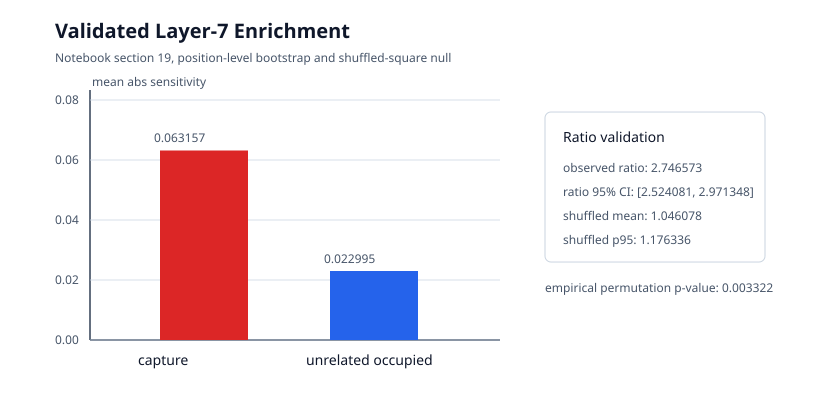

# The Mystery of Layer 7

At the end of Part II, the question changed.

In Part I, we asked whether Othello-GPT had board-state information inside it at all. A linear probe told us yes, with the important qualification that decodability is not use. In Part II, we learned how to turn that representation into a causal object. We used semantic directions from the board probe, measured local gradients, checked small residual interventions against Jacobian predictions, and asked how a direction could be transformed by later layers.

That machinery gives us a sharper question than "does the model know the board?"

The sharper question is:

```text
where does board state become rule-relevant evidence?
```

Othello legality is not a property of one square by itself. It is a relationship among squares. A target square must be empty. In at least one direction from that target, there must be a contiguous line of opponent discs. At the far end of that line, there must be a friendly disc. Only then does the target become a legal move.

So if the model is using board state to predict legal moves, somewhere in the network a static board-like representation has to become sensitive to this relational structure:

```text
empty target
    opponent line
    friendly terminator
```

This chapter is the first attempt to find where that happens.

The result is not where the earlier chapters might have led us to look first. Layer 4 was the natural home for the board probe. The board is highly decodable there. The Jacobian intervention examples in Chapters 4 and 5 also began there. But the strongest legality-specific evidence in the executed notebook does not appear at layer 4.

It appears at layer 7.

Layer 7 is the eighth and final transformer block in this zero-based model. That makes the result intriguing but also dangerous to overread. We have not yet found a complete circuit. We have not proved that layer 7 contains a symbolic Othello rule. We have found something narrower and more useful: in the layer sweep, capture-line squares become much more selectively aligned with the model's legality contrast at layer 7 than at layers 2, 4, or 6.

The chapter is about how that result emerged. It should feel less like a treasure map and more like an investigation that first looked in the obvious place and got a disappointing answer.

## Why Raw Move Logits Were the Wrong Target

The first impulse is simple. Pick a legal move, compute its logit, and ask which board-square directions increase that logit.

We already did a version of this in Chapter 4. For the concrete analysis prefix, the selected legal move was:

```text
E3
```

The move was not chosen because it was the model's top move. The model's favorite move on that prefix was `E8`. `E3` was useful because it had a clean capture ray:

```text
E3 target
D3 opponent
C3 opponent
B3 friendly terminator
```

This gives us a human-readable rule structure to compare against the model's internal sensitivities.

But a raw move logit is a mixed object. A high logit for `E3` can mean several things at once:

- `E3` is legal.
- `E3` is strategically attractive among legal moves.
- `E3` resembles moves that often occur in the training distribution.
- The model has some broader contextual preference for that coordinate.
- The final readout happens to favor `E3` for reasons not specific to legality.

If we differentiate the raw `E3` logit, we are asking:

```text
what locally increases the model's score for E3?
```

That is not the same as asking:

```text
what locally supports E3 being legal rather than illegal?
```

The distinction matters because the Othello rule is about legality. Once a move is legal, a model trained on human or generated game transcripts may still prefer one legal move over another. That preference can depend on strategy, game phase, or policy-like tendencies. If our target mixes legality with preference, then square sensitivities may point to features that explain why the model likes `E3`, not why it treats `E3` as legal.

So the notebook introduced a more rule-specific scalar.

## A Legality Contrast

Let \(z_m\) be the output logit for a selected legal move \(m\). Let \(I\) be the set of currently illegal empty-square move tokens. The legality contrast is:

$$
L_m^{\text{legality}}
=
z_m
-
\operatorname{mean}_{j \in I} z_j.
$$

Read this as: how far above the average illegal empty-square move does the selected legal move sit?

The set \(I\) is important. It includes empty board squares that are currently illegal moves. It excludes occupied squares, because a model can learn not to play occupied squares for reasons that are partly about occupancy rather than capture legality. It excludes the four starting center squares, because those squares are not move tokens in this vocabulary. It also excludes `pass`.

The executed notebook also tracked a second contrast:

$$
L_m^{\text{legal-pref}}
=
z_m
-
\operatorname{mean}_{j \in \mathcal{L}\setminus\{m\}} z_j,
$$

where \(\mathcal{L}\) is the set of current legal moves. This second quantity asks whether the chosen legal move is preferred among other legal moves. It is useful as a diagnostic, but it is not the main target in this chapter. The legality contrast is the more direct attempt to isolate legal-vs-illegal separation.

For the concrete `E3` example, the executed notebook reported:

| Quantity | Value |
| --- | ---: |
| Raw `E3` logit | 8.9408 |
| Mean illegal empty-square logit | -1.5438 |
| Mean other-legal logit | 8.9298 |
| Legality contrast | 10.4845 |
| Legal-preference contrast | 0.0110 |
| Rank among all output tokens | 4 |
| Rank among current legal moves | 4 |
| Illegal empty-square tokens in contrast | 23 |

The numbers say something simple. `E3` is far above the illegal empty-square baseline. But it is not especially preferred over the other legal moves; its legal-preference contrast is only about `0.0110`. That is exactly the kind of situation where a legality contrast helps. The raw logit is large. The legal-vs-illegal separation is large. The within-legal preference is small.

So now we have a scalar target that better matches the rule question.

Instead of differentiating \(z_{E3}\), differentiate \(L_{E3}^{\text{legality}}\).

## Which Board Squares Should Matter?

For a selected move, the Othello rule gives us a prediction about which squares should matter.

For `E3`, the relevant line is:

```text
E3 -> D3 -> C3 -> B3
```

The target `E3` must be empty. The first two squares along the line, `D3` and `C3`, must be opponent discs. The far square, `B3`, must be a friendly terminator. If either opponent square were missing, the line would break. If the terminator were not friendly, the line would not make `E3` legal.

The board probe gives us semantic directions for individual square states. For an occupied square \(q\), the mine-vs-theirs direction is:

$$
v_{q,\text{mine-vs-theirs}}
=
W_{q,\text{mine}} - W_{q,\text{theirs}}.
$$

Here \(W\) is the trained probe's weight tensor. As in earlier chapters, this is an operational semantic direction, not a named internal variable guaranteed to be used by the model.

Now compute the gradient of the legality contrast with respect to the residual stream at a chosen layer:

$$
g_m^{\text{legality}}
=
\nabla_{h_{\ell,t}} L_m^{\text{legality}}.
$$

The layer is \(\ell\). The token position is the current final prefix token \(t\). The source hook in the first version of the experiment was the same kind of residual hook we used earlier:

```text
blocks.4.hook_resid_post
```

Projecting the gradient onto a semantic square direction gives:

$$
S_{\ell,q}
=
v_{q,\text{mine-vs-theirs}}^\top
g_m^{\text{legality}}.
$$

This is a local first-order sensitivity. If \(S_{\ell,q}\) is large in magnitude, then a small residual edit along that square's mine-vs-theirs probe direction has a relatively large predicted effect on the legality contrast. Since the sign depends on direction conventions and on whether a square should become more mine-like or more theirs-like, much of the aggregate analysis uses absolute values:

$$
|S_{\ell,q}|.
$$

The concrete `E3` example gave an encouraging but messy first look.

| Square | Role | Layer-4 mine-vs-theirs sensitivity | Absolute rank |
| --- | --- | ---: | ---: |
| `D3` | capture-line opponent, distance 1 | 0.023003 | 10 |
| `C3` | capture-line opponent, distance 2 | 0.039680 | 3 |
| `B3` | friendly terminator, distance 3 | 0.011548 | 31 |

`C3` ranked third by absolute legality sensitivity. `D3` ranked tenth. Those are not tiny effects. They suggest the legality contrast is paying attention to squares that a human rule-checker would also name.

But the table is not clean enough to declare victory.

The top ten layer-4 squares also included several unrelated squares. The highest absolute sensitivity was `B6`, an unrelated empty square. `G6`, `F6`, `C5`, and `F1` were unrelated occupied squares under the role labeling used by the notebook. This does not make the capture-line result meaningless. It does mean the single example is not a mechanism.

There are many possible reasons. The probe directions could mix correlated board features. Nearby and distant squares can be statistically related through game history. A legal move's probability can depend on strategic or distributional context. The model may also use a more distributed representation than the square-by-square directions expose.

So the next step was forced:

```text
repeat the measurement across many positions
```

## The First Aggregate Test Was Disappointing

The notebook sampled mid-game prefixes and chose a legal move with a nontrivial capture line in each position. The sampling procedure used random legal Othello games, prefix lengths between `12` and `45`, and a fixed legality random seed. It skipped duplicate prefixes. For each sampled position, the chosen move had at least one capture line and at least two flipped pieces, selected by maximizing flipped pieces, then number of capture lines, then lower token id.

For each position, the notebook computed the legality gradient and projected it onto semantic board directions. Then it grouped squares into categories:

- opponent pieces on true capture lines
- friendly terminators supporting those lines
- unrelated occupied controls
- unrelated empty controls
- nearby irrelevant controls

The key point is that the summary was not just a pool of unrelated square values. The statistical test used per-position aggregates and bootstrap resampling across positions, because many squares from the same board are correlated. Treating every square as an independent data point would overstate the evidence.

At layer 4, the raw category means did not give the clean story we wanted.

| Category | Count | Mean absolute sensitivity | Median |
| --- | ---: | ---: | ---: |
| unrelated occupied | 1085 | 0.028870 | 0.018428 |
| capture terminator | 101 | 0.026124 | 0.016780 |
| capture opponent | 205 | 0.024721 | 0.019021 |
| nearby irrelevant | 595 | 0.019139 | 0.011985 |
| unrelated empty | 1618 | 0.016610 | 0.010984 |

This was not the expected pattern. If the layer-4 board directions were already organized as clean legality evidence, we might expect capture opponents to stand clearly above unrelated occupied controls. They did not. The unrelated occupied mean was higher.

The per-position test was also weak:

| Metric | Value |
| --- | ---: |
| mean(capture - unrelated occupied) | -0.000499 |
| bootstrap 95% CI lower | -0.003646 |
| bootstrap 95% CI upper | 0.002784 |
| mean capture/unrelated ratio | 1.118791 |
| mean shuffled capture/unrelated ratio | 1.038956 |

The confidence interval crosses zero. The mean difference is slightly negative. The ratio is above one, but the shuffled ratio is also above one. This is not a robust layer-4 enrichment result.

It would be easy to hide this result because the later layer-7 result is cleaner. That would make the investigation less honest. The weak layer-4 aggregate is one of the most important moments in the chapter.

It tells us that decodable board state and local square sensitivity are not enough. The model can carry a board-like representation at layer 4, and individual capture squares can have noticeable legality-gradient projections there, while the dataset-level rule-specific signal remains inconclusive.

That is a real conceptual distinction:

```text
board state decodable at a layer
    !=
capture-line legality enriched at that layer
```

The first statement is about representation. The second is about whether the model's local output sensitivity is selectively concentrated on the squares that make a chosen move legal.

Layer 4 looked good for representation. It did not yet look like the place where the rule became clean.

!!! question "Pause and think"
    If a layer has excellent board-probe accuracy but weak capture-line enrichment, what hypotheses remain open?

    The board information may not yet be transformed into legality evidence. The semantic directions may not align with the downstream computation. The aggregation may be too noisy. Or the model may use the information later, after additional transformations.

## Path Structure, Not Just Square Lists

The first aggregate test grouped squares by role. But the Othello rule is not merely:

```text
these squares are important
```

It is:

```text
these squares form a path from the target
```

For `E3`, the path is visible:

```text
distance 1: D3, opponent
distance 2: C3, opponent
distance 3: B3, friendly terminator
```

More generally, a legal move can have capture lines in several directions. A path-sensitive computation might care about distance from the target, whether the line is contiguous, and whether the terminal square has the right owner.

So the notebook also grouped sensitivity by distance along capture directions and compared it to noncapture directions at the same distances. This is a more structured question than "are capture squares high on average?"

The executed summary at this stage still did not reveal a strong standalone distance story:

| Kind | Distance | Mean absolute sensitivity | Count |
| --- | ---: | ---: | ---: |
| capture opponent | 1 | 0.024515 | 101 |
| capture opponent | 2 | 0.024711 | 58 |
| capture opponent | 3 | 0.024890 | 29 |
| capture opponent | 4 | 0.024809 | 16 |
| capture opponent | 5 | 0.039739 | 1 |
| capture terminator | 2 | 0.023909 | 43 |
| capture terminator | 3 | 0.020419 | 29 |
| capture terminator | 4 | 0.039229 | 13 |
| capture terminator | 5 | 0.033058 | 15 |
| capture terminator | 6 | 0.012466 | 1 |
| noncapture control | 1 | 0.019686 | 236 |
| noncapture control | 2 | 0.018792 | 142 |
| noncapture control | 3 | 0.018485 | 92 |
| noncapture control | 4 | 0.022473 | 58 |
| noncapture control | 5 | 0.023184 | 33 |

The capture opponent means are a bit higher than noncapture controls at several distances, but the pattern is not decisive. Some bins are small. The distance-5 capture-opponent bin has only one example. Terminator means vary. The result is suggestive at best.

This is where the layer question becomes unavoidable.

Maybe the problem was not the score. The legality contrast was better than a raw logit. Maybe the problem was not the square grouping. Capture lines and terminators were the right rule objects. Maybe the problem was the layer.

Layer 4 may be where board state is readable. But legality may be computed later.

## Sweeping the Layers

Othello-GPT has eight transformer blocks, indexed `0` through `7`. A full layer-by-layer study would be expensive, so the notebook used a restricted sweep:

```text
LEGALITY_LAYER_SWEEP = [2, 4, 6, 7]
```

For each layer in the sweep, the notebook trained a lightweight linear board probe at that layer. The probe was trained for `8` epochs, using the same kind of mine/theirs/empty target as before. It then constructed semantic directions from that layer's probe weights and repeated the legality-gradient analysis at that layer.

The score for each layer was:

$$
R_\ell
=
\frac{
\operatorname{mean}_{q \in \text{capture}} |S_{\ell,q}|
}{
\operatorname{mean}_{q \in \text{unrelated}} |S_{\ell,q}| + \epsilon
}.
$$

Here \(S_{\ell,q}\) is the legality-gradient projection onto the layer-\(\ell\) semantic direction for square \(q\). The numerator uses capture-supporting squares. In the layer sweep implementation, this capture set used the union of capture-line opponent squares and friendly terminators. The denominator uses unrelated occupied controls. The small \(\epsilon\) prevents division by zero.

The result was the pivot of the chapter.

<figure markdown>

<figcaption>
Layer sweep from the executed notebook, section 17. Layer 7 has much stronger capture-vs-unrelated enrichment even though its lightweight probe accuracy is lower than layer 4.
</figcaption>
</figure>

| Layer | Probe validation accuracy | Capture-vs-unrelated ratio | Capture-minus-unrelated |
| ---: | ---: | ---: | ---: |
| 2 | 0.883759 | 1.076216 | -0.000256 |
| 4 | 0.952699 | 1.098189 | -0.000439 |
| 6 | 0.891667 | 1.006662 | -0.000596 |
| 7 | 0.850000 | 2.251362 | 0.026569 |

Layer 7 was qualitatively different.

Layers 2, 4, and 6 had ratios close to one. Their mean capture-minus-unrelated differences were slightly negative. Layer 7 had a ratio of `2.251362` and a positive difference of `0.026569`.

The most interesting part of this table is not only that layer 7 is high. It is that layer 4 has better probe accuracy than layer 7 but far weaker legality enrichment.

Layer 4 probe validation accuracy in the sweep was `0.952699`. Layer 7 probe validation accuracy was `0.850000`. If we were measuring only "how readable is the board?", layer 4 would look better. But the legality enrichment score asks a different question: when we look at the gradient of a legality contrast, are capture-supporting square directions especially important compared with unrelated occupied controls?

On that question, layer 7 wins by a large margin.

This is the central lesson of the chapter:

```text
the most board-decodable layer need not be the most rule-relevant layer
```

That sentence is a bridge from representation to reasoning. A representation can be very readable before it has been transformed into the quantities that directly support a decision. Later layers can make the representation less linearly probe-friendly while making it more aligned with output-relevant rule structure.

This does not mean that layer 7 "knows the board better." It means that, under this legality-gradient measurement, layer 7's semantic square directions are much more selectively aligned with capture-line evidence.

## Why Probe Accuracy Can Fall While Relevance Rises

The layer-sweep table can feel counterintuitive at first. If layer 4 has better board-probe accuracy, why does layer 7 show stronger legality enrichment?

The answer is that probe accuracy and legality enrichment measure different properties.

A board probe asks:

```text
can an external linear readout recover each square's state?
```

The legality enrichment analysis asks:

```text
when the model separates a chosen legal move from illegal moves,
are the local sensitivities concentrated on the squares that make
the chosen move legal?
```

The first question rewards a clean, broadly readable board representation. The second rewards alignment with a task-specific scalar. A layer can be excellent for the first and only weakly specialized for the second.

One plausible picture is:

```text
middle layers:
    maintain board-state variables in a broadly decodable form

late layers:
    transform those variables into move-specific evidence
```

This is an interpretation, not a proven decomposition. The notebook does not show exactly how the transformation happens. It does not show which components write the layer-7 signal. It does not show whether attention supplies path information or whether the MLP constructs the relevant relation. Those are Chapter 8 and Chapter 9 questions.

But the table makes the next step rational. If we want to find rule-like computation, layer 7 is the place to inspect next.

!!! question "Pause and think"
    Suppose a late layer has lower board-probe accuracy but stronger legality-gradient enrichment. Does that mean the board representation was destroyed?

    Not necessarily. The representation may have been transformed into a form that is less optimized for an external square classifier but more useful for the model's own output computation.

## Validating the Layer-7 Result

A ratio can be misleading.

If the denominator is tiny, a ratio can look large even when the absolute difference is small. If a few outlier positions dominate, a mean ratio can exaggerate a fragile result. If the capture labels are correlated with some artifact of square identity or game phase, a naive comparison can fool us.

So the notebook reran the layer-7 analysis with more careful validation.

For each sampled position, it computed the layer-7 legality gradient for the chosen move. It projected that gradient onto the layer-7 semantic directions from the layer-7 probe. It collected absolute sensitivities for the same square categories as before. Then it evaluated the capture-opponent enrichment against unrelated occupied controls.

There are two subtle details here.

First, the final validation focused on capture opponents rather than the union of capture opponents and terminators. That is why the validated ratio differs from the layer-sweep ratio. The layer sweep used a broader capture-support set. The validation test focused on the opponent discs on actual capture lines.

Second, the bootstrap was done over position-level means. For each position, the notebook computed a capture-opponent mean and an unrelated-occupied mean. The bootstrap resampled positions, not individual squares. That keeps the uncertainty estimate closer to the true experimental unit.

The raw layer-7 distributions already looked different:

| Category | Count | Mean absolute sensitivity | Median |
| --- | ---: | ---: | ---: |
| capture opponent | 205 | 0.061847 | 0.044633 |
| nearby irrelevant | 595 | 0.037307 | 0.028864 |
| unrelated empty | 1618 | 0.032901 | 0.026925 |
| capture terminator | 101 | 0.022928 | 0.018961 |
| unrelated occupied | 1085 | 0.022898 | 0.018482 |

Capture opponents now stand well above unrelated occupied controls. Nearby irrelevant and unrelated empty squares are not zero, which is important. The model is not using only the two or three human-named capture squares. But the capture-opponent category is clearly elevated.

The position-level validation made the result much stronger:

<figure markdown>

<figcaption>
Validated layer-7 capture-opponent enrichment from the executed notebook, section 19. The bootstrap resamples positions, and the shuffled-square null permutes square labels within the layer-7 sensitivity maps.
</figcaption>
</figure>

| Metric | Value |
| --- | ---: |
| Capture mean | 0.063157 |
| Unrelated occupied mean | 0.022995 |
| Observed ratio | 2.746573 |
| Difference in means | 0.040162 |
| Difference 95% CI | [0.035965, 0.044268] |
| Ratio 95% CI | [2.524081, 2.971348] |
| Shuffled mean ratio | 1.046078 |
| Shuffled 95th percentile | 1.176336 |
| Empirical permutation p-value | 0.003322 |

This is the strongest Chapter 7 result.

The difference confidence interval is entirely positive. The ratio confidence interval is far above one. The shuffled-square null is near one, with a 95th percentile of `1.176336`, far below the observed ratio of `2.746573`. The empirical permutation p-value is `0.003322`.

The shuffled control is especially useful. It asks what happens if the sensitivity values are preserved but their square labels are permuted before comparing capture squares with unrelated occupied squares. If the observed result were a generic artifact of the distribution of sensitivities, or if random square assignments often produced a similar ratio, the shuffled ratios would often approach the observed ratio. They did not.

The careful interpretation is:

```text
at layer 7, legality-gradient sensitivity is strongly enriched on
opponent squares that lie on true capture lines
```

That statement is narrower than "layer 7 computes Othello legality." It does not identify the components. It does not prove an algorithm. But it is much stronger than the earlier layer-4 aggregate.

## What "Layer 7 Computes Legality" Means Here

The notebook section title asks:

```text
Which layer computes legality?
```

That is a useful experimental question, but the prose needs more careful language.

Layers do not compute in isolation. Layer 7 receives everything written by layers 0 through 6. Its attention and MLP sublayers read a residual stream already shaped by earlier computation. The final logits then depend on layer 7's output, final normalization, and the unembedding. A high layer-7 enrichment score does not mean layers 0 through 6 were irrelevant.

The result also does not mean all of legality is localized to layer 7. It means that when we choose the layer-7 residual stream as the intervention site, use layer-7 probe directions as semantic axes, and differentiate a move-specific legality contrast through the remaining computation, the local sensitivities are strongly enriched on true capture-line opponent squares.

That is a long sentence. It is worth keeping because each clause prevents a different overclaim.

The evidence supports:

```text
layer 7 is a privileged site for capture-line legality relevance
```

It does not yet support:

```text
layer 7 alone implements the Othello legal-move rule
```

The distinction is not wordplay. A full mechanism would need to answer questions the current chapter does not answer:

- Which layer-7 component writes the relevant evidence?
- Does attention carry information from previous move positions?
- Does the MLP transform board features into a relational legality feature?
- Is the target-empty condition represented in the same pathway?
- Are terminators handled by the same components as opponent-line squares?
- Does the same pattern generalize to all move families and game phases?
- Can interventions rescue or disrupt the computation in a way that traces a path?

Those are later questions. Chapter 7 earns the right to ask them.

## Why Capture Opponents Beat Terminators

One detail in the validated layer-7 distribution deserves attention. Capture opponents were strongly elevated. Friendly terminators were not.

In the layer-7 distribution table, capture terminators had mean absolute sensitivity `0.022928`, almost identical to unrelated occupied controls at `0.022898`. That does not mean terminators are unimportant in Othello. Symbolically, they are essential. Without the friendly terminator, the opponent line does not make the target legal.

So why might the model's layer-7 legality-gradient sensitivity concentrate more on opponent-line squares than on terminators?

Several possibilities remain open.

First, the terminator information may already be settled earlier. If the model has already established that a line terminates correctly, the late-stage marginal sensitivity might concentrate on the opponent run. A local gradient measures what would change the score near the current activation, not every fact that was necessary to produce that activation.

Second, the terminator feature may be represented in a direction not well captured by the simple layer-7 mine-vs-theirs probe direction. The probe's square directions are useful handles, but they are not guaranteed to align perfectly with the model's causal basis.

Third, terminator evidence may be more distributed. A friendly terminator at varying distances could be encoded as a path-level or move-level feature rather than as a square-local sensitivity. In that case, a square-by-square projection would understate its role.

Fourth, the analysis selected one type of contrast and one control category. A different score, intervention site, or matched path-control design might expose terminator effects more clearly.

The right conclusion is not "terminators do not matter." The right conclusion is that this particular layer-7 sensitivity analysis most clearly enriches on capture-line opponent squares. That is already an important clue about where to look, but it is not the whole Othello rule.

## The Role of Absolute Sensitivity

The aggregate analysis uses \(|S_{\ell,q}|\). That choice is practical but imperfect.

The sign of \(S_{\ell,q}\) depends on how the semantic direction is defined. Mine-vs-theirs is a contrast: moving in the positive direction makes the probe more likely to read "mine" rather than "theirs." For a capture-opponent square, the move is legal because the square is currently theirs. Depending on the exact contrast and downstream sign conventions, the legality-supporting direction may be positive or negative.

Absolute value asks whether the legality contrast is sensitive to that square-state direction at all. It does not ask whether the sign matches a particular symbolic intervention story.

This is appropriate for a first enrichment test. We are localizing where the legality contrast has large square-state sensitivities. But it leaves sign-specific questions unresolved. A stronger mechanistic account would eventually ask:

```text
does making an opponent-line square more opponent-like increase legality,
and does making it more mine-like or empty-like decrease legality?
```

The notebook contains later semantic intervention and component analyses, but those belong to the next chapters. Chapter 7's contribution is the layer-localization result, not a complete sign-resolved rule proof.

## Why This Is a Reasoning Chapter

Part III is called "From Representation to Reasoning." That phrase needs care.

Reasoning can sound like a claim about conscious deliberation or symbolic logic. We do not need that meaning. In this book, the shift from representation to reasoning means that we stop asking only whether the model carries board facts and start asking whether those facts are combined in rule-relevant ways.

The layer-7 result is the first strong evidence for that shift.

The board-probe result in Chapter 2 was a state result:

```text
given the move history, a linear readout can recover square states
```

The layer-7 enrichment result is closer to a rule-relevance result:

```text
given a selected legal move, the legality contrast is locally most
sensitive to opponent squares on the move's true capture lines
```

That second statement contains a relationship. The same square can be capture-relevant for one target and unrelated for another. A model cannot solve that by storing only a static list of occupied squares. It has to make the board facts interact with a candidate move and a direction from that move.

Again, we should not overclaim. The experiment does not prove the model implements the human algorithm. It does not identify a complete relational circuit. But it shows that the late residual geometry is no longer merely board-like. It is selectively aligned with a rule-defined relationship.

That is why layer 7 is mysterious. It is where the evidence starts to look less like "the board is represented" and more like "the represented board is being arranged around a legal-move computation."

## What Could Still Be Wrong?

Strong evidence is not perfect evidence. Several limitations remain.

The sampled dataset had `50` positions. That is enough to see a clear effect here, but it is not a complete sweep over Othello. Game phase, move type, line length, corner structure, edge structure, and multi-direction captures could all matter.

The layer sweep used only layers `2`, `4`, `6`, and `7`. It did not test every block. The result makes layer 7 stand out among the tested layers, but it does not tell us the full trajectory from layer 0 to layer 7.

The layer probes were lightweight probes trained for `8` epochs for runtime reasons. Their validation accuracies are useful diagnostics, but they are not optimized layer-by-layer probe studies. A different probe training setup might change the absolute accuracies. The layer-7 enrichment result is not simply a probe-accuracy result, but the semantic directions still depend on the trained probes.

The control set uses unrelated occupied squares. That is a reasonable control for mine-vs-theirs sensitivity because it compares occupied square-state directions against other occupied square-state directions. But there are many possible controls. A matched control could pair capture-line squares with noncapture squares at the same distance from the target, similar occupancy history, same region, or similar recency of modification.

The shuffled-square null is a good check against denominator artifacts and generic sensitivity distributions, but it is not a full causal pathway test. It says the observed square labels matter. It does not say which component creates the pattern.

Finally, the analysis is local and first-order. Gradients tell us how infinitesimal residual edits would affect the legality contrast near the current activation. They are stronger than probe correlations, but they are not the same as ablating a component or patching a path through the model.

These limitations do not erase the result. They define its boundary.

## What We Learned

The investigation began with a practical problem: raw move logits mix legality with move preference. The executed notebook therefore defined a legality contrast, comparing the selected legal move's logit against the mean logit of currently illegal empty-square moves.

For the concrete `E3` example, the legality contrast was `10.4845`: a raw `E3` logit of `8.9408` minus a mean illegal empty-square logit of `-1.5438`. The capture ray was `E3` target, `D3` and `C3` opponent squares, and `B3` friendly terminator. At layer 4, `C3` and `D3` had noticeable legality-gradient sensitivity, ranking third and tenth by absolute mine-vs-theirs sensitivity. But the single example was messy, with several unrelated squares also near the top.

The first dataset-level layer-4 test was weak. Capture-vs-control differences did not separate cleanly: mean(capture - unrelated occupied) was `-0.000499`, with bootstrap 95% CI `[-0.003646, 0.002784]`. That result kept the investigation honest. Board decodability at layer 4 did not imply clear rule-specific enrichment at layer 4.

The layer sweep changed the picture. Layers 2, 4, and 6 had capture-vs-unrelated ratios near one: `1.076216`, `1.098189`, and `1.006662`. Layer 7 had ratio `2.251362` and capture-minus-unrelated `0.026569`.

The validation test made the layer-7 result stronger. Capture-opponent mean sensitivity was `0.063157`, unrelated occupied mean sensitivity was `0.022995`, and the observed ratio was `2.746573`. The difference was `0.040162`, with bootstrap 95% CI `[0.035965, 0.044268]`. The shuffled-square null had mean ratio `1.046078`, 95th percentile `1.176336`, and empirical permutation p-value `0.003322`.

The conservative conclusion is:

```text
layer 7 is the first tested layer where capture-line opponent squares show
strong, validated enrichment in legality-gradient sensitivity
```

This is evidence for rule-relevant transformation, not a complete circuit.

## The Next Mystery

Layer 7 is not a primitive object. It is a transformer block.

Inside it are attention heads, an MLP, residual additions, normalizations, and thousands of learned parameters. The layer-7 enrichment result tells us where to look next. It does not tell us which part of the layer is responsible.

The next question is therefore more localized:

```text
within layer 7, which components actually matter for the legality contrast?
```

That question belongs to Chapter 8.

## Try It Yourself

1. Recompute the legality contrast for a chosen legal move by subtracting the mean logit over currently illegal empty-square moves. Why should occupied squares be excluded from the illegal baseline?
2. For the `E3` example, write out the capture ray and identify the target, opponent-line squares, and friendly terminator.
3. Explain why a raw move-logit gradient and a legality-contrast gradient can rank square directions differently.
4. Using the layer-sweep table, compare probe validation accuracy with capture-vs-unrelated ratio. Why does layer 4 look better by one metric and layer 7 by the other?
5. Design a matched control for capture-line opponent squares that controls for distance from the target.
6. Explain why the layer-7 shuffled-square null is a useful denominator-artifact check.
7. Advanced: repeat the enrichment analysis without taking absolute values, and separate signs according to whether the square is expected to support or oppose the selected move's legality.

## References

- Executed notebook: `demos/Othello_GPT_Jacobian_Lens.ipynb`, sections `11. A legality score instead of a raw move logit`, `12. Which board squares causally support legality?`, `15. Dataset-level legality relevance test`, `16. Path structure, not just square relevance`, `17. Which layer computes legality?`, and `19. Is the layer-7 legality enrichment real?`, on `diegovalverde/TransformerLens`, branch `othello-jspace-analysis`.
- Project research memory: [research log](../research/research_log.md), [experiment index](../research/experiment_index.md), [findings snapshot](../research/findings_snapshot.md), [model architecture](../research/model_architecture.md), and [provenance](../research/provenance.md).
- Chapter 7 measured figures: [chapter07_layer_sweep.svg](../figures/chapter07_layer_sweep.svg) and [chapter07_layer7_validation.svg](../figures/chapter07_layer7_validation.svg).
