# Seeing the Hidden Capture Rays

Look first. Do not start with the metric.

<figure markdown>
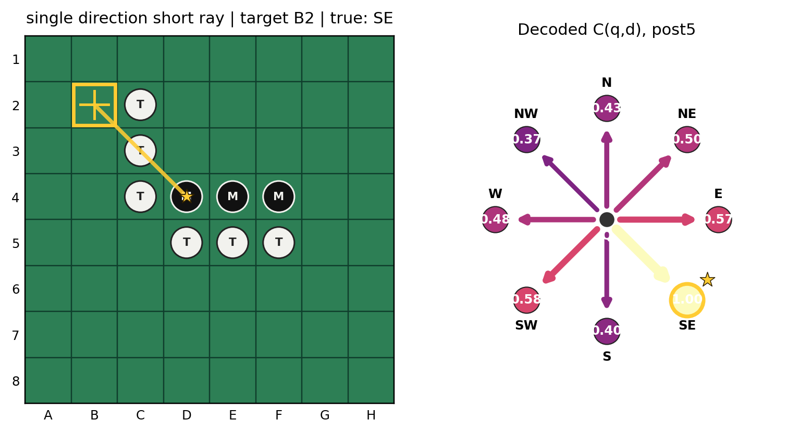
<figcaption>
Held-out short single-ray capture at target `B2`. The left panel shows the simulator board and the true `SE` capture ray. The right panel shows a linear-probe readout from `blocks.5.hook_resid_post`: each compass direction is an independently decoded probability for \(C(q,d)=1\), with the true direction highlighted.
</figcaption>
</figure>

The board is small. The question is not.

The highlighted target is `B2`. Othello asks whether placing a disc there would capture anything. In the southeast direction, the ray runs through opponent discs and reaches a friendly terminator. So the simulator says that direction is valid.

Now imagine erasing the compass. Give me only the model's hidden state at the final token of the move prefix: one vector with 512 numbers. No board object. No simulator. No explicit loop over directions.

Could a single linear map reconstruct that the valid ray from `B2` points southeast?

In this held-out example, yes. More surprisingly, the aggregate result says this is not a one-off. A linear directional decoder can recover the capture relation with very high accuracy from upstream residual states. That is a qualitative step beyond the board probe from Chapter 2.

The board probe asked unary questions:

```text
What occupies C3?
What occupies D3?
Is F6 empty?
```

This interlude asks a relational question:

```text
From target q, does direction d contain an opponent run followed by a friendly terminator?
```

That relation is closer to the rule of Othello than square occupancy is. It is also more dangerous to overinterpret. A probe can read a relation without proving that the network uses the probe direction as its native causal coordinate. The distinction from Chapter 3 still applies.

But the visual result is worth pausing over. From one residual-stream vector, a linear readout can reconstruct a directional capture graph over the board.

## How to Read the Compass

The figure has two jobs.

The left panel is ordinary Othello evidence. The green grid is the board. The highlighted square is the target being queried. White discs marked `T` are one player; black discs marked `M` are the other, in the relative mine/theirs convention used throughout the book. The gold ray is simulator ground truth: if the target were played, that direction would capture. Gold stars mark true valid capture directions.

The right panel is not the model's output distribution over moves.

It is an external probe readout. For a fixed target \(q\), the linear decoder emits eight independent probabilities, one for each direction:

```text
N, NE, E, SE, S, SW, W, NW
```

A bright arrow means:

```text
the residual state contains information that this trained linear decoder maps
to high probability that C(q,d)=1
```

It does not mean the model is consciously looking southeast. It does not mean a neuron arrow exists inside the network. It does not mean the compass is the model's algorithm. The compass is an instrument, like the board probe was an instrument.

The important new thing is what the instrument reads.

In Chapter 2, the probe was asked for square states. Here the target is the capture predicate:

$$
C(q,d)=1
$$

iff starting at an empty target square \(q\), and moving in direction \(d\), we encounter:

```text
one or more opponent pieces
followed by a friendly piece
```

Otherwise:

$$
C(q,d)=0.
$$

The simplest positive ray looks like this:

```text
target -> opponent -> opponent -> mine
```

A visually similar negative ray looks like this:

```text
target -> opponent -> opponent -> empty
```

The second ray contains opponent pieces, but it has no friendly terminator. It is not a legal capture direction. That distinction is exactly why the predicate is relational. No individual square alone determines it. The answer depends on an ordered pattern across several squares.

!!! question "Pause and think"
    If every individual square state is linearly decodable, does it automatically follow that the capture predicate must also be linearly decodable?

    No. The capture predicate is a nonlinear relation over multiple square states. The Transformer computation before the probe may make that relation linearly accessible, but it is not a direct consequence of square-wise decodability.

## More Than One Direction Can Be True

A target square is not choosing one of eight directions. Othello moves can capture along several rays at the same time.

<figure markdown>
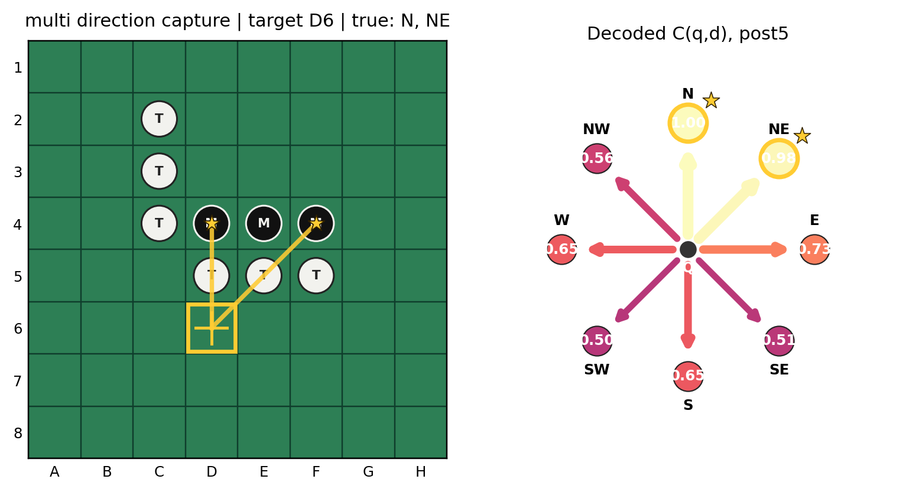
<figcaption>
Held-out multi-direction capture at target `D6`. The simulator marks true capture directions `N` and `NE`. The compass shows the `blocks.5.hook_resid_post` linear-probe probabilities for each direction, with both true directions highlighted.
</figcaption>
</figure>

This held-out example queries target `D6`. The simulator says there are two valid capture directions, `N` and `NE`. The probe assigns high probability to both.

That is why the directional decoder is not an ordinary eight-class softmax. It is a multi-label decoder:

$$
h \in \mathbb{R}^{512}
\quad\longrightarrow\quad
\left[p_N, p_{NE}, p_E, p_{SE}, p_S, p_{SW}, p_W, p_{NW}\right].
$$

Each output asks its own binary question:

```text
Does this direction satisfy the capture relation?
```

Two directions can be true. Three can be true. None can be true. The target-square/direction pair is the unit of supervision.

This matters because the representation being decoded is not merely "where is the move?" or "which direction is best?" It is closer to a small relational database over the current board: for this target and this direction, is the Othello capture clause satisfied?

## The Near-Miss Test

A probe that merely detects opponent pieces along a direction would look impressive on easy examples and fail on the rule.

So the hard cases are not random invalid rays. They are near misses.

<figure markdown>
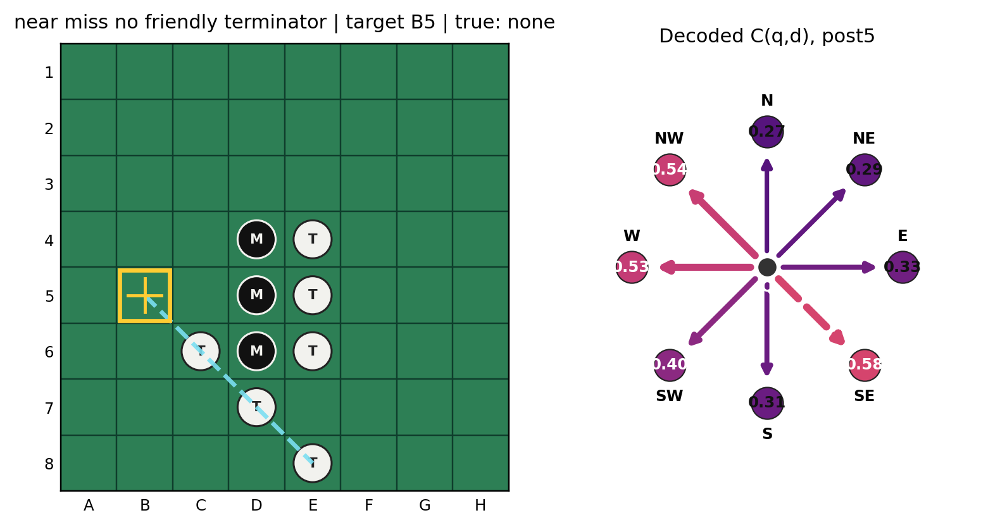
<figcaption>
Held-out no-terminator near miss at target `B5`. The dashed ray marks an opponent run that lacks a friendly terminator, so there is no true valid direction. The compass shows `blocks.5.hook_resid_post` linear-probe probabilities rather than model output probabilities.
</figcaption>
</figure>

The target is `B5`. There is an opponent run southeast from the target, but the ray does not end in a friendly terminator. The simulator says there is no valid capture direction here.

This is the case that separates "opponent nearby" from "valid Othello capture." If a decoder simply learned that opponent pieces in a direction are suspicious, it should light up the southeast direction as valid. The actual aggregate test explicitly compares valid capture directions against this no-terminator class.

There is another near-miss family as well:

<figure markdown>
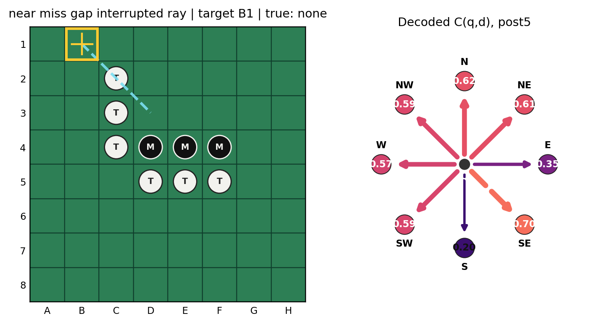
<figcaption>
Held-out interrupted-ray near miss at target `B1`. The selected direction is not a true capture direction because the ray structure is broken. This example was selected deterministically from held-out data before inspecting the linear-probe probabilities.
</figcaption>
</figure>

Here the visual evidence is again close to rule evidence without satisfying the rule. These examples keep the interpretation honest. They ask whether the decoded relation includes the terminator condition, not just local adjacency or opponent presence.

## The Quantitative Result

Now we can read the table.

The Section 47-48 experiment trained a linear directional probe for \(C(q,d)\) and evaluated it on held-out game-level test data. The visualized residual sites were:

| Site label | Hook |
| --- | --- |
| post4 | `blocks.4.hook_resid_post` |
| post5 | `blocks.5.hook_resid_post` |
| mid6 | `blocks.6.hook_resid_mid` |
| post6 | `blocks.6.hook_resid_post` |
| post7 | `blocks.7.hook_resid_post` |

Across all held-out valid targets, there were `13,701` target squares with at least one true capture direction. That number is targets, not games and not board positions.

| Site | Top-1 true-direction accuracy | Top-2 | Top-3 | Macro AUROC | Hard AUROC |
| --- | ---: | ---: | ---: | ---: | ---: |
| post4 | 98.29% | 99.76% | 99.94% | 0.9957 | 0.9601 |
| post5 | 98.38% | 99.72% | 99.90% | 0.9985 | 0.9905 |
| mid6 | 98.26% | 99.74% | 99.90% | 0.9984 | 0.9897 |
| post6 | 93.88% | 99.36% | 99.83% | 0.9972 | 0.9811 |
| post7 | 91.88% | 99.09% | 99.72% | 0.9974 | 0.9798 |

The hard AUROC is the important extra column. It compares true valid capture directions with opponent runs that have no friendly terminator. That is the near-miss distinction from the previous figure.

<figure markdown>
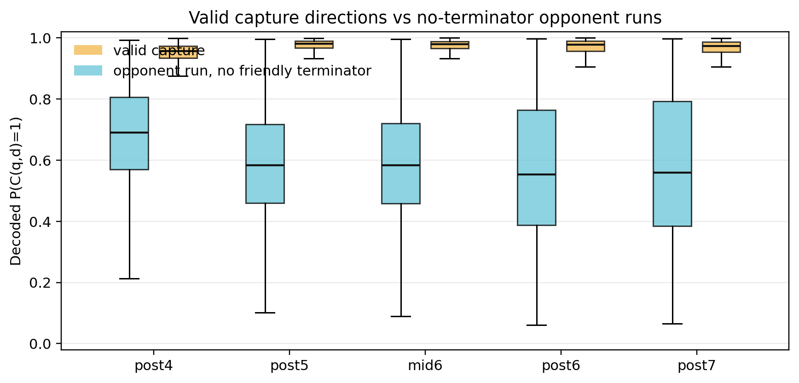
<figcaption>
Held-out valid capture directions versus opponent runs without friendly terminators. The plotted values are linear-probe probabilities for \(C(q,d)=1\) across residual sites. The largest hard-case separation appears by post5.
</figcaption>
</figure>

The hard AUROC rises from `0.9601` at post4 to `0.9905` at post5. The mean valid-minus-no-terminator probability gap also grows, from `0.2661` at post4 to `0.3829` at post5.

That is the cleanest aggregate sharpening in this experiment.

The cautious interpretation is:

```text
the valid-capture relation is already highly linearly decodable by post4,
and the difficult no-terminator contrast becomes markedly cleaner by post5
```

The tempting interpretation would be stronger:

```text
MLP5 computes the Othello capture rule
```

That is not established. MLP5 is an especially interesting transformation site. It may sharpen an already-existing relational feature. It may reduce one important near-miss ambiguity. It may rotate the representation into a basis that this linear decoder can read more cleanly. It may participate in a broader distributed transformation. The present evidence does not choose among those possibilities.

!!! success "Strong evidence - directional capture relations are linearly decodable"
    Held-out valid targets: `13,701`.

    Post4 top-1 true-direction accuracy: `98.29%`.

    Post5 top-1 true-direction accuracy: `98.38%`.

    Post4 hard valid-vs-no-terminator AUROC: `0.9601`.

    Post5 hard valid-vs-no-terminator AUROC: `0.9905`.

    Interpretation: a linear readout can recover directional capture structure from the residual stream, with especially strong hard-case sharpening by post5.

    Not established: that the probe direction is the model's causal basis, that MLP5 is the complete capture-rule mechanism, or that this is a complete legality circuit.

## Watching the Relation Move

The site-progression figures show the same target across several residual sites.

<figure markdown>
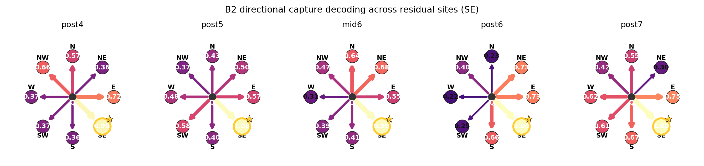
<figcaption>
Held-out `B2` short-ray example across post4, post5, mid6, post6, and post7. Each compass is a linear-probe readout for the same target and true `SE` direction. The true direction is already visible early, but the surrounding invalid probabilities are not static.
</figcaption>
</figure>

For `B2`, the true southeast direction is visible throughout the progression. But the other arrows do not simply fade away monotonically. Some invalid directions rise or fall as the representation moves downstream.

The near-miss progression is even more useful:

<figure markdown>
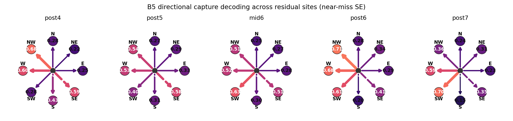
<figcaption>
Held-out `B5` no-terminator near miss across residual sites. There is no true valid direction. The plot shows linear-probe probabilities, not model move probabilities, and illustrates why individual examples need aggregate metrics.
</figcaption>
</figure>

For this target there is no gold direction. The southeast ray looks tempting because it contains an opponent run, but the simulator label is false. Across sites, several probabilities remain moderate. That is not a contradiction of the high AUROC result. AUROC is an aggregate ranking metric across many positive and negative ray labels; one visual example is a local diagnostic.

This is a recurring lesson in the book. A representation can be strong without being clean in every individual view. The probe can rank positives above negatives extremely well across a dataset while some particular invalid direction remains visually salient in a particular board context.

## Non-Monotonic Does Not Mean Forgotten

The top-k direction plot makes the non-monotonicity obvious.

<figure markdown>
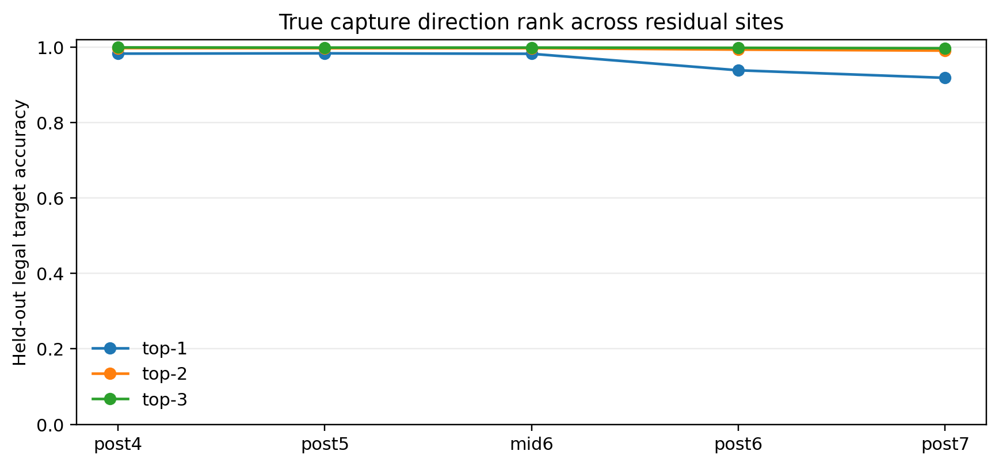
<figcaption>
Held-out true capture direction rank across residual sites for all valid targets. The linear probe remains very strong, but top-1 accuracy declines at later sites even while macro AUROC stays high.
</figcaption>
</figure>

The all-target top-1 accuracy is slightly higher at post5 than post4, then drops at post6 and post7:

```text
post4: 98.29%
post5: 98.38%
mid6:  98.26%
post6: 93.88%
post7: 91.88%
```

Yet macro AUROC remains very high at every site:

```text
post4: 0.9957
post5: 0.9985
mid6:  0.9984
post6: 0.9972
post7: 0.9974
```

These facts can coexist because the metrics ask different questions.

Top-1 true-direction accuracy asks:

```text
among the eight directions for a valid target, is a true direction the single
highest-scoring direction?
```

Macro AUROC asks:

```text
across positive and negative ray labels, how well does the score rank true
captures above non-captures?
```

Later representations may still separate valid and invalid ray labels extremely well while allowing some invalid direction to become highly scored in a particular target context. That could happen because downstream computation is preparing the state for the final move distribution, not for our diagnostic probe's preferred geometry.

So the late-layer top-1 drop does not mean the model forgot Othello. It means the representation geometry changed. Probe cleanliness is not the same as computational usefulness.

!!! question "Pause and think"
    If post7 has lower top-1 directional accuracy than post5, does that contradict Chapter 7's layer-7 result?

    No. Chapter 7 measured legality-gradient enrichment of square-semantic directions. This interlude measures linear decodability of a directional capture predicate. A relation can be decodable before it becomes aligned with the final decision geometry.

## Directional Rays and Direct Legality Diverge at MLP6

The directional-capture MLP6 result is subtle enough to name directly.

The preregistered Section 47 question asked whether directional-capture AUROC increases from `blocks.6.hook_resid_mid` to `blocks.6.hook_resid_post`. On the primary AUROC metric, it does not. Macro AUROC goes from `0.9984` at mid6 to `0.9972` at post6. Hard AUROC goes from `0.9897` to `0.9811`.

That negative result should constrain the story. We should not claim that MLP6 improves this directional linear readout.

But Section 50 now shows why that negative directional-AUROC result was not evidence against MLP6. When the target is not eight ray predicates but the direct 64-square legal mask, MLP6 is the dominant transition: exact-mask accuracy rises from `78.59%` at mid6 to `97.24%` at post6.

So the right lesson is narrower and sharper. MLP6 does not make the directional ray probe's AUROC better. It makes legal-square identity itself much more directly linearly decodable. That is exactly the kind of transformation a downstream computation could need: not better access to every separate ray, but a cleaner variable for which squares are legal moves.

The useful rule is:

$$
\boxed{
\text{no directional-ray AUROC gain} \ne \text{no MLP6 computation}
}
$$

This is Chapter 6's architecture lesson in experimental form. A component can matter by routing, transforming, gating, or preparing a representation, even if the easiest linear decoder at its output is not better than the decoder at its input.

## Long Rays and Board-Wide Fields

The first example was short. The relation is not only an adjacency detector.

<figure markdown>
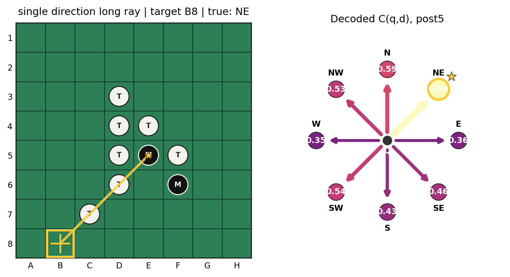
<figcaption>
Held-out long single-ray capture at target `B8`, true direction `NE`. The compass shows `blocks.5.hook_resid_post` linear-probe probabilities, with the simulator-valid direction highlighted.
</figcaption>
</figure>

The target is `B8`, and the true direction is `NE`. The predicate still has the same form: one or more opponent pieces followed by a friendly terminator. The line can be short or long. The direction can be cardinal or diagonal. The label is not determined by one neighboring square.

Once we have a directional decoder, we can apply it more broadly. We do not have to query only the single hand-picked target. For one residual vector, the probe can score every target-square/direction pair and summarize the result as a board-wide field.

<figure markdown>
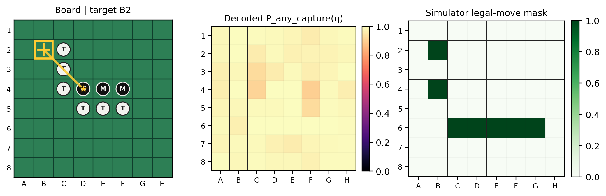
<figcaption>
Held-out full-board visualization. The middle panel applies the linear directional probe across target squares and summarizes the reconstructed probability that any capture direction exists for each target. The right panel is the simulator legal-move mask. This is a probe-reconstructed capture field, not a native internal board tensor.
</figcaption>
</figure>

This figure is the visual centerpiece of the interlude. The left panel reminds us of the concrete board. The middle panel asks, for every square, whether the linear probe can reconstruct any valid capture direction. The right panel is the simulator legal-move mask.

The phrase needs care:

```text
probe-reconstructed capture field
```

not:

```text
literal capture map stored inside the network
```

A single 512-dimensional residual state contains enough linearly accessible information for the probe to reconstruct a board-wide field of candidate directional captures. That is already remarkable. It is not a license to claim the network stores this exact heatmap as a discrete internal tensor.

The conceptual transition from Chapter 2 is now visible:

```text
Chapter 2:
hidden state -> square occupancy map

Interlude 7½:
hidden state -> directional capture relations
```

Static board facts:

```text
C3 = theirs
D3 = theirs
B3 = mine
```

Relational board fact:

```text
from E3 toward west:
opponent -> opponent -> mine
therefore capture-valid
```

That is the qualitative step: from objects and properties to relations among objects.

## From Rays to the Whole Legal-Move Mask

There is a sharper version of the board-wide question.

Othello legality is not merely related to the capture predicate. It is exactly the disjunction of the eight directional capture predicates:

$$
\text{Legal}(q)=\bigvee_d C(q,d).
$$

So after training the directional capture probes in Section 47, we can ask a direct sufficiency question:

```text
Can the decoded rays reconstruct the simulator's complete legal-move mask?
```

The test is deliberately simple. For each held-out board position and each of the 64 board squares, the existing Section 47 probe emits eight directional probabilities. I did not train a new legal-move probe. I reused the same directional capture probes and the same held-out game-level split.

For a square \(q\), define:

$$
s(q)=\max_d p(C(q,d)=1).
$$

This is a decoded legality score, not a calibrated legal-move probability. The max is important: it matches the logical fact that one valid capture direction is enough. I did not treat the eight outputs as independent and did not use a noisy-OR probability as the primary score.

Then, for each residual site, I chose one threshold on validation positions:

$$
\hat{y}(q)=1 \quad \text{iff} \quad s(q)\ge \tau.
$$

The threshold \(\tau\) was selected independently per site to maximize square-level F1 on validation data, then frozen before evaluating held-out TEST positions. The mask convention is also fixed: 64 board squares only, pass excluded. Occupied squares are ordinary negative examples because a legal placement must be empty.

<figure markdown>
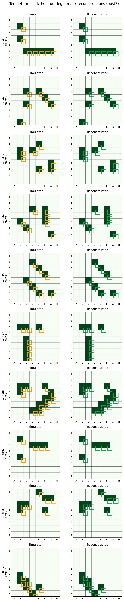
<figcaption>
Ten deterministic held-out TEST boards for the best validation-selected site, `blocks.7.hook_resid_post`. Each row compares the simulator legal-move mask with the mask reconstructed from decoded directional capture rays. Filled dark-green squares are legal squares according to that panel's mask. Orange outlines mark simulator-legal squares on the left. Green outlines on the right are true positives; red `FP` and blue dashed `FN` markers would show false positives and false negatives.
</figcaption>
</figure>

The picture is intentionally mundane. It is not a cherry-picked hero board. It is the first ten held-out TEST boards under a deterministic ordering for the best validation-selected site. The point is that the reconstructed mask is usually not merely close in a heatmap sense. It often gets the entire legal set exactly right.

The compact result is:

| Site | Validation threshold | Square AUROC | Square F1 | Exact mask accuracy | Mean Jaccard | Mean FP / board | Mean FN / board |
| --- | ---: | ---: | ---: | ---: | ---: | ---: | ---: |
| post4 | 0.9033 | 0.9947 | 0.9172 | 27.68% | 0.8554 | 1.0215 | 0.5461 |
| post5 | 0.9122 | 0.9992 | 0.9785 | 68.35% | 0.9574 | 0.3017 | 0.0990 |
| mid6 | 0.9062 | 0.9993 | 0.9796 | 70.24% | 0.9593 | 0.2970 | 0.0835 |
| post6 | 0.9082 | 0.9999 | 0.9961 | 94.48% | 0.9914 | 0.0458 | 0.0269 |
| post7 | 0.8941 | 0.9998 | 0.9961 | 93.94% | 0.9893 | 0.0646 | 0.0074 |

By validation-selected square F1, the best site was post7. On held-out TEST, post7 reached square AUROC `0.9998`, square F1 `0.9961`, exact-mask accuracy `93.94%`, and mean Jaccard `0.9893`. The average board had only `0.0646` false positives and `0.0074` false negatives.

Post6 was slightly better on exact-mask accuracy, at `94.48%`, even though post7 was the validation-selected best site. That is useful rather than awkward. It reinforces the earlier warning that the later trajectory is not a clean monotonic story. The relation can stay extremely available while the representation is being reshaped for downstream use.

There is a crucial control. I also compared against a simpler baseline using only the existing square-state probe's decoded target emptiness. That baseline asks:

```text
Is q empty?
```

and pretends that emptiness alone is enough for legality. It is not. The emptiness-only baseline reached square F1 `0.4648` and exact-mask accuracy `2.63%`, with about `20.91` false positives per board. That is exactly what should happen if the new result is about capture-rule structure rather than mere board occupancy. Knowing where the empty squares are is not enough. The model state must also contain information about which empty squares are connected to opponent runs and friendly terminators.

This is why the experiment matters. The earlier compass plots showed that individual capture directions are decodable. The legal-mask reconstruction asks whether those decoded directional facts are sufficient to rebuild the whole legal action set. They are. From one residual vector, a linear directional decoder plus a fixed max-over-rays rule can recover almost every square of the simulator's legal mask on held-out games.

That supports a precise claim:

```text
the residual state contains linearly decodable relational rule information
sufficient to reconstruct the board's legal moves
```

It still does not support a stronger causal claim:

```text
the model literally applies this probe, this threshold, and this OR rule
inside its own computation
```

The distinction is the spine of the book. This is stronger than "the board is in the model." It is not yet "we have found the model's algorithm." It shows that the hidden state contains enough rule-shaped information for a very simple external decoder to reconstruct legal moves. Chapter 8 can then ask which later components align that available structure with the model's actual next-move logits.

## MLP6 Makes Legal Squares Linearly Explicit

The ray result left one major ambiguity.

The decoded legal-mask rule above still uses an external nonlinear operation:

$$
s(q)=\max_d p(C(q,d)=1).
$$

That is not a linear legal-square decoder. It is eight directional linear readouts followed by a max over directions.

So the next test asked a stricter question:

```text
Can one linear map from the residual stream directly predict all 64 legal squares?
```

The direct probe was deliberately simple. For each residual site, it used one learned linear layer:

$$
h \in \mathbb{R}^{512}
\quad\longmapsto\quad
\text{64 independent legal-square logits}.
$$

There was no hidden layer, no attention, no nonlinear feature extractor, and no max over directions. The only nonlinearity was the sigmoid output link used for binary classification. Positive class weights were computed from the Section 47 TRAIN split only, because legal squares are sparse. Thresholds were selected on VALIDATION by square-level F1, then frozen for held-out TEST.

The MLP6 result is strong:

| Site | Threshold | Square AUROC | Square F1 | Exact mask accuracy | Mean Jaccard |
| --- | ---: | ---: | ---: | ---: | ---: |
| post4 | 0.8425 | 0.9872 | 0.8477 | 10.84% | 0.7470 |
| post5 | 0.9244 | 0.9997 | 0.9851 | 76.84% | 0.9680 |
| mid6 | 0.9302 | 0.9997 | 0.9864 | 78.59% | 0.9703 |
| post6 | 0.9969 | 1.0000 | 0.9976 | 97.24% | 0.9947 |
| post7 | 0.9986 | 0.9999 | 0.9972 | 96.63% | 0.9926 |

The preregistered comparison is `blocks.6.hook_resid_mid` to `blocks.6.hook_resid_post`. Exact whole-board reconstruction jumps from `78.59%` to `97.24%`, a gain of `18.65` percentage points. The paired board bootstrap 95% CI for that gain is `[16.66, 20.57]` percentage points. Square F1 rises from `0.9864` to `0.9976`.

<figure markdown>
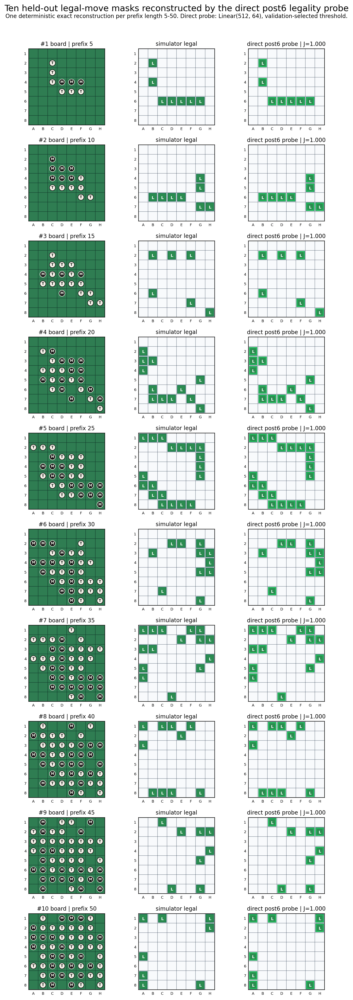
<figcaption>
Ten deterministic held-out TEST boards, one exact post6 reconstruction per prefix length from 5 through 50. The left column shows the board in the relative mine/theirs convention. The middle column is the simulator legal-move mask. The right column is the direct `blocks.6.hook_resid_post` linear legality probe after thresholding. All ten displayed masks are exact reconstructions.
</figcaption>
</figure>

This is stronger than the earlier ray+max result in one important sense: by post6, legality itself is linearly accessible. The probe does not need to decode eight rays and compose them externally. It reads the legal-square mask directly.

The comparison to ray+max makes the point sharper:

| Site | Direct exact mask | Ray+max exact mask | Direct minus ray+max |
| --- | ---: | ---: | ---: |
| post4 | 10.84% | 27.68% | -16.84 pp |
| post5 | 76.84% | 68.35% | +8.48 pp |
| mid6 | 78.59% | 70.24% | +8.35 pp |
| post6 | 97.24% | 94.48% | +2.76 pp |
| post7 | 96.63% | 93.94% | +2.69 pp |

Post4 is still easier for ray+max. But after the post5/mid6 region, and especially after MLP6, the direct legal-square probe is no longer weaker. At post6 it slightly exceeds the Section 49 ray+max decoder: `97.24%` exact masks versus `94.48%`.

That makes MLP6 a major representational transition. The most precise claim is:

```text
MLP6 makes legal-square identity substantially more linearly explicit.
```

The exact unsupported claim is also important:

```text
MLP6 literally computes a symbolic OR over rays.
```

The experiment does not prove that. It proves that after MLP6, a single linear readout can recover the whole legal-move mask with very high held-out accuracy. The internal computation that creates this accessibility may involve distributed transformations, calibration, routing, or composition that this probe does not isolate.

The geometry result adds one more clue. At mid6, the direct legal-square directions project strongly into the corresponding directional-ray span: mean projection fraction `0.8655`. At post6 that mean falls to `0.7257`, even while direct legal-mask accuracy sharply improves. So post6 is not merely "the same ray subspace, read out harder." The direct legality representation is being reorganized into a geometry that is extremely easy for a direct linear decoder to read, while becoming less dominated by the eight fitted ray directions.

This is a very strong result for MLP6. It says that the relation was already richly available, but MLP6 makes the identity of legal squares almost explicit as a direct linear variable.

## The Causal Question Is Still Open

Section 47 also tried a more intervention-like diagnostic: suppress the learned capture direction and observe what changes.

<figure markdown>
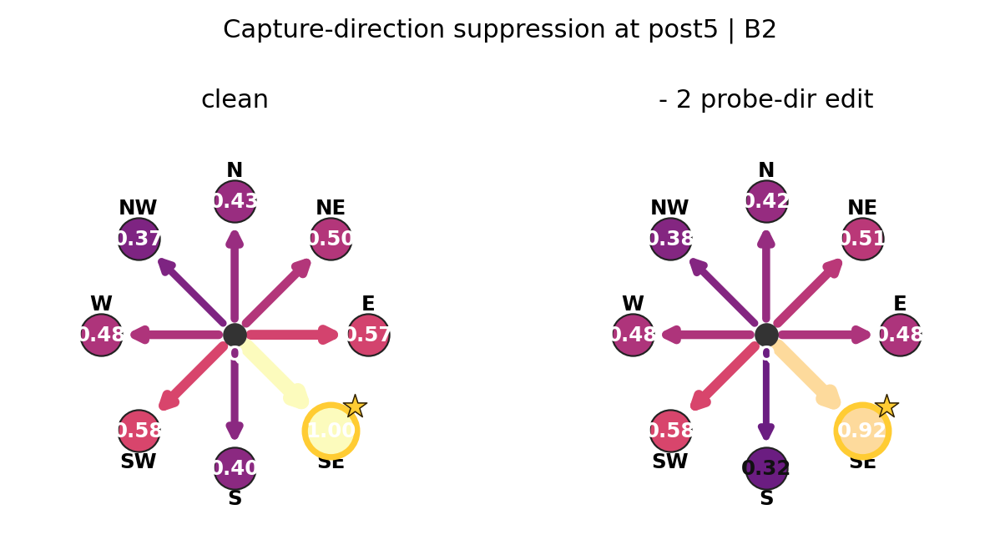
<figcaption>
Held-out `B2` suppression diagnostic at post5. A finite edit of size `alpha = 2.0` in the negative learned probe direction lowers the linear-probe probability for the true `SE` capture direction from `0.9950` to `0.9235`; the selected legality contrast changes from `11.1586` to `10.9237`. This is a diagnostic, not proof that the probe direction is the model's native causal basis.
</figcaption>
</figure>

For this example, suppressing the `SE` probe direction at post5 changed the decoded `SE` probability by `-0.0715` and the legality contrast by `-0.2348`. That is suggestive in the expected direction.

But the evidence is magnitude dependent. Small edits did not give robust clean local causal evidence in the same way the Chapter 4 Jacobian checks did. Larger finite edits show stronger expected-sign effects, but larger edits also carry more off-manifold risk.

So this figure belongs near the end, not at the beginning. It points to the next question:

```text
is the learned capture-relation direction causally aligned with the model's
native computation?
```

The answer is not yet settled.

!!! question "Pause and think"
    Does linear decodability establish that the network causally uses the probe direction?

    No. It establishes that an external linear map can read the relation from the activation. Causal use requires intervention, path, component, or mediation evidence.

## Why This Does Not Contradict Layer 7

At first glance, the result may seem to collide with Chapter 7.

Chapter 7 said layer 7 was where capture-line legality geometry became strongly enriched. This interlude says directional capture relations are already highly linearly decodable around layers 4 and 5.

Those statements answer different questions.

| Question | Tool | Result |
| --- | --- | --- |
| Can I linearly read which ray is a valid capture? | Capture-relation probe | Already strong by layer 4/5 |
| Which board-semantic directions are preferentially aligned with legality? | Legality-gradient enrichment | Strongest at layer 7 among tested layers |

The first question is about available information. The second is about decision-aligned sensitivity. A representation can contain a relation before the final computation has aligned that relation with a move-legality contrast.

That gives us one of the central lessons of Part III:

$$
\boxed{
\text{a relation can be represented before it becomes aligned with the final decision geometry}
}
$$

This is why the interlude belongs between Chapters 7 and 8. It changes what layer 7 might be doing. Layer 7 may not need to discover the Othello capture relation from scratch. It may receive an already-rich relational representation and transform it into evidence that the final logits can use.

That makes Chapter 8 sharper, not weaker.

## What We Learned

The capture predicate \(C(q,d)\) is a directional relation: empty target, opponent run, friendly terminator. It is not a square label and it is not a mutually exclusive direction class.

A linear probe can decode this relation from held-out residual states with high accuracy. Across `13,701` held-out valid targets, post4 top-1 true-direction accuracy was `98.29%`, post5 was `98.38%`, and top-3 accuracy stayed above `99.89%` through mid6. Macro AUROC was at least `0.9957` at all reported sites.

The hard no-terminator contrast sharpened most clearly by post5. Hard AUROC rose from `0.9601` at post4 to `0.9905` at post5, and the mean valid-minus-no-terminator probability gap rose from `0.2661` to `0.3829`.

The directional result is not monotonic. Later layers keep very high AUROC but lower top-1 direction accuracy. That should make us less simplistic about "where the information is." Probe-readable structure can be transformed, mixed, or repurposed downstream.

The direct legal-square result changes the MLP6 story. A single `Linear(512, 64)` probe reconstructs the whole legal-move mask exactly on `78.59%` of held-out boards at mid6 and `97.24%` at post6. The paired bootstrap 95% CI for that gain is `[16.66, 20.57]` percentage points. That is strong evidence that MLP6 makes legal-square identity substantially more linearly explicit.

The evidence boundary remains firm. We have strong evidence for linear decodability of a relational capture predicate and direct legal-square identity after MLP6. We do not yet have proof that the probe direction is the model's causal basis, that MLP5 computes the full capture rule, that MLP6 literally computes an OR over rays, or that the legality circuit is complete.

What we now know is richer than the Chapter 2 board map. From a single residual vector, a simple linear decoder can reconstruct which rays around a target satisfy the capture relation, and it can extend that readout into a board-wide probe-reconstructed capture field.

Layer 7 therefore enters Chapter 8 under a new light. It may not be inventing the relation. It may be transforming an upstream relational representation into decision-aligned legality evidence.

So the next question is more precise:

```text
inside layer 7, which component performs the strongest tested transformation?
```

Next: Chapter 8 - MLP7.

## Try It Yourself

1. Given the ray `target -> opponent -> mine`, label \(C(q,d)\). What changes if the last square is empty?
2. Explain the difference between square-state decoding and capture-relation decoding.
3. Why can a target square have more than one true capture direction?
4. Given eight decoded probabilities and two true capture directions, decide whether top-1 and top-2 true-direction accuracy succeed.
5. Design a near-miss control that distinguishes "there is an opponent piece in this direction" from "this direction is a valid capture."
6. Explain why MLP5 improving hard AUROC does not prove MLP5 implements the Othello capture rule.
7. Advanced: train a multi-label linear decoder from residual states to eight directional-capture labels for one fixed target square, then test whether the learned directions causally affect logits under small residual edits.

## References

- Executed notebook: `demos/Othello_GPT_Jacobian_Lens.ipynb`, sections `47. Where does a capture ray become an internal feature?`, `48. Visualizing decoded capture rays`, `49. Can decoded capture rays reconstruct the legal-move mask?`, and `50. Does MLP6 make legal-square identity linearly explicit?`, on `diegovalverde/TransformerLens`, branch `othello-jspace-analysis`.
- Capture-ray visualization source commit: `b4b529fec329dc318755c579c58af65950143323`.
- Legal-mask reconstruction source commit: `97ecdbc`.
- Direct legal-square reconstruction source commit: `c6e32d6`.
- TransformerLens source notes: `docs/research/section48_capture_ray_visualization_notes.md`, `docs/research/section49_legal_mask_reconstruction_notes.md`, and `docs/research/section50_direct_legality_probe_notes.md`.
- Source output directories: `demos/othello_jacobian_lens_outputs/capture_ray_visualization_20260828_193735/`, `demos/othello_jacobian_lens_outputs/legal_mask_reconstruction_20260829_204725/`, and `demos/othello_jacobian_lens_outputs/direct_legality_probe_20260830_011103/`.
- Project research memory: [research log](../research/research_log.md), [experiment index](../research/experiment_index.md), [findings snapshot](../research/findings_snapshot.md), [final evidence map](../research/final_evidence_map.md), and [open questions](../research/open_questions.md).
