# MLP7

Chapter 7 narrowed the search.

Before opening layer 7 into components, the interlude showed that directional capture relations are already strongly decodable upstream. So the question here is not whether layer 7 invents the capture relation from nothing, but which part of layer 7 most strongly aligns available structure with the legality contrast.

We began Part III with the whole eight-block network. The board was decodable in the middle of the model, but the clearest rule-relevant geometry did not appear there. When the notebook swept layers `2`, `4`, `6`, and `7`, layer 7 stood out: capture-supporting square directions were much more aligned with the legality contrast than unrelated occupied controls.

That was progress, but it was still coarse.

Layer 7 is not one operation. It is the final transformer block. Inside it are eight attention heads, one 2048-neuron MLP, residual paths, and normalization before each sublayer. Saying "layer 7 matters" is like saying "the last page of the circuit diagram matters." It tells us where to look next, not what the mechanism is.

The question of this chapter is therefore:

> Layer 7 contains eight attention heads and one 2048-neuron MLP. Which component is most responsible for the legality-related effect?

This is one rung higher on the evidence ladder:

```text
layer localization
    ->
component localization
```

But the boundary matters. Finding an important component does not mean we have found the Othello legality algorithm. A component can matter because it reads useful information, transforms useful information, writes useful information, or participates in a broader redundant computation. Component localization tells us where the next set of mechanistic questions should attach.

## The Suspect List

Recall the block structure from Chapter 6. At a fixed token position, the final block has this shape:

```text
r_pre
   |
   v
attention
   |
attn_out
   +
r_pre
   |
   v
r_mid
   |
   v
MLP
   |
mlp_out
   +
r_mid
   |
   v
r_post
```

For layer 7 specifically, the attention sublayer contains heads:

```text
L7H0, L7H1, L7H2, L7H3, L7H4, L7H5, L7H6, L7H7
```

and the MLP is:

```text
MLP7
```

<figure markdown>

<figcaption>
Candidate components inside the final transformer block.
</figcaption>
</figure>

The figure deliberately does not highlight a winner. Before seeing data, all nine components are suspects. The layer-7 attention heads can mix information across positions and write an attention update into the current residual row. MLP7 then reads the normalized `resid_mid` state at each position and writes a 512-dimensional `mlp_out` update. Since `resid_mid` already includes the attention update, the MLP is downstream of layer-7 attention inside the same block.

That ordering will matter later. A large MLP7 effect would not imply that attention is irrelevant. It could mean that attention helps build the state MLP7 reads.

## The Score Being Explained

The target remains the Chapter 7 legality contrast. We should not silently drift back to raw logits.

For a selected legal move \(m\), let \(z_m\) be the model's output logit for that move. Let \(I\) be the set of currently illegal empty-square move tokens. Then:

$$
L_m = z_m - \operatorname{mean}_{j \in I} z_j.
$$

The illegal set is not "all illegal tokens." It is specifically empty board squares that are illegal moves in the current Othello position. Occupied squares are excluded because the model may suppress them through occupancy features rather than capture-line legality. The four starting center squares are not move tokens in this vocabulary, and `pass` is not part of this empty-square baseline.

For the concrete example carried forward from Chapter 7, the selected move is:

```text
E3 target
D3 opponent
C3 opponent
B3 friendly terminator
```

The executed notebook reported:

| Quantity | Value |
| --- | ---: |
| Raw `E3` logit | 8.9408 |
| Mean illegal empty-square logit | -1.5438 |
| Mean other-legal logit | 8.9298 |
| Legality contrast | 10.4845 |
| Legal-preference contrast | 0.0110 |
| Rank among all output tokens | 4 |
| Rank among current legal moves | 4 |
| Illegal empty-square tokens in contrast | 23 |

This score is useful because it is closer to the rule question than a raw move logit. It asks whether `E3` is separated from currently illegal empty squares, not whether `E3` is the model's favorite legal move.

At a residual state \(r\), define the local legality-gradient direction:

$$
g = \nabla_r L_m.
$$

For this chapter, \(r\) is the layer-7 residual stream at the current final token position. The gradient says which small residual-space changes would locally increase or decrease the legality contrast.

Now every component output inside layer 7 writes into the same 512-dimensional residual space. That gives us a natural first comparison:

$$
A_c = g^\top c.
$$

Here \(c\) is a component write, such as one head's result vector or the MLP7 output vector at the final token position.

This is signed attribution. If \(A_c\) is positive, the current component output points locally in a direction that raises the selected move's legality contrast. If it is negative, the current component output points locally in a direction that lowers the contrast. The sign can be meaningful, but it can also be context dependent, especially when the selected scalar is a contrast.

The notebook also ranks by:

$$
|A_c|.
$$

The absolute value asks a different question: how strongly is the component output aligned with the local legality sensitivity, regardless of sign?

Both quantities matter. Signed attribution tells us the local direction of contribution. Absolute attribution tells us which components are large players in this local geometry. Neither is an intervention. A component can align with a gradient without being uniquely necessary, and it can have a large local attribution while downstream nonlinearities or parallel paths complicate the causal story.

!!! question "Pause and think"
    If MLP7 has the largest attribution, why do we still need ablation?

    Because attribution compares a current output vector with a local gradient. It does not show what happens when the component is removed or replaced and the model is rerun.

## A Single-Position Clue

The notebook first decomposed the concrete `E3` example. It enabled per-head attention results with `model.set_use_attn_result(True)` and read the head vectors from:

```text
blocks.7.attn.hook_result
```

That detail matters. The individual head outputs were reconstructed from the per-head result tensor, not by trying to split the aggregate `hook_attn_out` tensor after the fact. MLP7 came from:

```text
blocks.7.hook_mlp_out
```

For the single `E3` position, the component attribution table was:

| Component | Legality attribution | Absolute attribution | Rank |
| --- | ---: | ---: | ---: |
| MLP7 | -0.560007 | 0.560007 | 1 |
| L7H2 | 0.351337 | 0.351337 | 2 |
| L7H0 | 0.221331 | 0.221331 | 3 |
| L7H4 | 0.128856 | 0.128856 | 4 |
| L7H1 | 0.113646 | 0.113646 | 5 |
| L7H5 | 0.069681 | 0.069681 | 6 |
| L7H6 | 0.042409 | 0.042409 | 7 |
| L7H3 | -0.017783 | 0.017783 | 8 |
| L7H7 | -0.003058 | 0.003058 | 9 |

MLP7 had the largest absolute attribution. It was not close to zero. In this local example, its output was more strongly aligned with the legality-gradient direction than any individual attention head output.

The block-level summary was also revealing:

| Quantity | Legality attribution |
| --- | ---: |
| `resid_pre L7` | 0.288673 |
| `attn_out L7` | 0.271383 |
| `mlp_out L7` | -0.560007 |
| `resid_post L7` | 0.000048 |
| Final legality contrast | 10.484534 |

Do not overread the near-zero `resid_post` attribution. The legality contrast itself is large. The attribution table is a local dot product with the residual state and component writes under a particular decomposition, not a decomposition of the scalar logit contrast into independent causal terms. The useful clue is simpler: among the layer-7 component writes in this position, MLP7 is the largest absolute local alignment.

But one position is one position.

It is one prefix, one selected legal move, one capture ray, one local gradient. A mechanistic investigation cannot stop there.

## Repeating Across Positions

The notebook next repeated layer-7 component attribution over the first `30` positions from the sampled legality-position set. The sampled positions were the same kind used in the Chapter 7 legality analysis: random legal Othello games, mid-game prefixes, duplicate prefixes skipped, and a selected legal move chosen to have nontrivial capture structure. The component-localization section fixed:

```text
COMPONENT_LAYER = 7
COMPONENT_NUM_POSITIONS = 30
```

For each position, it recomputed the same legality contrast for the selected legal move, took the legality gradient at the final token position, and computed attribution for all eight layer-7 heads and MLP7.

<figure markdown>

<figcaption>
Component attribution is a local alignment measure, not an ablation. Bars show mean absolute legality attribution over 30 positions.
</figcaption>
</figure>

The aggregate table was:

| Component | Mean signed attribution | Mean absolute attribution | Median signed attribution | Rank |
| --- | ---: | ---: | ---: | ---: |
| MLP7 | 0.126682 | 0.267666 | 0.135275 | 1 |
| L7H0 | 0.169024 | 0.201140 | 0.147394 | 2 |
| L7H2 | 0.157269 | 0.186625 | 0.070900 | 3 |
| L7H7 | 0.135668 | 0.180907 | 0.111529 | 4 |
| L7H3 | 0.057958 | 0.128902 | 0.047306 | 5 |
| L7H4 | 0.027255 | 0.066253 | 0.014419 | 6 |
| L7H6 | 0.033227 | 0.061204 | 0.044634 | 7 |
| L7H1 | 0.026097 | 0.060749 | 0.022503 | 8 |
| L7H5 | 0.040836 | 0.055079 | 0.045661 | 9 |

MLP7 still ranked first by mean absolute attribution. The heads were not negligible. L7H0, L7H2, and L7H7 had substantial mean absolute attributions. But the first repeated-position clue pointed to MLP7.

This is stronger than the single-position result. It shows that the MLP7 alignment is not merely an accident of the `E3` example. Still, it remains attribution.

!!! question "Pause and think"
    Why can signed and absolute attribution tell different stories?

    Signed attribution asks whether the component output points with or against the local score gradient. Absolute attribution asks how large the alignment is regardless of direction. A component can have large effects of mixed sign across examples.

## Ablation: Moving From Suspect to Evidence

Chapter 6 separated attribution from ablation. This is where that distinction becomes practical.

Attribution asks:

```text
Is the current component output aligned with the local downstream sensitivity?
```

Ablation asks:

```text
What changes when the component is replaced and the model is rerun?
```

The notebook's component ablation is specific. It does not delete a layer. It does not zero every token position. It does not replace a whole residual stream. For each of the 30 component positions, it ablates one layer-7 component at the current final token position and recomputes the logits.

For attention heads, the hook is:

```text
blocks.7.attn.hook_result
```

The hook patches:

```text
result[:, final_token, head_index, :]
```

to that head's mean result vector computed over the 30-position component set.

For MLP7, the hook is:

```text
blocks.7.hook_mlp_out
```

The hook patches:

```text
mlp_out[:, final_token, :]
```

to the mean MLP7 output vector over the same 30-position component set.

Then the model is run forward normally with the hook active, and the selected move's logits and contrasts are recomputed.

The sign convention is:

$$
\Delta L_c = L_m(\text{ablate } c) - L_m(\text{clean}).
$$

!!! info "Component-ablation sign convention"
    Negative \(\Delta L_c\) means the replacement reduced the selected move's legality contrast. Positive \(\Delta L_c\) means the replacement increased it.

This convention prevents a common confusion. A component with mean signed effect `-0.105164` is not being reported as having "negative importance." It means that, on average under this replacement intervention, removing or replacing that component lowered the selected move's legality contrast by about `0.105164`.

## The Component-Ablation Result

<figure markdown>

<figcaption>
Layer-7 component ablation effects over 30 positions. Main bars show mean absolute legality effect; signed means are reported separately in the labels.
</figcaption>
</figure>

The measured component-ablation summary was:

| Component | Mean signed effect | Mean absolute effect | Median effect | Mean selected-logit effect | Rank |
| --- | ---: | ---: | ---: | ---: | ---: |
| MLP7 | -0.105164 | 0.262614 | -0.128594 | -0.101680 | 1 |
| L7H7 | -0.109719 | 0.109719 | -0.104066 | -0.081282 | 2 |
| L7H2 | -0.093151 | 0.094140 | -0.093622 | -0.071195 | 3 |
| L7H0 | -0.090048 | 0.090048 | -0.083029 | -0.076222 | 4 |
| L7H3 | -0.050368 | 0.053335 | -0.047586 | -0.036045 | 5 |
| L7H1 | 0.017107 | 0.031420 | 0.009137 | -0.001614 | 6 |
| L7H5 | 0.001272 | 0.020224 | 0.004613 | -0.006459 | 7 |
| L7H6 | 0.007529 | 0.018022 | 0.001273 | -0.003348 | 8 |
| L7H4 | 0.001514 | 0.007506 | 0.002101 | -0.002327 | 9 |

This is the key component result of the chapter.

MLP7 had the largest mean absolute ablation effect under this intervention: `0.262614`. The largest displayed individual head effect was L7H7 at `0.109719`, followed by L7H2 at `0.094140` and L7H0 at `0.090048`. Under this measurement, MLP7's mean absolute effect was more than twice the largest individual head effect.

The careful claim is:

```text
MLP7 had the largest mean absolute ablation effect among layer-7 components
under the notebook's mean-replacement intervention.
```

The careless claim would be:

```text
MLP7 computes Othello legality.
```

Do not write the second sentence. The experiment does not show that.

!!! success "Strong evidence -- MLP7 is an important legality component"

    Dataset:
    30 positions

    Attribution:
    MLP7 mean absolute legality attribution = 0.267666

    Ablation:
    MLP7 mean absolute legality effect = 0.262614

    Largest displayed individual head ablation effect:
    L7H7 mean absolute effect = 0.109719

    Interpretation:
    MLP7 is the strongest layer-7 component under these attribution and ablation analyses.

    Not established:
    what computation MLP7 performs internally.

## Agreement Between Attribution and Ablation

The important point is not merely that MLP7 wins one table. It is that two different analyses point to the same broad component.

Attribution says:

```text
MLP7's current output aligns most strongly, on average,
with the legality-gradient direction.
```

Ablation says:

```text
Replacing MLP7's output causes the largest average legality disturbance
among the tested layer-7 components.
```

This agreement is stronger than either result alone. Attribution is local and descriptive. Ablation is interventional but baseline-dependent. When both point toward MLP7, the component-localization claim becomes much more credible.

Still, this is not a complete circuit. We have not shown what MLP7 reads. We have not shown that it detects the target-empty condition, the opponent run, or the friendly terminator. We have not shown whether its output writes directly to the legal move logit or changes a residual feature that the final readout then uses. We have not shown whether other components can compensate.

The evidence ladder has moved, but it has not reached the top.

<figure markdown>

<figcaption>
Chapter 8 moves the strong-evidence frontier from layer localization to MLP7 component localization. The selected neuron subpopulation remains a candidate frontier, not a complete mechanism.
</figcaption>
</figure>

## What About The Attention Heads?

The head results should not be dismissed.

L7H7, L7H2, and L7H0 have meaningful effects. Their mean absolute ablation effects are `0.109719`, `0.094140`, and `0.090048`. Their attribution values are also substantial. They may be doing several useful things:

- supplying information to MLP7
- writing legality-relevant information directly
- helping construct the `resid_mid` state that MLP7 reads
- contributing redundant or complementary paths
- affecting other legal moves or the illegal baseline in ways the component table compresses

The architecture makes this especially important. MLPs are position-wise, but MLP7 does not read the original token row in isolation. It reads the current `resid_mid`, after all previous blocks and after layer-7 attention have already written into the current position. If attention heads route earlier move information into the current token row, MLP7 can transform that routed information without itself attending across positions.

<figure markdown>

<figcaption>
Architectural hypothesis: layer-7 attention may help construct the residual state that MLP7 reads. The component results do not yet establish this causal path.
</figcaption>
</figure>

!!! question "Pause and think"
    If MLP7 ablation has a much larger effect than any single attention head, does that prove attention is irrelevant?

    No. MLP7 reads `resid_mid`, which already includes the attention update. A large MLP7 effect could depend on information supplied by attention.

This is one of the central lessons of residual-network interpretability. A component can matter because of what it writes, but also because of what it reads. An MLP has no direct cross-position attention operation, yet it can still depend on earlier move tokens if previous attention operations have moved relevant information into its input state.

## A Component Can Matter In Several Ways

MLP7 is a 2048-neuron nonlinear map. At one token position, it reads a normalized version of `resid_mid` and writes a 512-dimensional update:

$$
m_7 = \mathrm{MLP}_7(\mathrm{Norm}(r^\text{mid}_7)).
$$

This large ablation effect could arise because MLP7:

- detects important board configurations
- transforms previously computed features into a more logit-useful basis
- amplifies legality evidence already present in the residual stream
- suppresses illegal-move evidence
- rotates information into a direction used by final normalization and unembedding
- participates in several computations, only one of which affects the selected legality contrast

The current experiment does not distinguish these. It says MLP7 is important under the tested component intervention. It does not say why.

That uncertainty is not a failure. It gives us the next question:

```text
If MLP7 matters, is the effect spread diffusely across all 2048 neurons,
or concentrated in a smaller subpopulation?
```

## A Small Mediation Diagnostic

Before opening the MLP, the notebook ran a small semantic-edit by component-ablation interaction on the concrete `E3` example.

The question was:

```text
When we perturb a semantic board direction, how much of its effect changes
when MLP7 is simultaneously ablated?
```

The implementation used the same component-ablation hook for MLP7 as before. It applied layer-4 mine-vs-theirs semantic edits to two capture-line squares and two unrelated occupied squares, choosing the edit sign that lowered the normal legality contrast for that square. It then compared the edit effect with MLP7 intact and with MLP7 ablated.

The measured quantity was:

$$
M = \Delta L_\text{normal} - \Delta L_\text{MLP7 ablated}.
$$

For the four displayed edits:

| Square | Edit group | \(\Delta L\) normal | \(\Delta L\) with MLP7 ablated | \(M\) |
| --- | --- | ---: | ---: | ---: |
| C3 | capture-line semantic edit | -0.012246 | -0.025317 | 0.013071 |
| D3 | capture-line semantic edit | -0.007092 | -0.066767 | 0.059675 |
| G4 | unrelated-square semantic edit | -0.007164 | -0.002657 | -0.004507 |
| F6 | unrelated-square semantic edit | -0.011683 | -0.002885 | -0.008799 |

<figure markdown>

<figcaption>
Example-level semantic-edit by MLP7-ablation diagnostic. This is not a dataset-level mediation distribution.
</figcaption>
</figure>

The mean mediation-like effect over the two capture-line edits was `0.036373`; over the two unrelated edits it was `-0.006653`. Across all four rows, the mean was `0.014860`, which is the compact value reported in the notebook's final summary.

This is suggestive but small and example-specific. A useful intuition is closing a road after changing upstream traffic. If changing an upstream feature changes the destination, and closing component \(C\) removes part of that change, then \(C\) may lie on a path carrying part of the effect. But residual networks have bypasses, interactions, and shared baselines. Mediation can be partial, sign-sensitive, and context-specific. This diagnostic supports asking more about MLP7; it does not establish a unique pipeline.

## Opening The MLP

MLP7 is not one indivisible object.

The architecture reference tells us its shape:

```text
d_model = 512
d_mlp   = 2048
```

At one token position, ignoring batch and position axes, the MLP computation is:

$$
p_j = x W_\text{in}[:,j] + b_{\text{in},j},
$$

$$
g_j = \mathrm{GELU}(p_j),
$$

$$
c_j = g_j W_\text{out}[j,:].
$$

The full MLP output is:

$$
\mathrm{MLP7}(x) = \sum_j c_j + b_\text{out}.
$$

This exact decomposition gives us a neuron-level version of the same attribution idea:

$$
A_j = g^\top c_j.
$$

Each neuron contributes a scalar post-activation \(g_j\) times one output vector \(W_\text{out}[j,:]\). Dotting that contribution with the legality gradient tells us how much that neuron's current write aligns with the local legality contrast.

Again, this is attribution, not causal proof. It tells us which neuron writes are aligned with the local score direction under the current activations. It does not tell us what activates the neuron, whether the neuron detects a capture pattern, or whether removing it will selectively break legality.

!!! question "Pause and think"
    Why can the final MLP depend on earlier move tokens even though MLPs are position-wise?

    Because the MLP reads the current residual row after previous layers and layer-7 attention have already mixed information into that row.

## Candidate MLP7 Neurons

The notebook ranked all 2048 MLP7 neurons by mean absolute legality attribution over the 30 component positions. The top 20 fixed candidate neurons were:

```text
399, 1322, 1576, 366, 558, 1858, 1747, 495, 1167, 14,
1400, 272, 1673, 1953, 991, 734, 1000, 877, 125, 912
```

The top rows were:

| Rank | Neuron | Mean signed attribution | Mean absolute attribution |
| ---: | ---: | ---: | ---: |
| 1 | 399 | -0.219701 | 0.276027 |
| 2 | 1322 | -0.046603 | 0.119989 |
| 3 | 1576 | -0.076215 | 0.114282 |
| 4 | 366 | -0.024346 | 0.077682 |
| 5 | 558 | 0.004495 | 0.077444 |

Neuron 399 is a useful concrete example. Its mean signed legality attribution was `-0.219701`, and its mean absolute legality attribution was `0.276027` over 30 positions. By this ranking, it is much larger than the next candidate.

That is interesting, but the label should stay boring. Neuron 399 is not "the legality neuron." It is not "the capture neuron." It is not "the rule neuron." The supported statement is:

```text
neuron 399 had the largest mean absolute MLP7 neuron attribution
in this 30-position component-localization analysis
```

The broader observation is that legality attribution is not uniformly spread over all 2048 neurons. A small set of neurons appears unusually aligned with the legality-gradient direction. That makes them candidates for further tests.

## Group Ablations

The next test was stronger. If the top-attribution neurons are genuinely important, then replacing groups of them should move the legality contrast more than replacing random same-size groups.

The notebook patched MLP7 post-activations:

```text
blocks.7.mlp.hook_post
```

at the final token position. For a selected group of neurons, it replaced their post-activation values with the mean `hook_post` values from the 30-position component set. It tested top-attribution groups of sizes:

```text
1, 2, 5, 10, 20
```

and compared them to `25` random same-size groups for each size.

This cell used a different sign convention from the whole-component ablation table:

$$
D_N = L_m(\text{clean}) - L_m(\text{ablated}).
$$

!!! info "Neuron-group sign convention"
    The neuron-group table reports `legality_degradation = L_clean - L_ablate`. Negative values therefore mean the mean-replacement intervention increased the measured legality contrast. The important comparison here is the size and separation of the selected groups from random same-size groups, not a simple ordinary-language "degradation" sign.

The measured summary was:

| Group | Size | Mean legality degradation | Random same-size mean |
| --- | ---: | ---: | ---: |
| top neurons | 1 | -0.137254 | 0.000685 |
| top neurons | 2 | -0.153469 | -0.001759 |
| top neurons | 5 | -0.204493 | -0.000735 |
| top neurons | 10 | -0.335030 | 0.002325 |
| top neurons | 20 | -0.543530 | 0.012949 |

<figure markdown>

<figcaption>
Top-attribution MLP7 neuron groups produce much larger signed legality shifts than random same-size groups under the notebook's `L_clean - L_ablate` convention.
</figcaption>
</figure>

The direction of the signed shift is not the main lesson. The main lesson is concentration. The selected groups move the legality contrast far more than random same-size groups. The top-20 group had a mean value of `-0.543530`, while the random same-size mean was `0.012949`. Under this hook intervention, attribution-based neuron selection found a small group with an unusually large causal effect.

!!! info "Candidate neuron concentration"

    MLP7 width:
    2048

    Candidate ranking:
    mean absolute legality attribution over 30 positions

    Top-20 group ablation:
    -0.543530 under the notebook's `L_clean - L_ablate` convention

    Random same-size mean:
    0.012949

    Interpretation:
    selected MLP7 neurons are much more causally important under this test than random same-size groups.

    Not established:
    that these neurons detect the Othello capture rule.

!!! question "Pause and think"
    Does a top-20 group effect prove each of the 20 neurons is individually important?

    No. A group effect can be driven by a few neurons, interactions among neurons, or a direction shared across the selected set.

## Why This Is Both Exciting And Dangerous

At this point, the tempting story is:

```text
board state
    ->
layer 7
    ->
MLP7
    ->
20 legality neurons
    ->
legal moves
```

That story is too neat.

What we have actually localized is:

```text
where:
    layer 7

which broad component:
    MLP7

which subpopulation candidates:
    high-attribution MLP7 neurons
```

What we have not established is just as important:

- what the selected neurons detect
- whether they respond to the capture conjunction
- whether they distinguish valid capture lines from invalid opponent runs
- whether their input weights align with board semantics
- whether their output weights write legality evidence selectively
- whether individual neuron ablations are selective
- whether disrupting them can be rescued by patching the right upstream signal

A selected neuron group can matter for many reasons. It may participate in several unrelated computations. It may write broadly useful final-layer features. It may be correlated with legality without detecting the relational Othello rule itself. Or it may be part of a distributed legality computation in which no single neuron has a clean symbolic role.

The careful conclusion is:

```text
the effect is concentrated enough for attribution-based neuron selection
to identify unusually important MLP7 subgroups
```

not:

```text
20 neurons implement legality
```

!!! question "Pause and think"
    What would it mean if top-attribution neurons behaved no differently from random neurons under ablation?

    It would weaken the case that the attribution ranking found causally relevant units. Attribution would still describe local alignment, but it would not have transferred to this intervention.

## Why The Sign Is Less Important Than The Separation

The neuron-group result is easy to misread because the table calls the quantity `legality_degradation`, while the measured top-neuron values are negative. Under the notebook's definition:

$$
D_N = L_\text{clean} - L_\text{ablated}.
$$

If \(D_N\) is positive, the ablated run has a lower legality contrast than the clean run. If \(D_N\) is negative, the ablated run has a higher legality contrast than the clean run.

For the selected top groups, the values were negative and large in magnitude. For random groups, they were close to zero. That means the top-attribution neurons are not behaving like arbitrary MLP7 neurons under this hook intervention. They are sitting on a direction that strongly changes the selected legality contrast when replaced by the mean post-activation baseline.

This is still useful even though the sign is not the naive "damage" direction. The intervention is not a surgical deletion of semantic content. It replaces GELU post-activations with mean values estimated from a small component set. For a final-layer MLP, this can remove, add, or shift several kinds of evidence at once. The sign can depend on the replacement baseline, the selected move, the illegal-empty baseline, and how the MLP output interacts with final normalization and unembedding.

So the interpretation should focus on three things:

- the selected groups separate strongly from random same-size groups
- the separation grows as more top-attribution neurons are included
- the selected neurons are candidates for mechanistic follow-up, not already interpreted rule variables

This also explains why the component-level MLP7 ablation and the neuron-group ablation should not be forced into the same sign story. The component ablation replaces the full 512-dimensional `hook_mlp_out` vector. The neuron-group ablation replaces selected scalar `hook_post` values before the MLP output projection is summed. These are related interventions, but they are not the same operation.

## What Would Count As More Mechanistic?

Component localization is a real step, but it is not the endpoint.

A more mechanistic account would need to connect at least three sides of the MLP:

```text
what MLP7 reads
what its nonlinear units select
what its output directions write
```

The current chapter mostly establishes the second question as worth asking. The attribution ranking says that some neuron contributions align strongly with the legality-gradient direction. The group ablation says that replacing selected neuron activations changes the legality contrast much more than replacing random same-size groups. Together, those results justify opening MLP7.

But knowing that a neuron writes in a useful direction does not tell us what activates it. A neuron might have a strong output vector toward a legality-relevant direction and still be activated by a broad mixture of board features, game phase, move history statistics, or a correlated strategic feature. Conversely, a neuron might respond cleanly to a capture-line pattern but write in a direction that is only weakly connected to the selected legality contrast. Good mechanistic evidence eventually has to join input-side selectivity with output-side causal effect.

For Othello, the natural relational hypothesis is:

```text
empty target
    plus contiguous opponent run
    plus friendly terminator
    implies legal move
```

That hypothesis is stricter than "high attribution." It asks whether the internal unit or subspace distinguishes valid capture structure from nearby invalid structure. A square next to an opponent disc is not enough. An opponent run without a friendly terminator is not enough. A friendly adjacent disc is not enough. A real capture-line feature has to care about the relationship among the target square, the ray direction, the opponent run, and the terminator.

That is why Chapter 8 should end with uncertainty rather than triumph. We have found an important component and a candidate neuron population. We have not shown that the candidates implement the relational rule.

!!! question "Pause and think"
    What experiment would distinguish a "legality writer" neuron from a "capture-pattern detector" neuron?

    A writer test would focus on the neuron's output direction and causal effect on logits. A detector test would compare its activation across valid capture patterns and matched invalid controls.

There is also a possible subspace story. The important object may not be one neuron. It may be a direction or low-dimensional region inside the 2048-dimensional MLP activation space. Individual neurons can look messy while a selected group or subspace has a reliable effect. The top-20 group result is compatible with that possibility. It does not force a single-neuron interpretation.

!!! question "Pause and think"
    Why might neuron attribution and semantic selectivity identify different neurons?

    Attribution depends on both activation and output direction. Semantic selectivity depends on what changes a neuron's activation. A neuron can be a strong writer without being a clean detector, or a clean detector without writing strongly to the measured score.

## What We Learned

Chapter 7 found that layer 7 is the clearest tested site for capture-line legality enrichment. Chapter 8 opened that layer and found that MLP7 is the strongest component under two complementary tests.

Attribution over 30 positions ranked MLP7 first, with mean absolute legality attribution `0.267666`. Component ablation over the same 30-position component set also ranked MLP7 first, with mean absolute legality effect `0.262614`. The largest displayed individual head ablation effect was L7H7 at `0.109719`.

The attention heads remain interesting. L7H7, L7H2, and L7H0 are nonzero under ablation and attribution. They may supply information to MLP7, write complementary evidence, or participate in the same computation through routes not resolved by this chapter.

Opening MLP7 gave a candidate neuron set. The top 20 neurons by mean absolute attribution were fixed for downstream analysis, and group ablations showed that selected top-attribution groups produce much larger signed legality shifts than random same-size groups. Neuron 399 was the largest single attribution candidate, with mean absolute attribution `0.276027`.

The evidence ladder now supports:

```text
MLP7 is an important layer-7 component for the legality contrast
```

It does not support:

```text
MLP7 implements the Othello legal-move algorithm
```

or:

```text
neuron 399 is a rule neuron
```

The next scientific question is no longer simply "which neurons have big attribution?" Ranking neurons is the easy part. Understanding what they compute is harder.

For Othello, a true rule-related neuron or subspace would need to do something relational. It would ideally distinguish:

```text
empty target
+ opponent run
+ friendly terminator
```

from superficially similar invalid cases:

```text
opponent run with no friendly terminator
friendly adjacent piece
empty adjacent square
broken line
```

and perhaps generalize across multiple capture directions and line lengths.

That is the next mystery:

```text
Are the candidate neurons actually sensitive to the relational structure
of the Othello rule?

Or have we merely found units that happen to write strongly into a
legality-relevant direction?
```

Chapter 9 will hunt for rule circuits. It should begin with this uncertainty intact.

## Try It Yourself

1. Compute \(g^\top c\) for \(g = [1, -2, 0.5]\) and \(c = [3, 1, 4]\). What is the signed attribution? What is the absolute attribution?
2. Explain the difference between signed attribution and absolute attribution in one sentence each.
3. Under the component-ablation convention \(\Delta L = L_\text{ablate} - L_\text{clean}\), if clean \(L=10\) and ablated \(L=9.7\), what is \(\Delta L\)? Does ablation raise or lower the contrast?
4. Compare MLP7 mean absolute ablation effect `0.262614` with L7H7 mean absolute effect `0.109719`. What can you infer, and what can you not infer?
5. Explain why MLP7 importance does not imply attention irrelevance.
6. Given neuron post-activation \(g_j\) and output vector \(W_\text{out}[j,:]\), write the neuron's residual contribution.
7. Explain why high neuron attribution does not show what activates a neuron.
8. Design a matched-control dataset for testing whether a neuron distinguishes valid Othello capture lines from invalid opponent runs.
9. Advanced: reproduce the top-N versus random neuron-group ablation curve from the JSON and explain the sign convention.

## References

- Executed notebook: `demos/Othello_GPT_Jacobian_Lens.ipynb`, sections `20. Layer-7 component decomposition`, `21. Causal ablation of layer-7 components`, `24. Capture-line intervention x component ablation interaction`, `25. What is MLP7 doing?`, `26. MLP7 neuron ablation`, and `28. Fix the candidate MLP7 legality neurons`, on `diegovalverde/TransformerLens`, branch `othello-jspace-analysis`.
- Project research memory: [research log](../research/research_log.md), [experiment index](../research/experiment_index.md), [findings snapshot](../research/findings_snapshot.md), [model architecture](../research/model_architecture.md), and [provenance](../research/provenance.md).
- Chapter 8 measured figures and data: [mlp7_component_attribution.svg](../figures/mlp7_component_attribution.svg), [mlp7_component_attribution.json](../figures/mlp7_component_attribution.json), [mlp7_component_ablation.svg](../figures/mlp7_component_ablation.svg), [mlp7_component_ablation.json](../figures/mlp7_component_ablation.json), [mlp7_neuron_group_ablation.svg](../figures/mlp7_neuron_group_ablation.svg), [mlp7_neuron_group_ablation.json](../figures/mlp7_neuron_group_ablation.json), [mlp7_semantic_mediation.svg](../figures/mlp7_semantic_mediation.svg), and [mlp7_semantic_mediation.json](../figures/mlp7_semantic_mediation.json).
- Chapter 8 conceptual figures: [layer7_component_map.svg](../figures/layer7_component_map.svg), [attention_to_mlp7_hypothesis.svg](../figures/attention_to_mlp7_hypothesis.svg), and [evidence_ladder_mlp7.svg](../figures/evidence_ladder_mlp7.svg).
