# Hunting Rule Circuits

Chapter 8 ended at an uncomfortable place.

The investigation had narrowed dramatically. We started with an eight-block transformer. Chapter 7 pointed to layer 7 as the tested layer where capture-line geometry was most strongly enriched in the legality contrast. Chapter 8 opened layer 7 and found that MLP7 was the strongest component under both attribution and ablation. Then it opened MLP7 and found a fixed list of candidate neurons whose group ablations moved the legality contrast much more than random same-size groups.

The tempting story is obvious:

```text
board state
    ->
layer 7
    ->
MLP7
    ->
rule neurons
    ->
legal moves
```

Perhaps one neuron detects the opponent run. Perhaps another detects the friendly terminator. Perhaps a third writes "this target is legal." That would be a beautiful circuit story.

It would also be too easy.

The question in this chapter is stricter:

> We have localized legality-related computation to MLP7 and identified a small set of causally important neurons. Do those neurons actually implement recognizable pieces of the Othello capture rule?

This distinction matters because localization is not interpretation. Causal importance is not semantic monosemanticity. A neuron can matter for a behavior without corresponding to a clean human-readable concept. A clean human-readable rule can be implemented by a distributed population rather than by one named unit.

So this chapter is not a victory lap. It is the point where the neat story meets the data.

## What Would A Rule Neuron Have To Show?

Othello legality has a concrete relational form. A target square is legal when it is empty and at least one ray from that target has:

```text
one or more contiguous opponent pieces
then a friendly terminator
```

For the concrete `E3` example used throughout Part III, the capture ray was:

```text
E3 target
D3 opponent
C3 opponent
B3 friendly terminator
```

That rule is not a property of `D3` alone, or `C3` alone, or `B3` alone. It is a relationship among the target, the direction, the contiguous opponent run, and the terminator. If we want to call a neuron a rule-related detector, then activation should at least show some sensitivity to that relationship.

For example, a capture-line detector might distinguish:

```text
target -> opponent -> opponent -> mine
```

from superficially similar invalid cases:

```text
target -> opponent -> opponent -> empty
target -> mine
target -> empty
target -> opponent -> empty -> mine
```

The last case is a broken run. In the executed notebook, broken-line-like empty gaps were not preserved as a separate top-level condition; they appeared inside the broader `opponent_without_terminator` failure modes. The conceptual distinction is still useful because it says what kind of control a stronger test would want.

<figure markdown>

<figcaption>
Matched structural conditions used to ask whether MLP7 neurons distinguish the relational ingredients of Othello legality.
</figcaption>
</figure>

These signatures are not necessary conditions for every distributed implementation. A model could compute legality through a subspace, a multi-neuron population, or a basis that does not align with our named board features. But the signatures are reasonable tests of the simple hypothesis:

```text
the high-attribution MLP7 neurons are clean rule detectors
```

That is the hypothesis this chapter tries to break.

!!! question "Pause and think"
    If a neuron has high legality attribution but poor valid-vs-invalid selectivity, what possibilities remain?

    It might be a writer rather than a detector. It might respond to a correlated feature. It might be polysemantic. Or the relevant rule variable might live in a population rather than in that one unit.

## The Fixed Candidate Set

The candidate neurons were fixed before these semantic tests.

That methodological detail is not cosmetic. If we inspect every semantic test, pick whichever neurons look best, and then tell a story about those neurons, we can easily overfit our interpretation. Chapter 8 ranked neurons by mean absolute legality attribution over the 30-position component set. This ranking produced a fixed top-20 candidate list:

```text
399, 1322, 1576, 366, 558, 1858, 1747, 495, 1167, 14,
1400, 272, 1673, 1953, 991, 734, 1000, 877, 125, 912
```

The ranking question was:

```text
which MLP7 neuron writes are aligned with the legality-gradient direction?
```

The new question is different:

```text
what do those neurons respond to?
```

Keeping the candidate set fixed makes the second question more honest. Neuron 399, for example, entered Chapter 9 because it was the strongest attribution-ranked MLP7 neuron, with mean signed legality attribution `-0.219701` and mean absolute attribution `0.276027` over 30 positions. It did not enter because it looked semantically clean in the later condition tests.

That difference will matter.

## Building Relational Conditions

The notebook built a relational-condition dataset from real random-play histories. It sampled up to `200` positions, with prefix lengths between `12` and `55`, and inspected at most `16` target squares per position. Each row was a real board position plus a candidate target square, annotated by ray structure around that target under the side to move.

The top-level condition labels were:

| Condition | Examples | Positions | Mean prefix length | Mean occupied | Mean total flipped | Mean longest capture line |
| --- | ---: | ---: | ---: | ---: | ---: | ---: |
| `valid_capture` | 763 | 199 | 32.676278 | 36.673657 | 1.668414 | 1.668414 |
| `opponent_without_terminator` | 654 | 191 | 30.469419 | 34.467890 | 0.000000 | 0.000000 |
| `friendly_adjacent` | 563 | 178 | 29.094139 | 33.094139 | 0.000000 | 0.000000 |
| `multiple_capture` | 515 | 188 | 35.361165 | 39.355340 | 3.578641 | 2.048544 |
| `empty_adjacent` | 467 | 147 | 24.456103 | 28.453961 | 0.000000 | 0.000000 |

The `valid_capture` rows are legal targets with one capture direction. The `multiple_capture` rows are legal targets with more than one capture direction. The `opponent_without_terminator` rows have an adjacent opponent run in at least one direction but lack the friendly terminator needed to make the target legal. The `friendly_adjacent` and `empty_adjacent` rows are invalid local controls.

There are two statistical cautions.

First, several target squares can come from the same board position. These examples are not fully independent samples from the world. They share game phase, board region, move history, and global occupancy.

Second, a condition label compresses a lot of structure. An invalid target can fail for several reasons across its eight rays. A valid target can have other invalid-looking rays in addition to the valid ray. The dataset is therefore a structured probe of neuron activations, not a perfect symbolic truth table.

For each sampled position, the notebook cached the final-token MLP7 preactivations and post-GELU activations:

```text
blocks.7.mlp.hook_pre
blocks.7.mlp.hook_post
```

The activation analyses below use the post-GELU activations at:

```text
blocks.7.mlp.hook_post
```

That is the same scalar site used in the Chapter 8 neuron-group ablations.

## The Obvious Test: Valid Versus Invalid

The first test asks the simple question.

For a fixed candidate neuron \(j\), is its activation higher on valid captures than on opponent runs without a friendly terminator?

The notebook computed an unpaired standardized selectivity:

$$
S_j
=
\frac{
\operatorname{mean}(a_j \mid \text{valid capture})
-
\operatorname{mean}(a_j \mid \text{opponent without terminator})
}{
\sigma_{\text{pooled},j}
}.
$$

Here \(a_j\) is the post-GELU activation of candidate neuron \(j\). Positive values mean the neuron was higher on valid captures under this comparison. Negative values mean it was higher on the invalid opponent-without-terminator condition.

The result is not the clean rule-neuron result one might have expected.

<figure markdown>

<figcaption>
Unpaired activation selectivity among fixed attribution-ranked candidates. Effects are small and mixed.
</figcaption>
</figure>

The largest positive standardized values were:

| Neuron | Valid mean | Invalid opponent-run mean | Standardized selectivity |
| ---: | ---: | ---: | ---: |
| 1167 | 0.229822 | 0.172248 | 0.107989 |
| 734 | 0.254424 | 0.210395 | 0.094814 |
| 1747 | 0.295384 | 0.251131 | 0.081680 |
| 272 | 0.272094 | 0.225598 | 0.077419 |
| 877 | 0.336358 | 0.296262 | 0.062688 |

Values around `0.05` to `0.1` standardized units are not crisp separators. They are small shifts in a noisy activation distribution.

More importantly, several high-attribution neurons had negative values:

| Neuron | Valid mean | Invalid opponent-run mean | Standardized selectivity |
| ---: | ---: | ---: | ---: |
| 399 | 0.298471 | 0.384435 | -0.125210 |
| 1322 | 0.183225 | 0.218659 | -0.074643 |
| 1673 | 0.195157 | 0.231362 | -0.067286 |
| 14 | 0.116563 | 0.139480 | -0.052277 |
| 366 | 0.299257 | 0.331134 | -0.051922 |

Neuron 399 is the conceptual pivot. It was the strongest attribution-ranked MLP7 neuron in Chapter 8. But under this valid-vs-opponent-without-terminator activation comparison, it does not become the cleanest valid-capture detector. Its selectivity is negative.

That does not make neuron 399 unimportant. It means the simple story is wrong:

```text
high legality attribution
    !=
clean valid-capture activation detector
```

This is a major result, even though it is a negative result. It prevents us from confusing a neuron that affects the legality contrast with a neuron that recognizes the symbolic capture condition in its activation.

## Why Unpaired Comparisons Can Mislead

The unpaired test is a useful first pass, but it is also confounded.

A valid capture example and an invalid opponent-run example may differ in:

- target square
- board region
- prefix length
- game phase
- adjacent opponent-run length
- local occupancy
- global board state
- number of other legal moves

So even a positive activation difference could be caused by something other than validity. A neuron could prefer late-game edge positions, and if valid captures are more common there in this sample, it could look weakly validity-selective. Or a neuron could respond to occupancy density, and occupancy density could differ between conditions.

Matched controls are an attempt to reduce this problem.

!!! question "Pause and think"
    Why are matched controls stronger than unpaired condition averages?

    Matching narrows alternative explanations. If valid and invalid examples share target square, rough game phase, local run length, and occupancy, then a remaining activation difference is harder to explain as a generic dataset imbalance.

## Matched Valid-Versus-Invalid Controls

The notebook greedily paired valid rows with `opponent_without_terminator` rows. It approximately matched:

- target square
- target region
- prefix-length bin
- adjacent opponent-run length
- occupied-count bin

Each invalid row was used at most once. The resulting matched analysis contained:

```text
654 valid/invalid pairs
```

For each pair and each candidate neuron, the notebook computed:

$$
\Delta a_j
=
a_j(\text{valid})
-
a_j(\text{matched invalid}).
$$

The largest mean matched differences were:

| Neuron | Mean valid-minus-invalid | Median | Fraction positive |
| ---: | ---: | ---: | ---: |
| 991 | 0.069904 | 0.0 | 0.414373 |
| 877 | 0.053469 | 0.0 | 0.446483 |
| 272 | 0.047312 | 0.0 | 0.328746 |
| 1167 | 0.039280 | 0.0 | 0.389908 |
| 1747 | 0.018654 | 0.0 | 0.477064 |

And several candidates were negative:

| Neuron | Mean valid-minus-invalid | Median | Fraction positive |
| ---: | ---: | ---: | ---: |
| 399 | -0.089261 | 0.0 | 0.296636 |
| 366 | -0.053210 | 0.0 | 0.298165 |
| 558 | -0.041524 | 0.0 | 0.087156 |
| 1576 | -0.038735 | 0.0 | 0.388379 |

<figure markdown>

<figcaption>
Mean matched valid-minus-invalid activation per fixed candidate neuron. The matched medians were `0.0` for all listed candidate neurons.
</figcaption>
</figure>

The matched result is even less consistent with a population of simple valid-line detectors. Some neurons have positive means. Some have negative means. Every displayed median is `0.0`.

The zero medians are not mysterious. MLP activations after GELU can be sparse or nearly zero for many examples. But they matter interpretively. If most paired differences are exactly or nearly zero and the means are driven by a subset of cases, then the evidence is not a clean "valid condition turns this neuron on" story.

The right interpretation is:

```text
some candidate neurons show weak matched valid-vs-invalid shifts,
but the fixed candidate set does not behave like a bank of clean
valid-capture detectors
```

That sentence is less satisfying than "we found the rule neuron." It is also what the data support.

## Line Length, Direction Count, And Flipped Pieces

Maybe validity is too coarse.

Another hypothesis is that candidate neurons respond to the structure of a valid capture, such as:

- length of the longest opponent run
- number of capture directions
- total number of flipped pieces

The notebook tested these correlations over the valid-condition examples:

```text
valid_capture + multiple_capture = 1,278 examples
```

The displayed Pearson correlations were small.

<figure markdown>

<figcaption>
Pearson correlations between candidate-neuron activation and capture-line structure over 1,278 valid-condition examples. The zero-centered scale makes the small magnitudes visible without implying large effects.
</figcaption>
</figure>

The largest values in the displayed summary were:

| Feature | Largest displayed correlations |
| --- | --- |
| longest capture line | neuron 1167 at `0.040129`; neuron 1322 at `-0.069893` |
| number of capture directions | neuron 991 at `0.031771`; neuron 1673 at `-0.070929` |
| total flipped pieces | neuron 991 at `0.036569`; neuron 1322 at `-0.071322` |

These are not literally zero. But under the current measurement, they are small. They do not show that a candidate neuron robustly tracks line length, number of directions, or total flipped pieces.

That weak result also matters. If the candidate neurons were cleanly specialized for recognizable capture-rule subfeatures, we might expect stronger monotonic structure. The current activation measurements do not show that.

## Maybe Observational Activation Is The Wrong Lens

Chapters 3 and 4 taught us not to stop at observation.

A neuron might not form clean natural clusters across the dataset but still be causally connected to a board semantic feature. For example, if we edit a friendly terminator direction in residual space and a candidate neuron's activation changes predictably, that is stronger evidence than a passive correlation.

The notebook therefore returned to the concrete analysis example and applied residual-space semantic edits. The setup was:

- source layer: layer 4
- source hook: `blocks.4.hook_resid_post`
- target layer: layer 7
- target activation hooks: `blocks.7.mlp.hook_pre` and `blocks.7.mlp.hook_post`
- analyzed activation: candidate post-GELU activation at `blocks.7.mlp.hook_post`
- perturbation magnitude: `|alpha| = 0.3`

For each semantic edit, the notebook measured how much the candidate MLP7 activations changed after continuing the model forward from the edited source residual state.

<figure markdown>

<figcaption>
Example-level semantic-edit activation deltas for the largest displayed candidate effects. These are sparse local effects, not a dataset-level mediation distribution.
</figcaption>
</figure>

The clearest displayed effects were sparse:

| Semantic edit | Sign | Neuron | Mean activation delta | Mean legality-contrast delta |
| --- | --- | ---: | ---: | ---: |
| friendly terminator | natural break-or-add | 1322 | 0.019275 | -0.005048 |
| friendly terminator | opposite | 1322 | -0.019228 | 0.001996 |
| friendly terminator | natural break-or-add | 125 | 0.018370 | -0.005048 |
| friendly terminator | opposite | 125 | -0.017688 | 0.001996 |
| capture opponent | opposite | 1322 | 0.008606 | -0.009669 |

The sign symmetry for neurons 1322 and 125 is interesting. Moving the semantic edit in one direction changes the activation positively; moving it in the opposite direction changes it negatively. That is the kind of local causal structure we want to see.

But the boundary is equally important:

```text
one board
one edit family
small activation changes
selected candidate neurons
```

This is not a general proof that those neurons detect friendly terminators. It is a local causal clue that semantic board edits can reach some candidate activations.

!!! question "Pause and think"
    If a residual-space semantic edit changes a candidate neuron activation, what does that establish?

    It supports a causal connection from the edited residual direction to that activation in that context. It does not establish that the neuron is a general detector for the edited semantic feature.

## Input-Weight Geometry

Activation tests are noisy. A different route is mechanistic geometry.

For an ordinary MLP neuron:

$$
p_j = x W_\text{in}[:,j] + b_{\text{in},j},
$$

$$
a_j = \mathrm{GELU}(p_j),
$$

$$
\text{write}_j = a_j W_\text{out}[j,:].
$$

The input vector \(W_\text{in}[:,j]\) is one way to ask what direction in the MLP input state makes the neuron turn on. If that vector strongly aligned with a board semantic direction, we might have evidence that the neuron reads a specific board feature.

The notebook compared candidate MLP7 input weights with:

- layer-7 board directions
- transported layer-4 board directions
- capture-line and terminator directions from the concrete example
- controls
- aggregate and gradient directions

The displayed cosines were generally small. A representative example from the findings snapshot is neuron 14:

| Comparison | Mean cosine | Mean absolute cosine |
| --- | ---: | ---: |
| layer-7 capture/terminator directions | 0.023496 | 0.040991 |
| layer-7 controls | 0.013219 | 0.023797 |

That is weak input-side evidence. It does not prove the neuron ignores board information. Several reasons remain open:

- the relevant feature may be distributed across many input directions
- LayerNorm changes effective geometry
- GELU means preactivation thresholds matter
- the probe direction may not match the model's causal basis
- the neuron may respond to a mixture of board state, move context, and routed information

But the result does not support the simple claim that the candidate neurons have obvious input-weight alignment with named board features.

!!! question "Pause and think"
    If \(W_\text{in}\) has low cosine with a probe direction, does that show the neuron does not use that feature?

    No. It weakens a simple one-direction detector story, but features can be represented in subspaces, transformed bases, normalized coordinates, or interactions with other variables.

## Detector Versus Conjunction

A true relational detector might not align strongly with any one semantic direction. It could respond to an interaction:

```text
opponent adjacent
AND
friendly terminator
```

This motivates an additive-versus-interaction regression. The notebook built features including:

- opponent adjacent
- friendly terminator
- target empty
- total opponent count nearby

Then it added interaction and capture-structure features:

- opponent adjacent times friendly terminator
- longest capture line
- number of capture directions

In simplified form, the comparison was:

$$
a_j \approx \beta_0
+ \beta_1 \text{opponent}
+ \beta_2 \text{terminator}
+ \cdots
$$

versus:

$$
a_j \approx \beta_0
+ \beta_1 \text{opponent}
+ \beta_2 \text{terminator}
+ \beta_3(\text{opponent} \times \text{terminator})
+ \cdots
$$

If candidate neurons were clean nonlinear conjunction detectors under this feature model, the interaction model should improve prediction substantially.

It did not.

The largest in-sample \(R^2\) improvements were tiny:

| Neuron | Additive \(R^2\) | Interaction \(R^2\) | Delta \(R^2\) | Interaction CV \(R^2\) |
| ---: | ---: | ---: | ---: | ---: |
| 1673 | 0.001317 | 0.003607 | 0.002291 | -0.000422 |
| 366 | 0.000410 | 0.001627 | 0.001217 | -0.004113 |
| 734 | 0.005749 | 0.006965 | 0.001217 | 0.001613 |
| 1747 | 0.005435 | 0.006473 | 0.001038 | 0.003107 |
| 125 | 0.001375 | 0.002376 | 0.001001 | -0.001860 |

Cross-validated \(R^2\) values were near zero or negative for many neurons. Negative cross-validated \(R^2\) means the model predicted held-out activations worse than a simple mean baseline.

This provides little evidence for a clean single-neuron conjunction detector under the tested feature model.

The wording matters: it does not prove there is no relational computation. It rules against a simple version of the hypothesis in these individual candidate activations, with these features, under this dataset construction.

## The Turning Point

At this point, the investigation has a deliberately mixed shape.

The strong results are still strong:

```text
board state is represented
semantic board directions are locally causal
layer 7 has capture-line enrichment
MLP7 is the strongest tested layer-7 component
top MLP7 neuron groups differ sharply from random groups
```

But the single-neuron semantic story is weak:

```text
valid-vs-invalid selectivity is small and mixed
matched medians are zero
line-structure correlations are small
input-weight cosines are small
interaction-regression gains are tiny
```

This is not a failed investigation. It changes the mechanistic hypothesis.

The computation may be distributed across neurons. It may be implemented in a basis poorly aligned with our square-level probe directions. It may depend on interactions among neurons. It may be partly inherited from attention or earlier layers. It may be more visible in population geometry than in individual units.

That is a mechanistic conclusion. It tells us the likely granularity of the computation.

## The Output Side Tells A Different Story

A neuron has two sides.

The input side asks:

```text
what activates this neuron?
```

The output side asks:

```text
what does this neuron write?
```

A neuron can lack a clean semantic input interpretation while still writing strongly into a legality-relevant residual direction. This is exactly where neuron 399 becomes interesting again.

The notebook compared each candidate output vector \(W_\text{out}[j,:]\) with legality-gradient directions, legal-vs-illegal unembedding directions, and selected-move unembedding directions across the 30-position component set.

For neuron 399, the displayed output-side summary was:

| Quantity | Value |
| --- | ---: |
| mean post-activation | 0.604659 |
| mean legality-gradient dot | -0.127217 |
| mean legality-gradient cosine | -0.110732 |
| activation-by-legality-write | -0.076923 |

The activation-by-legality-write score was:

$$
\operatorname{mean}(a_j)
\times
\operatorname{mean}(W_\text{out}[j,:]^\top g).
$$

In this displayed summary, neuron 399 had the strongest activation-by-write value among the fixed candidates. Neurons 1322 and 1576 were also comparatively large, at `-0.026670` and `-0.021911`.

This is the pedagogical contrast:

```text
neuron 399:
    strong attribution
    strong output-side legality-gradient alignment
    negative valid-vs-invalid activation selectivity
```

So neuron 399 is better described as having writer-like evidence than as a clean capture-pattern detector. Even that phrase should stay cautious. It is not "the legality writer neuron." Its output geometry is more interpretable than its activation selectivity.

<figure markdown>

<figcaption>
A candidate neuron can have weak input-side semantic selectivity while still writing in a direction aligned with legality-gradient geometry. The measured neuron-399 values are output-side evidence, not a complete rule circuit.
</figcaption>
</figure>

!!! question "Pause and think"
    Why can a neuron be easier to interpret from its output weights than from its input activations?

    Output weights are fixed write directions. Activation depends on context, normalization, nonlinear thresholds, and mixtures of features. A neuron can write in a relatively interpretable direction while being activated by a messy combination of inputs.

## End-To-End Single-Neuron Causal Tests

The strongest neuron-level test in this chapter asks:

```text
if we choose neurons using multiple lines of evidence,
do their ablations affect relational-condition moves more than controls?
```

The notebook built a combined evidence score from:

- valid-vs-opponent-without-terminator selectivity
- interaction-regression improvement
- activation-by-legality-write
- mean absolute attribution

The top five neurons by that combined score were:

```text
734, 1747, 1673, 125, 1167
```

The matched low-attribution controls were:

```text
1819, 694, 988, 940, 1963
```

The random controls were:

```text
12, 1346, 1386, 1664, 1945
```

For each sampled position, the notebook chose a preferred legal relational-condition target, favoring multiple capture directions, then total flipped pieces, then longest capture line. It tested `39` examples per neuron, for `195` examples per group.

The intervention was a mean-replacement ablation of individual neuron activations, using the sign convention:

$$
D = L_\text{clean} - L_\text{ablate}.
$$

Negative values therefore mean the ablated run had a higher measured legality contrast than the clean run. As in Chapter 8, the sign should not be overinterpreted as ordinary-language "damage." The separation from controls is the main point.

<figure markdown>

<figcaption>
End-to-end single-neuron test on preferred relational-condition moves. The selected combined-evidence group has a larger mean effect than controls, but the absolute effect is small.
</figcaption>
</figure>

The group summary was:

| Group | Examples | Mean legality degradation | Median | Mean selected-logit change |
| --- | ---: | ---: | ---: | ---: |
| combined-evidence top neurons | 195 | -0.019919 | -0.000007 | 0.026172 |
| low-attribution controls | 195 | -0.000001 | 0.000000 | 0.000003 |
| random controls | 195 | -0.003751 | 0.000000 | 0.003354 |

The individual combined-evidence neurons were mixed:

| Neuron | Examples | Mean legality degradation | Median | Mean selected-logit change |
| ---: | ---: | ---: | ---: | ---: |
| 1673 | 39 | -0.065093 | 0.001103 | 0.064082 |
| 125 | 39 | -0.037334 | -0.000742 | 0.032012 |
| 734 | 39 | -0.001635 | -0.002091 | 0.017964 |
| 1747 | 39 | -0.001183 | -0.002650 | 0.025397 |
| 1167 | 39 | 0.005649 | -0.000443 | -0.008596 |

This is positive evidence, but it is small.

The selected group had a larger mean effect than the low-attribution controls and the random controls. That supports the idea that the combined-evidence selection found something real. But the effect is much smaller than the whole-MLP7 component effect from Chapter 8, and much smaller than the top-20 attribution-selected group intervention. It does not explain the full MLP7 effect.

The conclusion is narrow:

```text
some candidate neurons carry selective causal influence,
but no individual neuron or tiny group presently explains MLP7's
legality-related computation
```

!!! question "Pause and think"
    If top-20 neuron ablation has a large effect but individual semantic selectivity is weak, what does that suggest?

    It suggests the relevant computation may live in a population or subspace. The neurons can matter collectively even if individual units do not map neatly onto symbolic rule variables.

## The Rescue Test We Still Want

The executed notebook did not contain a rescue experiment.

That absence matters. The current notebook includes ablations and mean-replacement interventions. It does not include an experiment where a candidate neuron or neuron population is restored after a semantic disruption and shown to recover legality behavior.

!!! info "An experiment we still want"
    A rescue test would be stronger than ablation alone. One version would first apply a semantic edit or neuron ablation that degrades the legality contrast, then patch back the proposed intermediate activation. If restoring that activation recovered the legality contrast selectively, it would provide sufficiency-like evidence for the proposed path.

Ablation is mostly necessity-like evidence:

```text
remove or replace something
observe that behavior changes
```

Rescue is closer to sufficiency evidence:

```text
restore the proposed internal cause
observe that behavior comes back
```

A complete circuit story should eventually have both. Chapter 9 does not.

## The Distributed-MLP7 Hypothesis

The current evidence is compatible with a different picture:

```text
board representation
    ->
late rule-sensitive transformation
    ->
MLP7 population computation
    ->
legality-relevant residual write
```

In this picture, some neurons contribute more than others, but the relational rule is not localized to one clean unit. Individual neurons may be polysemantic. Some may be writer-like. Some may respond only in subsets of contexts. The meaningful object may be a direction or low-dimensional subspace inside MLP7 activation space.

<figure markdown>

<figcaption>
Current mechanistic hypothesis, not an established complete circuit. Several MLP7 neurons may jointly transform mixed residual features into a legality-relevant write.
</figcaption>
</figure>

Distributed does not mean uninterpretable.

Mechanistic interpretability does not require:

```text
one neuron = one human concept
```

A computation can be understandable at the level of:

- a subspace
- a population
- a low-rank transformation
- a component
- a causal pathway
- an input-output geometry

J-space gives one reason to expect this. A semantic direction can be transformed by downstream computation into a context-dependent direction. The useful object may be the transformed population geometry, not a basis neuron. The failure to find a clean single-neuron detector is therefore not an interpretability dead end. It is evidence about the level at which the model may organize the algorithm.

!!! question "Pause and think"
    Would failure to find single-neuron semantics falsify the layer-7 and MLP7 results?

    No. Layer localization and component ablation are different evidence types. Weak single-neuron semantics changes the interpretation of the mechanism; it does not erase the evidence that layer 7 and MLP7 matter.

## Alternative Explanations

The mixed neuron evidence has several possible explanations. These should not be used to wave away negative results. They are hypotheses for future tests.

First, the neurons may be polysemantic. A candidate neuron could participate in legality and also respond to game phase, board region, move frequency, or strategic context.

Second, the rule may be distributed. The important variable may be represented across many MLP7 activations, so individual-neuron selectivity is a poor measurement.

Third, the probe basis may mismatch the model's causal basis. Probe directions are useful semantic handles, but a low cosine between \(W_\text{in}\) and a probe direction does not prove absence of board information.

Fourth, attention may supply relational features that MLP7 merely writes into a logit-useful basis. Since MLP7 reads `resid_mid`, it reads a state that already includes layer-7 attention output. A position-wise MLP can depend on earlier move tokens if attention has already routed that information into the current token row.

Fifth, LayerNorm and GELU complicate raw geometry. The input vector \(W_\text{in}\) is only part of the effective feature. Normalization, bias, sparsity, and activation thresholds all matter.

Sixth, the dataset and controls are limited. The condition dataset uses multiple target squares from the same board positions. The matched controls are approximate. The current condition taxonomy does not isolate every broken-line pattern as a separate label.

Seventh, the legality contrast is still an approximation. It is a better target than raw logits for legality, but the model may not internally compute exactly "selected legal move logit minus mean illegal empty-square logit."

The discipline is to let these explanations motivate better experiments, not to turn weak evidence into success by interpretation.

## What A Complete Circuit Would Require

A strong algorithmic circuit claim would need more than this chapter provides.

It would ideally establish:

| Requirement | What it would show |
| --- | --- |
| source representations | which board features are causally available at the relevant sites |
| routing | which attention heads or residual paths deliver those features |
| transformation | which MLP population combines target, opponent-run, and terminator information |
| read/write geometry | what activates the population and what residual direction it writes |
| necessity | ablation disrupts the predicted behavior selectively |
| mediation | upstream semantic edits lose their effect when the proposed path is disrupted |
| sufficiency or rescue | restoring the proposed intermediate computation restores behavior |
| generalization | the mechanism works across boards, moves, ray directions, and line lengths |

We do not yet have all eight.

The project has strong evidence for source representations, semantic causal relevance, layer-7 localization, and MLP7 importance. It has moderate evidence for candidate-neuron concentration and output-write geometry. It has weak and mixed evidence for individual-neuron relational selectivity. It does not yet have a complete path mediation or rescue result.

## Evidence Summary

The current evidence ladder looks like this:

<figure markdown>

<figcaption>
Chapter 9 makes the evidence frontier explicit. The strong frontier reaches MLP7 localization; the neuron-level rule-circuit story remains mixed and incomplete.
</figcaption>
</figure>

| Claim | Evidence | Confidence |
| --- | --- | --- |
| board state represented | strict split board probe reached `0.9796` held-out accuracy | strong / established |
| board state locally causally relevant | semantic residual interventions followed Jacobian predictions with max absolute error `0.000067` in the tested example | strong |
| layer-7 capture-line enrichment | validated capture-opponent ratio `2.746573`, bootstrap CI far above one, shuffled control near one | strong |
| MLP7 importance | largest layer-7 component attribution and ablation effect | strong |
| sparse-ish candidate neuron concentration | top-attribution groups separate strongly from random groups | moderate |
| individual valid-capture selectivity | valid-vs-invalid effects around `0.05` to `0.1`, with important negatives | weak |
| matched relational selectivity | 654 matched pairs, mixed means, medians `0.0` for all candidates | weak |
| line-length and direction dependence | largest displayed correlations around `0.04` to `0.07` in magnitude | weak |
| single-neuron conjunction detector | interaction delta \(R^2\) at most `0.002291`; CV \(R^2\) near zero or negative for many neurons | weak / unsupported |
| output-write geometry | neuron 399 has strong displayed activation-by-legality-write `-0.076923` | moderate |
| end-to-end selected-neuron causality | combined-evidence top five average `-0.019919` versus controls near zero | weak but positive |
| complete legality circuit | no rescue, no full attention-to-MLP-to-logit path | not established |

This table is the scientific story of the chapter.

The experiment did not fail because it failed to find a clean symbolic neuron. Finding that component-level computation is robust while single-neuron semantics are weak is itself mechanistic information. It tells us the computation is probably not organized at the granularity of one obvious "Othello-rule neuron."

That may be closer to how real neural networks organize algorithms than the simplest stories we want to tell about them.

## What We Learned

Chapter 8 gave us a fixed top-20 MLP7 candidate set:

```text
399, 1322, 1576, 366, 558, 1858, 1747, 495, 1167, 14,
1400, 272, 1673, 1953, 991, 734, 1000, 877, 125, 912
```

Chapter 9 asked whether those neurons implement recognizable pieces of the Othello capture rule.

The answer is mixed. The relational-condition dataset contained `763` valid-capture examples, `515` multiple-capture examples, `654` opponent-without-terminator examples, `563` friendly-adjacent examples, and `467` empty-adjacent examples. Candidate activations were measured at `blocks.7.mlp.hook_post`.

Unpaired valid-vs-invalid selectivity was small and mixed. The largest positive standardized values were neuron 1167 at `0.107989`, 734 at `0.094814`, and 1747 at `0.081680`. But neuron 399, the strongest attribution-ranked candidate, had selectivity `-0.125210`.

Matched controls did not clean up the story. Across `654` matched valid/invalid pairs, the largest mean valid-minus-invalid values were neuron 991 at `0.069904`, 877 at `0.053469`, 272 at `0.047312`, and 1167 at `0.039280`; medians were `0.0` for all candidates. Neuron 399 remained negative at `-0.089261`.

Line-structure correlations were weak over `1,278` valid-condition examples. Semantic edits produced sparse local activation effects, especially for neurons 1322 and 125 under friendly-terminator edits, but these were example-level clues. Input-weight geometry did not reveal obvious board-feature detectors. Interaction regressions did not support a clean nonlinear conjunction detector.

The output side was more interpretable. Neuron 399 had mean post-activation `0.604659`, mean legality-gradient dot `-0.127217`, and activation-by-legality-write `-0.076923`. That makes it more plausible as a writer-like candidate than as a clean valid-capture detector.

The end-to-end selected-neuron test was positive but small. The combined-evidence top-five neurons `[734, 1747, 1673, 125, 1167]` averaged mean legality degradation `-0.019919` over `195` examples, compared with `-0.000001` for low-attribution controls and `-0.003751` for random controls.

The conservative conclusion is:

```text
MLP7 contains candidate neurons with real legality-relevant effects,
but the executed tests do not identify a single-neuron Othello rule circuit.
```

The current best hypothesis is a distributed MLP7 population computation that participates in legality-relevant residual writing. That hypothesis still needs stronger path, mediation, rescue, and generalization tests.

## The Next Mystery

Part III began with representation and moved toward reasoning. The evidence now reaches MLP7 and partly into its neuron population, but it stops short of a complete algorithm.

That stopping point is useful. It shows what mechanistic interpretability can and cannot honestly claim from this evidence. We can localize. We can intervene. We can rank components and neurons. We can test semantic hypotheses. And still, when we ask whether a specific neuron implements the human Othello rule, the answer can be no, or not yet, or not at this granularity.

That is not a reason to give up on circuits. It is a reason to be more precise about what kind of circuit evidence we have.

The next part steps back from Othello-GPT and asks what this journey teaches more broadly. If world models, semantic directions, Jacobians, component localization, and mixed neuron evidence are all part of the same investigation, then the broader lesson is not "we found the rule neuron."

It is:

```text
mechanistic evidence comes in levels,
and the right level is discovered experimentally
```

## Try It Yourself

1. Compute a standardized valid-vs-invalid selectivity where valid mean is `0.30`, invalid mean is `0.24`, and pooled standard deviation is `0.60`. How large is the effect?
2. Explain why matching on target square reduces confounding in a valid-vs-invalid activation test.
3. In your own words, interpret Pearson \(r = 0.04\). Why should it not be described as exactly zero?
4. Compare an input-weight cosine with an output-gradient dot product. Which asks what activates a neuron, and which asks what the neuron writes?
5. Explain how a neuron can have weak semantic selectivity but a strong output effect.
6. Design a conjunction regression for target empty, adjacent opponent, and friendly terminator. What would count as evidence that the interaction matters?
7. What does negative cross-validated \(R^2\) mean in the interaction-regression test?
8. Design a rescue experiment for neuron 399 or for a candidate neuron population. What would you patch, and what behavior would you expect to recover?
9. Why does a top-20 neuron group effect not imply that each of the 20 neurons is individually important?
10. Propose a stronger matched control for broken-line cases than the current broad `opponent_without_terminator` condition.

## References

- Executed notebook: `demos/Othello_GPT_Jacobian_Lens.ipynb`, sections `28. Fix the candidate MLP7 legality neurons`, `29. What board conditions activate the candidate neurons?`, `30. Candidate neuron activation by Othello condition`, `31. Matched controls`, `32. Does neuron activation encode capture-line structure?`, `33. Do board-state edits causally change candidate-neuron activation?`, `34. What directions do the candidate neurons detect?`, `35. Test conjunction vs linear feature detection`, `36. What do the candidate neurons write?`, and `37. End-to-end causal test of the strongest neurons`, on `diegovalverde/TransformerLens`, branch `othello-jspace-analysis`.
- Project research memory: [research log](../research/research_log.md), [experiment index](../research/experiment_index.md), [findings snapshot](../research/findings_snapshot.md), [model architecture](../research/model_architecture.md), and [provenance](../research/provenance.md).
- Chapter 9 conceptual figures: [relational_capture_conditions.svg](../figures/relational_capture_conditions.svg), [neuron_detector_vs_writer.svg](../figures/neuron_detector_vs_writer.svg), [distributed_mlp7_hypothesis.svg](../figures/distributed_mlp7_hypothesis.svg), and [evidence_ladder_rule_circuit.svg](../figures/evidence_ladder_rule_circuit.svg).
- Chapter 9 measured figures and data: [mlp7_valid_invalid_selectivity.svg](../figures/mlp7_valid_invalid_selectivity.svg), [mlp7_valid_invalid_selectivity.json](../figures/mlp7_valid_invalid_selectivity.json), [mlp7_matched_valid_invalid.svg](../figures/mlp7_matched_valid_invalid.svg), [mlp7_matched_valid_invalid.json](../figures/mlp7_matched_valid_invalid.json), [mlp7_capture_structure_correlations.svg](../figures/mlp7_capture_structure_correlations.svg), [mlp7_capture_structure_correlations.json](../figures/mlp7_capture_structure_correlations.json), [mlp7_semantic_edit_activation.svg](../figures/mlp7_semantic_edit_activation.svg), [mlp7_semantic_edit_activation.json](../figures/mlp7_semantic_edit_activation.json), [mlp7_end_to_end_neuron_test.svg](../figures/mlp7_end_to_end_neuron_test.svg), and [mlp7_end_to_end_neuron_test.json](../figures/mlp7_end_to_end_neuron_test.json).
