# Chapter 10 - Beyond Othello

Chapter 9 ended without the clean object we might have hoped for.

We began this book with an unusually favorable problem. We knew the rules of the world. We knew the board after every move. We knew which moves were legal. We knew which pieces a move would flip. We had a small eight-block Transformer, a 512-dimensional residual stream, a 2048-neuron MLP in each block, and a simulator that could label every sampled position.

And even there, the final mechanistic story did not collapse into a neat rule neuron.

That should make us both more optimistic and more cautious.

The optimistic lesson is that substantial structure was recoverable. Board state was highly linearly decodable. Semantic directions from the probe were locally causally relevant. Small residual interventions could be predicted by local Jacobians. Semantic transport varied by context in a measurable way. Capture-line geometry became strongly enriched at layer 7. MLP7 was the strongest tested layer-7 component under attribution and mean-replacement ablation. Selected MLP7 neuron groups had much larger effects than random same-size groups.

The cautious lesson is that localization did not automatically become interpretation. The strongest component was not the same thing as a complete algorithm. The strongest attribution-ranked neuron was not a clean valid-capture detector. The current evidence supports candidate participation in a distributed legality computation, not a monosemantic Othello rule neuron and not a finished attention-to-MLP-to-logit circuit.

That is the right place to end the Othello investigation and begin the larger question:

```text
Which parts of this journey were specific to a tiny board game,
and which parts form a more general methodology for mechanistic
interpretability?
```

This chapter has three levels.

First, what did we learn scientifically about Othello-GPT?

Second, what did we learn methodologically about doing mechanistic interpretability?

Third, what changes when we try to apply the same discipline to language models, world models, agents, code models, robotics, or other systems where the true latent state is not handed to us by a simulator?

The answer is not a slogan. It is a research program.

## The Journey as a Method

It is tempting to summarize the book chapter by chapter.

That would miss the point.

The more portable object is the method that emerged from the case study. In Othello-GPT, the steps looked like this:

1. Choose a domain with known latent structure.
2. Define the latent variables precisely.
3. Test whether those variables are decodable.
4. Turn probe geometry into semantic directions.
5. Intervene on those directions.
6. Validate local causal predictions with Jacobians.
7. Transport semantic directions through downstream computation.
8. Construct a task-specific scalar that isolates the computation of interest.
9. Compare rule-relevant features with matched controls.
10. Sweep depth.
11. Localize to components.
12. Characterize candidate populations.
13. Try to falsify the cleanest semantic hypothesis.
14. Demand mediation, rescue, and generalization before claiming a circuit.

<figure markdown>

<figcaption>
A conceptual workflow distilled from the Othello-GPT investigation. The boxes are not a claim that every project must follow the same order. They are evidence gates that prevent a probe result or a localization result from becoming a finished mechanism too early.
</figcaption>
</figure>

The key word is "gate."

A successful probe opened the door to semantic interventions. It did not prove use. A successful intervention opened the door to Jacobian analysis. It did not identify a component. A layer-7 enrichment result opened the door to component analysis. It did not identify a rule. MLP7 attribution and ablation opened the door to neuron and population analysis. They did not make neuron 399 a symbolic legality variable.

Mechanistic interpretability is strongest when it moves through an evidence ladder rather than jumping from visualization to explanation.

A useful condensed ladder is:

```text
correlation
    -> decodability
    -> intervention
    -> local causal geometry
    -> localization
    -> mediation
    -> sufficiency / rescue
    -> generalization
```

This is not a universal taxonomy. Other projects will divide the rungs differently. Some will use activation patching before probes. Some will start with sparse features rather than neurons. Some will have no clean simulator and therefore no exact latent labels. The ladder is the working evidence discipline developed by this book.

Its purpose is not bureaucracy. Its purpose is to keep claims honest.

If we have decodability, say decodability. If we have local causal relevance, say local causal relevance. If we have component importance, say component importance. If we do not have rescue, do not imply sufficiency. If we do not have path mediation, do not describe a complete circuit.

## Why Othello Was Special

Othello-GPT was not easy because neural networks are simple. It was tractable because the external world was unusually well specified.

For every prefix, we had an exact latent state:

$$
B_t
$$

the board after \(t\) moves.

We also had exact transition dynamics. A simulator could deterministically update the board after each move. We had exact rules. We could compute legal moves, capture rays, opponent runs, friendly terminators, flipped pieces, and illegal empty-square moves. We had counterfactual structure: we knew which board facts should change legality under the human rule. We had dense labels: every sampled position supplied 64 square-level labels. And the model was small enough to support probes, hooks, gradients, JVPs, attribution, and ablation at a scale that would be expensive in a frontier language model.

<figure markdown>

<figcaption>
The Othello setting is unusually favorable because the researcher has exact external state, exact rules, dense labels, and a small hookable model. These advantages make the investigation falsifiable, not automatically simple.
</figcaption>
</figure>

This is why Othello is a useful laboratory.

It sits between trivial synthetic tasks and open-ended language. It is not a toy in the sense of being hand-written or transparent. The model is still a Transformer trained on sequences. Its representations are learned. Its components interact through residual streams, attention, nonlinear MLPs, and normalization. But the latent state behind the sequence is known.

That combination is rare.

In natural language, the equivalent of \(B_t\) is often not available. Consider:

```text
The doctor put the glass on the table because it was ...
```

What is the true latent state? The physical objects? The likely referent of "it"? The speaker's beliefs? The discourse state? The causal relation? The social intention? The syntactic parse? The semantic roles? The model may represent several of these at once. Some may be uncertain. Some may be theory dependent. Some may not have a single correct annotation.

In Othello, the square D3 is empty, mine, or theirs relative to the player to move. The simulator can tell us. In language, "the sentence implies blame" or "the speaker intends irony" is a much softer target.

That difference changes the first step of the workflow.

Before asking whether a direction is causal, we need to know what semantic variable the direction is supposed to represent.

## The Latent-Variable Problem

Chapter 3 warned that decodability is not enough.

Outside Othello, the warning becomes sharper. Decodability is often cheap. Semantically trustworthy latent-variable definitions are not.

Suppose a probe decodes sentiment, truthfulness, toxicity, subject identity, a factual relation, or a speaker role from an activation. That may be useful. But before calling the decoded feature a model variable, we should ask:

```text
Is this really a latent variable used by the model's computation?

Or is it a label recoverable from correlated features?
```

In Othello, the board state is externally defined. The probe label does not come from the model's behavior. It comes from the simulator. If the model predicts `E3`, the board label for D3 is not inferred from that prediction; it is computed by replaying the game.

In language, many labels are closer to interpretations. A toxicity label may summarize reader judgment. A truthfulness label may depend on an external fact database and a choice of phrasing. A "belief state" label may depend on a theory of mind. A "reasoning step" label may depend on how a human decomposes a solution.

This does not make language interpretability impossible. It means the semantic ontology is part of the experiment.

The mathematics generalizes more easily than the semantics.

That sentence is one of the central lessons of the book.

A linear probe is a linear probe whether the label is "D3 is mine" or "the subject is plural." A residual intervention still has the form:

$$
h' = h + \alpha v.
$$

A local derivative is still a local derivative. A Jacobian-vector product still asks what happens to downstream computation when we move along one direction. Component attribution can still compare a component write with a downstream gradient. Ablation and patching can still test causal dependence.

But the meaning of \(v\) changes.

In Othello, \(v\) can be grounded in a simulator-labeled square state. In a language model, \(v\) may be grounded in a probe trained on a dataset whose labels are imperfect, culturally variable, or entangled with many other features. The same formal operation can therefore carry different semantic risk.

## Getting Better Ground Truth

One practical strategy is to choose domains where the latent variables are better defined than in open-ended conversation.

Synthetic worlds are the cleanest end. Board games, grid worlds, finite-state machines, algorithmic tasks, small programming languages, and controlled reasoning environments can give exact state labels and exact counterfactuals. They let us test whether a sequence model builds internal variables corresponding to hidden state, and whether those variables are used.

Simulators occupy a middle ground. Robotics simulators, physics engines, navigation environments, and games can supply external state while preserving richer perceptual and control structure. The latent state may be continuous, noisy, or partially observed, but it is still more inspectable than the state behind ordinary text.

Natural data with external verifiers is another middle ground. Code execution, theorem checking, database state, compiler state, type checking, parsers, formal environments, and unit tests can provide machine-verifiable labels for parts of an otherwise natural task. A code model is especially attractive here: the source prefix is text-like, but the program state can often be computed by an interpreter.

<figure markdown>

<figcaption>
A conceptual spectrum. More formal domains tend to give cleaner latent variables; more natural domains tend to have greater external relevance. The tradeoff is not a strict law, but it is a useful design pressure.
</figcaption>
</figure>

The tradeoff is familiar:

```text
more synthetic
    -> cleaner latent variables

more natural
    -> greater external relevance but weaker ground truth
```

The point is not to stay forever in toy domains. The point is to use clean domains to develop evidence discipline, then carry that discipline into messier settings without pretending the ground truth came with us unchanged.

This also changes how we should evaluate success. A synthetic task can be judged partly by how sharply it lets us separate hypotheses. A natural-language task should be judged partly by whether the semantic target is stable enough for the intended claim. If the ontology is uncertain, the claim should be softer. A result can still be valuable, but it should be framed as evidence about one operationalization rather than evidence about the concept in all contexts.

For example, a probe for "belief state" in dialogue might use labels from a human annotation scheme, a simulator, or a scripted environment. Those are different objects. The same activation geometry could support a strong claim in the scripted environment and only a tentative claim in open conversation. The mathematics has not changed. The epistemic status of the label has.

That is why Othello should not be dismissed as merely small. It teaches us what clean evidence feels like. Once we have that standard, we can notice exactly which parts become weaker when the simulator disappears.

## What Generalizes Directly

Several mathematical tools from the book are domain independent.

A linear probe takes activations \(h\) and labels \(y\), and asks whether a simple readout can recover the labels.

Probe-weight differences can define semantic directions, such as:

$$
v = W_{\text{class A}} - W_{\text{class B}}.
$$

Residual interventions still add a small vector:

$$
h' = h + \alpha v.
$$

Gradients and Jacobians still describe local causal geometry:

$$
z(h + \delta h) \approx z(h) + J(h)\delta h.
$$

JVPs still let us compute \(Jv\) without materializing the whole matrix. Component attribution can still take the form:

$$
g^\top c,
$$

where \(g\) is a downstream sensitivity direction and \(c\) is a component write. Ablation, activation patching, path patching, mediation-like tests, and rescue tests all remain possible in principle.

What does not generalize automatically is the semantic trust we place in the variables.

That difference should shape the prose of future work. We should prefer phrases such as:

```text
direction associated with X under probe Y
```

over:

```text
the X direction
```

until the causal and semantic evidence becomes strong. Likewise:

```text
candidate legality-relevant neuron
```

is safer than:

```text
legality neuron
```

Chapter 9 showed why. Neuron 399 was highly legality-relevant on the output side. It had strong attribution and output-weight alignment with legality-gradient geometry. But it did not behave like a clean valid-capture detector on the input side. Naming it too early would have made the label behave like an explanation.

## J-Space Beyond Othello

J-space is one of the more portable ideas in the book, but also one of the easiest to overstate.

Suppose an LLM has a semantic direction \(v\), operationally associated with some feature:

- entity identity
- tense
- location
- factual relation
- speaker role
- program variable state

For a particular context \(x\), the local transformed direction:

$$
J_x v
$$

asks how downstream computation locally transforms that feature in that context.

This is useful because language is intensely context dependent. The same entity direction can matter differently in a factual question, a pronoun-resolution problem, a quotation, a negated sentence, or a role-play prompt. The same program-variable direction can matter differently inside an assignment, a branch condition, a function call, or an error message. The same location feature can be relevant to physical reasoning in one prompt and irrelevant in another.

The Othello result was useful not because a cosine of `0.617840` is profound by itself. It was useful because it made context dependence measurable. The local transformed G6 mine-vs-theirs direction had substantial alignment with the average transformed direction, but it was not context independent. Later legality analyses then asked whether some of that context dependence had known rule structure.

That is the general pattern:

```text
representation
    -> local transformed direction
    -> context variation
    -> task-specific causal score
```

J-space does not solve interpretability. It gives us a way to study the context-dependent transformation of interpretable directions.

That is enough.

## From Board State to World Models

Othello gave us a simple sequence:

```text
move history
    -> latent board
    -> next move
```

A richer learned system may have:

```text
observation history
    -> latent environment state
    -> prediction or action
```

The conceptual question remains:

```text
Does the system build internal variables corresponding to persistent
external state?
```

But the latent state may be continuous, uncertain, hierarchical, partially observed, and multimodal. A 64-square categorical probe is therefore a toy instance of a much larger problem.

Imagine a navigation policy. It receives camera or lidar observations and chooses actions. Possible latent variables include ego position, free space, obstacle identity, route goal, and dynamic-object motion. Suppose a probe decodes:

```text
pedestrian crossing from left
```

from an intermediate representation.

The Othello methodology says: do not stop there.

Ask:

1. Can the feature be decoded on held-out trajectories?
2. Can we identify a semantic direction or subspace?
3. Does perturbing it affect braking or path choice?
4. How is that direction transformed downstream?
5. Where does collision-risk geometry become action-relevant?
6. Which components matter?
7. Can the proposed pathway be patched or rescued?

This is not a claim that Othello experiments prove anything about robotics. It is a portability test for the methodology. The questions travel. The answers have to be earned again.

## Code Models as a Next Domain

Code may be one of the best intermediate domains between Othello and open-ended language.

A program execution has externally meaningful state:

- variable values
- control-flow location
- call stack
- types
- memory state
- intermediate expressions

An interpreter can provide ground truth. For a source prefix, we can often compute a program state outside the model, then ask whether a code model internally represents parts of that state:

```text
source tokens
    -> model residual state
    -> next token

external interpreter
    -> program state
```

Possible questions are direct analogs of the Othello questions:

- Is the current variable value decodable?
- Is the current scope decodable?
- Is the active branch condition represented?
- Do type-state directions affect next-token logits?
- Does a direction for a variable's value transform differently across contexts?
- Where does execution-state information become output-relevant?
- Which components matter under ablation?
- Can a proposed execution-state pathway be rescued?

Code is still messy. Models can rely on memorized idioms, indentation patterns, names, comments, or library priors. But compared with ordinary prose, code gives more external verifiers. That makes it a promising bridge domain for mechanistic world-model work.

## Language Models Are Hardest

Open-ended language models remove many of Othello's advantages.

There is no single correct latent ontology. Features overlap. Concepts are polysemantic. Prompts change the computation. Representations may be distributed across positions, heads, neurons, and subspaces. Tokenization matters. Latent variables can be uncertain rather than categorical. Long-range context can change what a direction means. Model behavior may be stochastic at sampling time even when logits are deterministic for one forward pass.

This makes matched controls and causal interventions more important, not less.

If a probe decodes a concept from an LLM activation, we should ask what else the probe could be reading. If a residual edit changes behavior, we should ask whether the edit was semantic or disruptive. If an attention head attends to a relevant word, we should ask what it writes and whether that write matters. If a neuron has a memorable activation pattern, we should ask what its output direction does.

Chapter 9's detector-versus-writer distinction is portable. A unit, direction, or feature can be interpretable through:

- what it reads
- where it routes information
- how it transforms information
- what it writes
- how it interacts with other units or features

<figure markdown>

<figcaption>
Read, route, transform, and write are analysis roles. One component can play several roles, and the interpretable scale may be a population rather than a single neuron.
</figcaption>
</figure>

Single neurons are one coordinate system. The model does not owe us a basis aligned with human concepts. A semantic computation might occupy a direction, a low-dimensional subspace, a distributed population, a nonlinear manifold, or a context-conditioned local subspace.

This is where the superposition frame is useful, if used carefully. The general idea is that a network can represent more useful features than there are conveniently interpretable basis neurons, especially when features are sparse. That gives one possible reason why MLP7 can be strongly causal while individual MLP7 neurons are semantically messy. But our Othello experiments did not establish superposition as the explanation. They established a pattern that is compatible with a population-level account.

Distributed does not mean uninterpretable.

It means the target of interpretation may be a subspace, population, or causal pathway rather than a one-neuron-one-rule decomposition.

## Negative Results Are Results

The project produced several important non-victories.

Layer-4 capture enrichment was inconclusive. Single-neuron valid-vs-invalid selectivity was weak. Matched relational selectivity did not produce clean detector neurons. Capture-line-length and direction correlations were small. Input-weight semantic alignment was weak. The conjunction regression offered little support for single-neuron relational detectors. End-to-end selected-neuron causal effects were small. Rescue was not run.

These results changed the hypothesis.

Without them, the book would be less reliable. A polished story that hides failures can sound more convincing while being less informative. The real investigation is more useful because the failed tests constrain the space of plausible mechanisms.

We can now say:

```text
MLP7 is important.
Candidate neuron groups matter more than random groups.
Individual candidate neurons are not clean rule detectors under the tests run.
The current best hypothesis is distributed and incomplete.
```

That is a stronger position than the prettier but false alternative:

```text
We discovered the Othello legality circuit.
```

We did not.

## A Map Is Not a Mechanism

The difference between a map and a mechanism is the final evidence distinction of the book.

<figure markdown>

<figcaption>
A map, a sensitivity map, a localization, and a mechanism are different evidence levels. Each is useful, but the language of the claim should match the evidence level reached.
</figcaption>
</figure>

A map says:

```text
feature X is decodable here
```

A sensitivity map says:

```text
changing direction X locally affects quantity Y
```

A localization says:

```text
component C matters
```

A mechanism says:

```text
these representations flow through these operations to produce this
behavior, and the predicted path survives interventions
```

The standard for a strong mechanistic explanation is therefore high. Ideally, it should predict:

- what representation exists
- where it exists
- how it is transformed
- which components transform it
- what downstream effect is produced
- what happens under counterfactual intervention
- what happens when the proposed path is blocked
- what happens when the path is restored
- where the mechanism generalizes

Not every study needs every item. But the language of the claim should match the evidence achieved.

## Final Evidence Table

Here is the compact state of the Othello-GPT evidence at the end of the book.

| Question | Best current evidence | Confidence | What is still missing |
| --- | --- | --- | --- |
| Does Othello-GPT contain board state? | Strict game-level split linear probe reached `0.9796` held-out accuracy over 330 validation positions. | Established / strong | Broader layer-by-layer representation study. |
| Is board state locally causally relevant? | Semantic residual interventions along probe directions followed Jacobian predictions with max absolute error `0.000067` in the tested example. | Strong | Larger dataset of semantic interventions and controls. |
| Is semantic transport context dependent? | Local-vs-averaged J-space cosine for G6 mine-vs-theirs was `0.617840`. | Moderate | More directions, layers, and context-factor analyses. |
| Where is capture-line sensitivity strongest? | Layer 7 capture-vs-unrelated ratio `2.251362`; validated capture-opponent ratio `2.746573` with bootstrap CI far above one and shuffled control near one. | Strong | Full layer sweep and stronger matched path controls. |
| Which layer-7 component matters most? | MLP7 had largest mean absolute attribution `0.267666` and mean absolute component-ablation effect `0.262614` over 30 positions. | Strong | Path analysis connecting inputs to MLP7 and outputs. |
| Are specific neurons unusually important? | Attribution-selected MLP7 groups moved the legality contrast much more than random same-size groups. | Moderate | Better population-level mediation and larger causal tests. |
| Are they clean capture-rule detectors? | Valid-vs-invalid, matched controls, line-structure correlations, input-weight geometry, and conjunction tests were weak or mixed. | Weak / mostly no under tested hypotheses | Stronger condition taxonomy, subspace tests, and path controls. |
| Do we have a complete legality circuit? | No. | Not established | Attention-to-MLP path mediation, rescue, sufficiency, and broad generalization. |
| Do we have rescue? | No rescue experiment is present in the executed notebook. | Not established | Targeted activation-patching rescue after semantic disruption or candidate-population ablation. |

This table is deliberately asymmetric. The upper rows are strong. The lower rows remain open.

## What Would We Do Next in Othello?

Before leaving Othello, the next experimental program is concrete.

<figure markdown>

<figcaption>
Open experimental program after the current evidence frontier. The current evidence narrows the search to layer 7, MLP7, and candidate populations, but the dashed arrows mark missing mediation, rescue, path, subspace, and generalization tests.
</figcaption>
</figure>

The most important next experiments are:

1. Dataset-level mediation. Test whether semantic board edits lose their legality effect when MLP7 or candidate populations are disrupted.
2. Rescue. Restore candidate population activations after a semantic disruption and ask whether legality behavior returns selectively.
3. Attention-to-MLP path analysis. Determine which layer-7 heads, if any, supply information used by MLP7.
4. Population directions. Search for low-dimensional MLP7 subspaces predictive of relational capture conditions.
5. Cross-ray generalization. Identify on one subset of directions and test on others.
6. Line-length generalization. Test whether the mechanism handles short and long capture rays with the same population geometry.
7. Multiple-capture positions. Test whether multi-direction captures use shared or separate subspaces.
8. Earlier-layer source pathways. Trace how board-state directions arrive at the layer-7 computation.
9. Alternative probe bases. Check whether another semantic basis aligns better with the causal geometry.
10. Counterfactual board states. Use the simulator to generate controlled board counterfactuals rather than relying only on naturally sampled positions.

These are future experiments. They are not current findings.

## What Would We Do Next in a Larger Model?

For a new domain, the reusable protocol is:

1. Pick one narrow latent variable.
2. Build strict held-out labels.
3. Test simple decodability.
4. Establish matched controls.
5. Define semantic directions or subspaces.
6. Perform small causal edits.
7. Validate local derivatives.
8. Compare J-space across contexts.
9. Define a downstream task-specific scalar.
10. Localize layer or module.
11. Test population semantics.
12. Demand ablation, mediation, and rescue.

The emphasis is one narrow question at a time.

Do not begin with:

```text
interpret the whole model
```

Begin with:

```text
does this model represent this variable here, and does changing it affect
this behavior in this context?
```

That question is small enough to fail productively.

## Does the Model Reason?

The subtitle of the book points from hidden board states toward rule circuits. Part III used the phrase "from representation to reasoning." The word "reasoning" needs an operational meaning.

We should not try to settle philosophical definitions. We did not show human-like deliberation. We did not show consciousness. We did not show a symbolic rule engine implemented in named variables.

What we observed was a transition from:

```text
state information being linearly recoverable
```

toward:

```text
context-dependent transformations selectively aligned with relational
rule structure and action scores
```

Calling that "reasoning" can be useful shorthand if the context is clear. The measurements establish transformations and causal relevance, not human-like thought.

That distinction matters especially when leaving Othello. The more open-ended the domain, the more carefully the claim strength should decrease unless the evidence rises to meet it.

## Research Directions

The book leaves several broader research directions.

### Context-conditioned feature transport

Study distributions of \(J_x v\) rather than a single average. Which context variables rotate, amplify, or suppress a semantic direction?

### Population-level rule representations

Search for low-dimensional causal subspaces inside MLPs and attention outputs. Test whether population geometry is more stable than individual neurons.

### Mechanistic world models

Use simulators to compare external latent state with internal state in environments richer than Othello.

### Automated hypothesis testing

Use known rules to automatically generate matched causal controls, counterfactuals, and falsification tests.

### Cross-model universality

Ask whether independently trained models discover similar functional subspaces, layers, or circuits for the same latent variables.

### Mechanistic generalization

Test whether a mechanism identified on one situation continues to predict unseen compositions, new contexts, and harder counterfactuals.

## The Original Mystery Again

At the beginning, we saw only move tokens:

```text
C4 C3 D3 ...
```

No board. No rulebook. No explicit state.

Now imagine being handed a new model and a new sequential environment. The first questions should feel familiar:

```text
What hidden world must this model keep track of?
Where is that world represented?
When does representation become computation?
What interventions distinguish correlation from use?
What evidence would convince us that we understand the mechanism?
```

The important achievement of this book was not finding a perfectly labeled circuit. It was learning how to turn vague interpretability questions into experiments that can progressively fail.

That sounds modest. It is also the point.

Mechanistic interpretability should not depend on stories that only become clearer as they become less testable. It should build explanations that can be localized, perturbed, contradicted, refined, and sometimes rescued. Othello-GPT gave us a clean world in which to practice that discipline. The model yielded real structure: a decodable board, causal semantic directions, local Jacobian predictions, context-dependent transport, layer-7 capture-line enrichment, and a strongly implicated MLP7 component.

It also refused to give us the cleanest ending.

That refusal is useful. It reminds us that a distributed mechanism can be interpretable without decomposing into one neuron per rule, and that negative results belong inside the mechanistic story rather than outside it.

The next model will not hand us the board. That is exactly why this evidence discipline matters.

## Try It Yourself

1. Choose another synthetic sequential domain, such as a finite-state machine or small grid world. What is the latent state \(B_t\)-analog?
2. Define one binary or categorical latent variable in that domain. What labels can you compute without using the model's predictions?
3. Design a probe experiment with a strict held-out split. What would count as decodability but not use?
4. Propose one semantic direction or subspace. What residual intervention would test local causal relevance?
5. Define a task-specific scalar analogous to the Othello legality contrast.
6. List three matched controls that would make a semantic interpretation harder to fake.
7. Sketch a rescue experiment. What would be disrupted, what would be restored, and what behavior should recover?
8. For a language-model feature of your choice, write the cautious version of the claim using "direction associated with X under probe Y."

## References

- Li et al., [*Emergent World Representations: Exploring a Sequence Model Trained on a Synthetic Task*](https://mlanthology.org/iclr/2023/li2023iclr-emergent/), International Conference on Learning Representations, 2023.
- Li et al.'s public [Othello World repository](https://github.com/likenneth/othello_world).
- Neel Nanda, [*Actually, Othello-GPT Has A Linear Emergent World Representation*](https://www.neelnanda.io/mechanistic-interpretability/othello), 2023.
- Nanda and Bloom, [*TransformerLens*](https://transformerlensorg.github.io/TransformerLens/content/citation.html), 2022.
- Gurnee et al., [*Verbalizable Representations Form a Global Workspace in Language Models*](https://transformer-circuits.pub/2026/workspace/index.html), Transformer Circuits Thread, 2026.
- Elhage et al., [*A Mathematical Framework for Transformer Circuits*](https://transformer-circuits.pub/2021/framework/index.html), Transformer Circuits Thread, 2021.
- Elhage et al., [*Toy Models of Superposition*](https://transformer-circuits.pub/2022/toy_model/index.html), Transformer Circuits Thread, 2022.
- Executed notebook: `demos/Othello_GPT_Jacobian_Lens.ipynb`, on `diegovalverde/TransformerLens`, branch `othello-jspace-analysis`.
- Project research memory: [provenance](../research/provenance.md), [model architecture](../research/model_architecture.md), [findings snapshot](../research/findings_snapshot.md), [research log](../research/research_log.md), [experiment index](../research/experiment_index.md), and [open questions](../research/open_questions.md).
